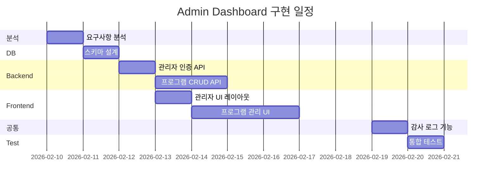

# 관리자 대시보드 (Admin Dashboard) - 기능 계획서

> 작성일: 2026-02-04  
> 작성자: AI Assistant  
> 우선순위: 낮음

---

## 1. 개요

### 1.1 목적
관리자가 복지 데이터를 추가, 수정, 삭제할 수 있는 대시보드를 제공합니다. 복지 프로그램 정보의 **체계적인 관리**와 **데이터 품질 유지**를 위한 핵심 관리 도구입니다.

### 1.2 배경
- 복지 프로그램 데이터는 지속적인 업데이트가 필요함 (신규 정책, 마감일 변경, 조건 변경 등)
- 수동 DB 작업 없이 **UI 기반의 직관적인 데이터 관리** 필요
- 데이터 변경 이력 추적 및 **감사(Audit) 로그** 필요
- 권한 기반 접근 제어로 **데이터 무결성 보장**
- 사용자 활동 통계 및 시스템 현황 모니터링

### 1.3 기존 구현 현황

| 항목 | 상태 | 위치 |
|------|------|------|
| `welfare_program` 테이블 | ✅ 구현됨 | Database |
| 복지 프로그램 CRUD API | ⚠️ 부분 구현 | Backend |
| 사용자 인증 | ✅ 구현됨 | `auth` 모듈 |
| **관리자 권한 체계** | ❌ 미구현 | - |
| **관리자 대시보드 UI** | ❌ 미구현 | - |
| **데이터 관리 페이지** | ❌ 미구현 | - |
| **통계/모니터링** | ❌ 미구현 | - |

---

## 2. 목표

### 2.1 핵심 목표
- [ ] 관리자 인증 및 권한 시스템 구현
- [ ] 복지 프로그램 CRUD 관리 페이지 구현
- [ ] 복지 프로그램 목록 조회 (검색, 필터, 페이지네이션)
- [ ] 복지 프로그램 추가 폼 및 유효성 검사
- [ ] 복지 프로그램 수정 기능
- [ ] 복지 프로그램 삭제 (소프트 삭제) 기능
- [ ] 데이터 변경 이력 로깅

### 2.2 확장 목표 (선택)
- [ ] 대시보드 통계 위젯 (총 프로그램 수, 활성 사용자, 검색량 등)
- [ ] 복지 프로그램 일괄 등록 (CSV/Excel 업로드)
- [ ] 복지 프로그램 일괄 내보내기 (CSV/Excel 다운로드)
- [ ] 데이터 변경 승인 워크플로우
- [ ] 사용자 관리 기능 (관리자 계정 관리)
- [ ] 시스템 설정 관리
- [ ] 알림/공지사항 관리

---

## 3. 범위

### 3.1 포함 (In Scope)
- 관리자 로그인 페이지 (`/admin/login`)
- 관리자 대시보드 메인 페이지 (`/admin`)
- 복지 프로그램 관리 페이지 (`/admin/programs`)
  - 목록 조회 (검색, 필터, 정렬, 페이지네이션)
  - 상세 조회
  - 신규 등록
  - 수정
  - 삭제 (소프트 삭제)
- 관리자 권한 검증 미들웨어
- 데이터 변경 감사 로그
- 관리자 전용 API 엔드포인트
- 반응형 관리자 UI (데스크탑 최적화)

### 3.2 제외 (Out of Scope)
- 일반 사용자 관리 기능 - v2.0 예정
- 복지 프로그램 자동 수집/크롤링
- 실시간 알림 시스템
- 복잡한 RBAC (Role-Based Access Control) - 단순 관리자/비관리자 구분만
- 다국어 관리자 UI
- 고급 분석 대시보드 (BI 도구 연동)

---

## 4. 기술적 고려사항

### 4.1 필요 기술 스택

| 영역 | 기술 | 비고 |
|------|------|------|
| Frontend | React, TypeScript, Tailwind CSS | 기존 스택 활용 |
| UI 컴포넌트 | Headless UI, React Hook Form | 폼 관리 |
| Backend | Node.js, NestJS | 기존 스택 활용 |
| Database | PostgreSQL | 기존 DB 활용 |
| 인증 | JWT, HttpOnly Cookie | 관리자 세션 관리 |
| 상태 관리 | React Query | 데이터 캐싱, 뮤테이션 |

### 4.2 의존성

```
auth (필수)
  │
  └── 관리자 인증/권한
        │
        ▼
admin-dashboard (현재)
        │
        ├── welfare_program (필수)
        │   └── 복지 데이터 CRUD
        │
        ├── user_activity_log (선택)
        │   └── 사용자 통계
        │
        └── analytics (선택)
            └── 대시보드 통계
```

| 의존 기능 | 필수 여부 | 연동 내용 |
|----------|----------|----------|
| auth 모듈 | 필수 | 관리자 인증, 권한 검증 |
| welfare_program 테이블 | 필수 | 복지 데이터 CRUD 대상 |
| user_activity_log | 선택 | 사용자 활동 통계 |
| analytics | 선택 | 대시보드 통계 위젯 |

### 4.3 데이터 모델

관리자 테이블 추가:
```sql
-- 관리자 계정 테이블
CREATE TABLE admin_user (
  id              UUID PRIMARY KEY DEFAULT gen_random_uuid(),
  email           VARCHAR(255) NOT NULL UNIQUE,
  password_hash   VARCHAR(255) NOT NULL,
  name            VARCHAR(100) NOT NULL,
  role            VARCHAR(50) DEFAULT 'admin',  -- 'admin', 'super_admin'
  is_active       BOOLEAN DEFAULT true,
  last_login_at   TIMESTAMP,
  created_at      TIMESTAMP DEFAULT CURRENT_TIMESTAMP,
  updated_at      TIMESTAMP DEFAULT CURRENT_TIMESTAMP
);

-- 데이터 변경 감사 로그 테이블
CREATE TABLE audit_log (
  id              UUID PRIMARY KEY DEFAULT gen_random_uuid(),
  admin_id        UUID NOT NULL REFERENCES admin_user(id),
  action          VARCHAR(50) NOT NULL,         -- 'CREATE', 'UPDATE', 'DELETE'
  entity_type     VARCHAR(100) NOT NULL,        -- 'welfare_program'
  entity_id       VARCHAR(255) NOT NULL,
  old_value       JSONB,
  new_value       JSONB,
  ip_address      VARCHAR(45),
  user_agent      TEXT,
  created_at      TIMESTAMP DEFAULT CURRENT_TIMESTAMP
);

-- 복지 프로그램 소프트 삭제 컬럼 추가
ALTER TABLE welfare_program 
ADD COLUMN deleted_at TIMESTAMP,
ADD COLUMN deleted_by UUID REFERENCES admin_user(id);
```

인덱스 추가:
```sql
-- 감사 로그 조회용 인덱스
CREATE INDEX idx_audit_log_entity ON audit_log(entity_type, entity_id);
CREATE INDEX idx_audit_log_admin ON audit_log(admin_id, created_at DESC);
CREATE INDEX idx_audit_log_created ON audit_log(created_at DESC);

-- 소프트 삭제 필터링
CREATE INDEX idx_welfare_program_deleted ON welfare_program(deleted_at) WHERE deleted_at IS NULL;
```

### 4.4 API 설계

```
# 관리자 인증
POST   /api/admin/auth/login          - 관리자 로그인
POST   /api/admin/auth/logout         - 로그아웃
GET    /api/admin/auth/me             - 현재 관리자 정보

# 복지 프로그램 관리
GET    /api/admin/programs            - 목록 조회 (검색, 필터, 페이지네이션)
GET    /api/admin/programs/:id        - 상세 조회
POST   /api/admin/programs            - 신규 등록
PUT    /api/admin/programs/:id        - 수정
DELETE /api/admin/programs/:id        - 삭제 (소프트 삭제)

# 감사 로그
GET    /api/admin/audit-logs          - 변경 이력 조회
GET    /api/admin/audit-logs/:entityId - 특정 엔티티 변경 이력

# 대시보드 통계 (확장)
GET    /api/admin/stats/overview      - 전체 통계 요약
GET    /api/admin/stats/programs      - 프로그램 통계
GET    /api/admin/stats/users         - 사용자 통계
```

### 4.5 UI 컴포넌트 구조

```
src/features/admin/
├── pages/
│   ├── AdminLoginPage.tsx
│   ├── AdminDashboardPage.tsx
│   ├── ProgramListPage.tsx
│   ├── ProgramDetailPage.tsx
│   ├── ProgramCreatePage.tsx
│   ├── ProgramEditPage.tsx
│   └── AuditLogPage.tsx
├── components/
│   ├── AdminLayout/
│   ├── AdminSidebar/
│   ├── AdminHeader/
│   ├── ProgramTable/
│   ├── ProgramForm/
│   ├── ProgramFilters/
│   ├── StatsCard/
│   ├── AuditLogTable/
│   └── ConfirmDialog/
├── hooks/
│   ├── useAdminAuth.ts
│   ├── usePrograms.ts
│   ├── useProgramMutation.ts
│   └── useAuditLogs.ts
├── api/
│   ├── adminAuthApi.ts
│   ├── programApi.ts
│   └── auditLogApi.ts
├── guards/
│   └── AdminGuard.tsx
└── types/
    └── admin.types.ts
```

---

## 5. 예상 일정

| 단계 | 예상 소요 | 시작일 | 완료일 | 담당 |
|------|----------|--------|--------|------|
| 요구사항 분석 | 1일 | 2026-02-10 | 2026-02-10 | 기획팀 |
| DB 스키마 설계 | 1일 | 2026-02-11 | 2026-02-11 | 백엔드팀 |
| 관리자 인증 API | 1일 | 2026-02-12 | 2026-02-12 | 백엔드팀 |
| 프로그램 CRUD API | 2일 | 2026-02-13 | 2026-02-14 | 백엔드팀 |
| 관리자 UI 레이아웃 | 1일 | 2026-02-13 | 2026-02-13 | 프론트엔드팀 |
| 프로그램 관리 UI | 3일 | 2026-02-14 | 2026-02-18 | 프론트엔드팀 |
| 감사 로그 기능 | 1일 | 2026-02-19 | 2026-02-19 | 풀스택 |
| 통합 테스트 | 1일 | 2026-02-20 | 2026-02-20 | QA팀 |
| **총 소요 기간** | **약 11일** | | | |



---

## 6. 위험 요소와 대응 방안

| 리스크 | 영향도 | 발생 확률 | 대응 방안 |
|--------|--------|----------|----------|
| 관리자 계정 보안 취약점 | 높음 | 중간 | 강력한 비밀번호 정책, 2FA 도입 검토, 로그인 시도 제한 |
| 데이터 무결성 손상 | 높음 | 낮음 | 소프트 삭제 적용, 감사 로그 필수화, 백업 정책 |
| 복잡한 폼 유효성 검사 | 중간 | 중간 | React Hook Form + Zod 스키마 검증, 단계별 검증 |
| 대량 데이터 처리 성능 | 중간 | 낮음 | 페이지네이션 필수, 서버사이드 필터링, 인덱스 최적화 |
| 권한 우회 시도 | 높음 | 낮음 | API 레벨 권한 검증, 프론트엔드/백엔드 이중 검증 |
| 동시 편집 충돌 | 낮음 | 낮음 | Optimistic Lock (버전 필드), 충돌 시 알림 |

---

## 7. 성공 지표 (KPI)

- 데이터 등록/수정 소요 시간: 평균 3분 이내
- 관리자 작업 오류율: 5% 이하
- 감사 로그 누락율: 0%
- 관리자 페이지 응답 시간: 평균 500ms 이내
- 데이터 무결성 오류: 0건

---

## 8. 다음 단계

`Cmd+Shift+P` → `BKIT: Design 문서 생성`을 실행하여 설계 문서를 작성하세요.

---
*우선순위: 낮음*  
*예상 소요: 11일*  
*의존성: auth (필수), welfare_program (필수)*
