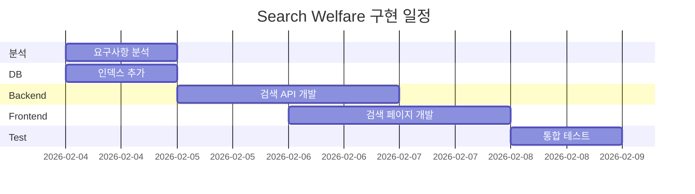

# 복지 검색 (Search Welfare) - 기능 계획서

> 작성일: 2026-02-03  
> 작성자: AI Assistant  
> 우선순위: 중간

---₩  

## 1. 개요

### 1.1 목적
사용자가 키워드, 카테고리, 지역 등 다양한 조건으로 복지 혜택을 직접 검색할 수 있는 기능입니다. 개인화 추천(`welfare-recommendation`)과 함께 사용자가 **능동적으로 복지 정보를 탐색**할 수 있도록 지원합니다.

### 1.2 배경
- `welfare-recommendation` 기능은 사용자 프로필 기반 **자동 추천** 제공
- 사용자가 특정 키워드나 조건으로 **직접 탐색**할 수 있는 기능 필요
- `검색 → 추천 → 저장`의 **완전한 사용자 여정** 완성
- 복지 정보 접근성 향상을 위한 핵심 기능

### 1.3 기존 구현 현황

| 항목 | 상태 | 위치 |
|------|------|------|
| `welfare_program` 테이블 | ✅ 구현됨 | Database |
| 복지 프로그램 데이터 | ✅ 구현됨 | 백엔드 |
| 추천 API | ✅ 구현됨 | `RecommendationController` |
| **검색 API** | ❌ 미구현 | - |
| **검색 페이지** | ❌ 미구현 | - |
| **검색 필터 UI** | ❌ 미구현 | - |

---

## 2. 목표

### 2.1 핵심 목표
- [ ] 키워드 기반 복지 검색 기능 구현
- [ ] 카테고리별 필터링 기능 구현
- [ ] 지역(시/도, 시/군/구)별 필터링 기능 구현
- [ ] 검색 결과 정렬 기능 (관련도순, 마감일순, 최신순)
- [ ] 검색 결과 페이지네이션 구현
- [ ] 검색 결과에서 즐겨찾기 추가 연동

### 2.2 확장 목표 (선택)
- [ ] 자동완성(Autocomplete) 기능
- [ ] 검색어 하이라이팅
- [ ] 최근 검색어 저장
- [ ] 인기 검색어 표시
- [ ] 고급 필터 (대상자 조건, 지원 금액 범위 등)
- [ ] 검색 결과 없을 때 유사 추천

---

## 3. 범위

### 3.1 포함 (In Scope)
- 검색 페이지 (`/search`)
- 키워드 검색 (프로그램명, 설명, 기관명)
- 카테고리 필터 (8개 카테고리)
- 지역 필터 (전국/시도/시군구)
- 정렬 옵션 (관련도, 마감일, 최신순, 인기순)
- 검색 결과 카드 UI
- 검색 결과 페이지네이션
- 빈 검색 결과 UI
- 검색 결과에서 즐겨찾기 토글
- 모바일 반응형 레이아웃

### 3.2 제외 (Out of Scope)
- 전문 검색 엔진 (Elasticsearch) 연동 - v2.0 예정
- 음성 검색
- 이미지/문서 기반 검색
- 검색 결과 공유 기능
- 검색 분석/통계 (admin-dashboard에서 처리)
- 자연어 질의 (AI 챗봇 형태)

---

## 4. 기술적 고려사항

### 4.1 필요 기술 스택

| 영역 | 기술 | 비고 |
|------|------|------|
| Frontend | React, TypeScript, Tailwind CSS | 기존 스택 활용 |
| Backend | Node.js, NestJS | 기존 스택 활용 |
| Database | PostgreSQL | ILIKE, Full-Text Search |
| 상태 관리 | React Query | 검색 결과 캐싱 |
| URL 상태 | URLSearchParams | 검색 조건 URL 공유 |

### 4.2 의존성

```
welfare_program (필수)
         │
         ├── 프로그램 데이터
         └── 카테고리/지역 정보
         │
         ▼
search-welfare (현재)
         │
         ├── save-favorites (선택)
         │   └── 검색 결과 북마크
         │
         └── welfare-recommendation (선택)
             └── 검색 → 추천 연계
```

| 의존 기능 | 필수 여부 | 연동 내용 |
|----------|----------|----------|
| welfare_program 테이블 | 필수 | 검색 대상 데이터 |
| save-favorites | 선택 | 검색 결과 즐겨찾기 |
| user-profile | 선택 | 지역 기본값 자동 설정 |

### 4.3 데이터 모델

기존 `welfare_program` 테이블 활용:
```sql
welfare_program (
  id              VARCHAR(100) PRIMARY KEY,
  name            VARCHAR(255) NOT NULL,      -- 검색 대상
  summary         TEXT,                        -- 검색 대상
  description     TEXT,                        -- 검색 대상
  category        VARCHAR(50),                 -- 필터
  organization    VARCHAR(255),                -- 검색 대상
  region_code     VARCHAR(10),                 -- 필터 (시도/시군구)
  eligibility     JSONB,                       -- 고급 필터용
  benefits        JSONB,
  deadline        DATE,                        -- 정렬 기준
  application_url VARCHAR(500),
  created_at      TIMESTAMP,
  updated_at      TIMESTAMP
)
```

검색 최적화를 위한 인덱스:
```sql
-- 텍스트 검색 인덱스 (GIN)
CREATE INDEX idx_welfare_program_search 
ON welfare_program 
USING GIN(to_tsvector('simple', name || ' ' || COALESCE(summary, '') || ' ' || COALESCE(organization, '')));

-- 카테고리 + 지역 복합 인덱스
CREATE INDEX idx_welfare_program_filter 
ON welfare_program(category, region_code);

-- 마감일 정렬용 인덱스
CREATE INDEX idx_welfare_program_deadline 
ON welfare_program(deadline NULLS LAST);
```

### 4.4 API 설계

```
GET /api/search
  - Query: keyword, category, region, sortBy, page, limit
  - Response: { results: [], totalCount, filters }

GET /api/search/suggestions
  - Query: keyword
  - Response: { suggestions: [] }

GET /api/search/filters
  - Response: { categories: [], regions: [] }
```

### 4.5 UI 컴포넌트 구조

```
src/features/search/
├── pages/
│   └── SearchPage.tsx
├── components/
│   ├── SearchBar/
│   ├── SearchFilters/
│   ├── SearchResults/
│   ├── SearchResultCard/
│   ├── SearchSort/
│   ├── SearchPagination/
│   ├── EmptySearchResults/
│   └── RecentSearches/
├── hooks/
│   ├── useSearch.ts
│   ├── useSearchFilters.ts
│   └── useSearchHistory.ts
├── api/
│   └── searchApi.ts
└── types/
    └── search.types.ts
```

---

## 5. 예상 일정

| 단계 | 예상 소요 | 시작일 | 완료일 | 담당 |
|------|----------|--------|--------|------|
| 요구사항 분석 | 0.5일 | 2026-02-04 | 2026-02-04 | 기획팀 |
| DB 인덱스 추가 | 0.5일 | 2026-02-04 | 2026-02-04 | 백엔드팀 |
| 백엔드 API 개발 | 1.5일 | 2026-02-05 | 2026-02-06 | 백엔드팀 |
| 프론트엔드 개발 | 2일 | 2026-02-06 | 2026-02-07 | 프론트엔드팀 |
| 통합 테스트 | 0.5일 | 2026-02-08 | 2026-02-08 | QA팀 |
| **총 소요 기간** | **약 5일** | | | |



---

## 6. 위험 요소와 대응 방안

| 리스크 | 영향도 | 발생 확률 | 대응 방안 |
|--------|--------|----------|----------|
| 검색 성능 저하 (대량 데이터) | 높음 | 중간 | DB 인덱스 최적화, 페이지네이션 필수, 캐싱 적용 |
| 검색 결과 품질 부족 | 중간 | 중간 | 한글 형태소 분석, 동의어 사전 추가 (v2.0) |
| 복잡한 필터 조합 쿼리 성능 | 중간 | 낮음 | 복합 인덱스 설계, 쿼리 최적화 |
| 지역 데이터 불일치 | 낮음 | 중간 | 표준 행정구역 코드 사용, 데이터 정규화 |
| 모바일 UX 복잡성 | 중간 | 낮음 | 필터 바텀시트 UI, 단계별 필터링 |

---

## 7. 성공 지표 (KPI)

- 검색 결과 응답 시간: 평균 300ms 이내
- 검색 → 상세 조회 전환율: 40% 이상
- 검색 → 즐겨찾기 추가율: 15% 이상
- 검색 결과 0건 비율: 10% 이하
- 재검색율 (검색 조건 수정): 30% 이하

---

## 8. 다음 단계

`Cmd+Shift+P` → `BKIT: Design 문서 생성`을 실행하여 설계 문서를 작성하세요.

---
*우선순위: 중간*  
*예상 소요: 5일*  
*의존성: welfare_program (필수)*
