# 관리자 대시보드 (Admin Dashboard) - 설계 문서

> 작성일: 2026-02-04  
> 버전: 1.0  
> 상태: 초안

---

## 1. 아키텍처 개요

### 1.1 시스템 아키텍처

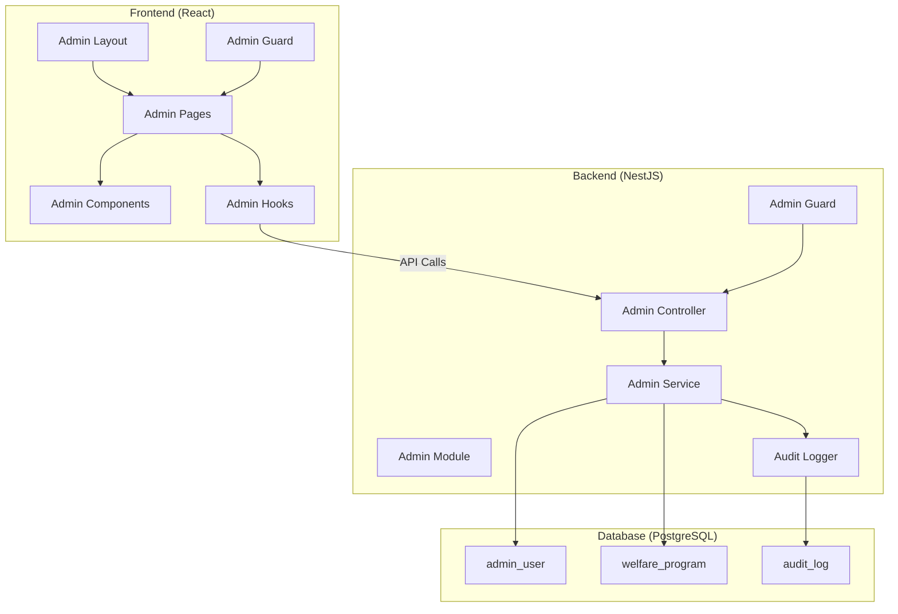

### 1.2 인증/인가 플로우

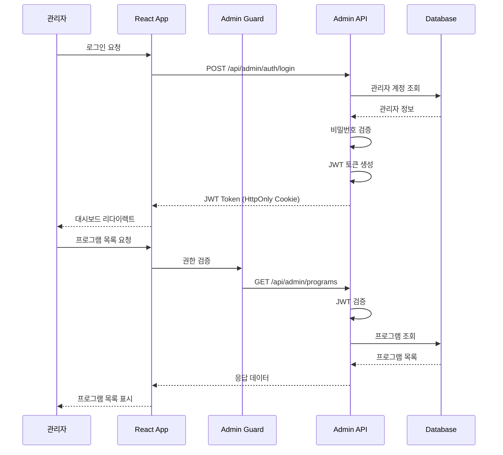

### 1.3 컴포넌트 다이어그램

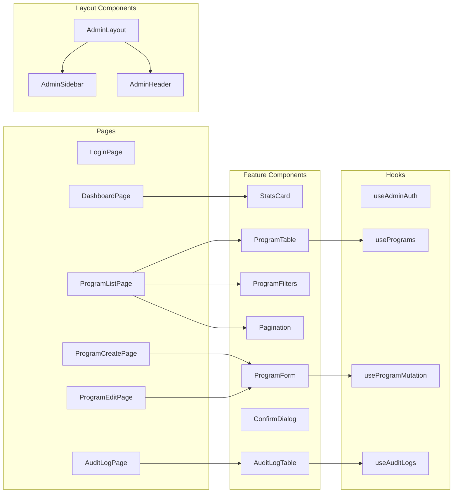

---

## 2. 데이터 모델

### 2.1 데이터베이스 스키마

#### 2.1.1 관리자 계정 테이블 (admin_user)

```sql
CREATE TABLE admin_user (
    id              UUID PRIMARY KEY DEFAULT gen_random_uuid(),
    email           VARCHAR(255) NOT NULL UNIQUE,
    password_hash   VARCHAR(255) NOT NULL,
    name            VARCHAR(100) NOT NULL,
    role            VARCHAR(50) NOT NULL DEFAULT 'admin',
    is_active       BOOLEAN DEFAULT TRUE,
    last_login_at   TIMESTAMP WITH TIME ZONE,
    login_attempts  INTEGER DEFAULT 0,
    locked_until    TIMESTAMP WITH TIME ZONE,
    created_at      TIMESTAMP WITH TIME ZONE DEFAULT CURRENT_TIMESTAMP,
    updated_at      TIMESTAMP WITH TIME ZONE DEFAULT CURRENT_TIMESTAMP
);

-- 인덱스
CREATE UNIQUE INDEX idx_admin_user_email ON admin_user(email);
CREATE INDEX idx_admin_user_active ON admin_user(is_active) WHERE is_active = TRUE;
```

#### 2.1.2 감사 로그 테이블 (audit_log)

```sql
CREATE TABLE audit_log (
    id              UUID PRIMARY KEY DEFAULT gen_random_uuid(),
    admin_id        UUID NOT NULL REFERENCES admin_user(id),
    action          VARCHAR(50) NOT NULL,
    entity_type     VARCHAR(100) NOT NULL,
    entity_id       VARCHAR(255) NOT NULL,
    old_value       JSONB,
    new_value       JSONB,
    changes         JSONB,
    ip_address      VARCHAR(45),
    user_agent      TEXT,
    created_at      TIMESTAMP WITH TIME ZONE DEFAULT CURRENT_TIMESTAMP
);

-- 인덱스
CREATE INDEX idx_audit_log_entity ON audit_log(entity_type, entity_id);
CREATE INDEX idx_audit_log_admin ON audit_log(admin_id, created_at DESC);
CREATE INDEX idx_audit_log_created ON audit_log(created_at DESC);
CREATE INDEX idx_audit_log_action ON audit_log(action);
```

#### 2.1.3 복지 프로그램 테이블 확장

```sql
-- 기존 welfare_program 테이블에 소프트 삭제 컬럼 추가
ALTER TABLE welfare_program 
ADD COLUMN IF NOT EXISTS deleted_at TIMESTAMP WITH TIME ZONE,
ADD COLUMN IF NOT EXISTS deleted_by UUID REFERENCES admin_user(id),
ADD COLUMN IF NOT EXISTS created_by UUID REFERENCES admin_user(id),
ADD COLUMN IF NOT EXISTS updated_by UUID REFERENCES admin_user(id),
ADD COLUMN IF NOT EXISTS version INTEGER DEFAULT 1;

-- 소프트 삭제 필터링 인덱스
CREATE INDEX idx_welfare_program_not_deleted 
ON welfare_program(id) WHERE deleted_at IS NULL;
```

### 2.2 TypeScript 타입 정의

#### 2.2.1 관리자 관련 타입

```typescript
// src/features/admin/types/admin.types.ts

/** 관리자 역할 */
export type AdminRole = 'admin' | 'super_admin';

/** 관리자 계정 */
export interface AdminUser {
  id: string;
  email: string;
  name: string;
  role: AdminRole;
  isActive: boolean;
  lastLoginAt: string | null;
  createdAt: string;
  updatedAt: string;
}

/** 관리자 로그인 요청 */
export interface AdminLoginRequest {
  email: string;
  password: string;
}

/** 관리자 로그인 응답 */
export interface AdminLoginResponse {
  admin: AdminUser;
  accessToken: string;
  expiresIn: number;
}

/** 관리자 인증 상태 */
export interface AdminAuthState {
  admin: AdminUser | null;
  isAuthenticated: boolean;
  isLoading: boolean;
}
```

#### 2.2.2 복지 프로그램 관련 타입

```typescript
// src/features/admin/types/program.types.ts

/** 복지 프로그램 카테고리 */
export type ProgramCategory = 
  | 'employment'
  | 'housing'
  | 'education'
  | 'healthcare'
  | 'childcare'
  | 'welfare'
  | 'culture'
  | 'other';

/** 대상 그룹 */
export type TargetGroup = 
  | 'youth'
  | 'elderly'
  | 'disabled'
  | 'low_income'
  | 'single_parent'
  | 'veteran'
  | 'multicultural'
  | 'all';

/** 자격 조건 */
export interface EligibilityCriteria {
  minAge?: number;
  maxAge?: number;
  incomeLevel?: 'low' | 'medium' | 'all';
  maxIncomePercentile?: number;
  residenceRequirement?: string;
  employmentStatus?: string[];
  additionalConditions?: string[];
}

/** 신청 방법 */
export interface ApplicationMethod {
  online?: {
    url: string;
    description?: string;
  };
  offline?: {
    address: string;
    hours?: string;
  };
  phone?: {
    number: string;
    hours?: string;
  };
  documents?: string[];
}

/** 복지 프로그램 */
export interface WelfareProgram {
  id: string;
  name: string;
  description: string;
  summary: string;
  category: ProgramCategory;
  targetGroups: TargetGroup[];
  eligibilityCriteria: EligibilityCriteria;
  applicationMethod: ApplicationMethod;
  requiredDocuments: string[];
  contactInfo: {
    phone?: string;
    email?: string;
    website?: string;
  } | null;
  managingOrganization: string;
  benefits: string;
  benefitAmount: string | null;
  applicationStartDate: string | null;
  applicationEndDate: string | null;
  isAlwaysOpen: boolean;
  sourceUrl: string | null;
  tags: string[];
  viewCount: number;
  bookmarkCount: number;
  isActive: boolean;
  version: number;
  createdAt: string;
  updatedAt: string;
  createdBy: string | null;
  updatedBy: string | null;
  deletedAt: string | null;
}

/** 프로그램 생성 요청 */
export interface CreateProgramRequest {
  name: string;
  description: string;
  summary: string;
  category: ProgramCategory;
  targetGroups: TargetGroup[];
  eligibilityCriteria: EligibilityCriteria;
  applicationMethod: ApplicationMethod;
  requiredDocuments?: string[];
  contactInfo?: WelfareProgram['contactInfo'];
  managingOrganization: string;
  benefits: string;
  benefitAmount?: string;
  applicationStartDate?: string;
  applicationEndDate?: string;
  isAlwaysOpen?: boolean;
  sourceUrl?: string;
  tags?: string[];
  isActive?: boolean;
}

/** 프로그램 수정 요청 */
export interface UpdateProgramRequest extends Partial<CreateProgramRequest> {
  version: number; // Optimistic Locking
}

/** 프로그램 목록 조회 파라미터 */
export interface ProgramListParams {
  page?: number;
  limit?: number;
  search?: string;
  category?: ProgramCategory;
  targetGroup?: TargetGroup;
  isActive?: boolean;
  includeDeleted?: boolean;
  sortBy?: 'name' | 'createdAt' | 'updatedAt' | 'viewCount';
  sortOrder?: 'asc' | 'desc';
}

/** 페이지네이션 응답 */
export interface PaginatedResponse<T> {
  data: T[];
  meta: {
    total: number;
    page: number;
    limit: number;
    totalPages: number;
    hasNext: boolean;
    hasPrev: boolean;
  };
}
```

#### 2.2.3 감사 로그 타입

```typescript
// src/features/admin/types/audit.types.ts

/** 감사 로그 액션 */
export type AuditAction = 'CREATE' | 'UPDATE' | 'DELETE' | 'RESTORE';

/** 엔티티 타입 */
export type EntityType = 'welfare_program' | 'admin_user';

/** 감사 로그 */
export interface AuditLog {
  id: string;
  adminId: string;
  adminName?: string;
  adminEmail?: string;
  action: AuditAction;
  entityType: EntityType;
  entityId: string;
  entityName?: string;
  oldValue: Record<string, unknown> | null;
  newValue: Record<string, unknown> | null;
  changes: {
    field: string;
    oldValue: unknown;
    newValue: unknown;
  }[] | null;
  ipAddress: string | null;
  userAgent: string | null;
  createdAt: string;
}

/** 감사 로그 조회 파라미터 */
export interface AuditLogParams {
  page?: number;
  limit?: number;
  adminId?: string;
  entityType?: EntityType;
  entityId?: string;
  action?: AuditAction;
  startDate?: string;
  endDate?: string;
}
```

#### 2.2.4 대시보드 통계 타입

```typescript
// src/features/admin/types/stats.types.ts

/** 대시보드 통계 개요 */
export interface DashboardStats {
  programs: {
    total: number;
    active: number;
    inactive: number;
    addedThisMonth: number;
    updatedThisMonth: number;
  };
  users: {
    totalProfiles: number;
    activeToday: number;
    activeThisWeek: number;
    newThisMonth: number;
  };
  activity: {
    totalSearches: number;
    totalRecommendations: number;
    totalBookmarks: number;
    searchesToday: number;
  };
  recentChanges: AuditLog[];
}

/** 프로그램 통계 */
export interface ProgramStats {
  byCategory: {
    category: string;
    count: number;
    percentage: number;
  }[];
  byTargetGroup: {
    targetGroup: string;
    count: number;
  }[];
  topViewed: {
    id: string;
    name: string;
    viewCount: number;
  }[];
  topBookmarked: {
    id: string;
    name: string;
    bookmarkCount: number;
  }[];
  expiringSOon: {
    id: string;
    name: string;
    applicationEndDate: string;
  }[];
}
```

---

## 3. API/인터페이스 설계

### 3.1 API 엔드포인트

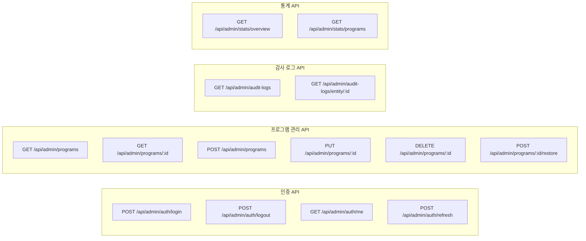

### 3.2 API 상세 명세

#### 3.2.1 인증 API

```typescript
// POST /api/admin/auth/login
interface LoginEndpoint {
  request: {
    body: {
      email: string;
      password: string;
    };
  };
  response: {
    admin: AdminUser;
    accessToken: string;
    expiresIn: number;
  };
  errors: {
    401: 'Invalid credentials';
    423: 'Account locked';
  };
}

// POST /api/admin/auth/logout
interface LogoutEndpoint {
  request: {};
  response: {
    message: 'Logged out successfully';
  };
}

// GET /api/admin/auth/me
interface MeEndpoint {
  request: {
    headers: {
      Authorization: 'Bearer <token>';
    };
  };
  response: AdminUser;
  errors: {
    401: 'Unauthorized';
  };
}
```

#### 3.2.2 프로그램 관리 API

```typescript
// GET /api/admin/programs
interface ListProgramsEndpoint {
  request: {
    query: ProgramListParams;
  };
  response: PaginatedResponse<WelfareProgram>;
}

// GET /api/admin/programs/:id
interface GetProgramEndpoint {
  request: {
    params: { id: string };
  };
  response: WelfareProgram;
  errors: {
    404: 'Program not found';
  };
}

// POST /api/admin/programs
interface CreateProgramEndpoint {
  request: {
    body: CreateProgramRequest;
  };
  response: WelfareProgram;
  errors: {
    400: 'Validation error';
  };
}

// PUT /api/admin/programs/:id
interface UpdateProgramEndpoint {
  request: {
    params: { id: string };
    body: UpdateProgramRequest;
  };
  response: WelfareProgram;
  errors: {
    400: 'Validation error';
    404: 'Program not found';
    409: 'Version conflict';
  };
}

// DELETE /api/admin/programs/:id
interface DeleteProgramEndpoint {
  request: {
    params: { id: string };
  };
  response: {
    message: 'Program deleted successfully';
  };
  errors: {
    404: 'Program not found';
  };
}

// POST /api/admin/programs/:id/restore
interface RestoreProgramEndpoint {
  request: {
    params: { id: string };
  };
  response: WelfareProgram;
  errors: {
    404: 'Program not found';
    400: 'Program is not deleted';
  };
}
```

### 3.3 React Hooks 인터페이스

#### 3.3.1 인증 Hook

```typescript
// src/features/admin/hooks/useAdminAuth.ts

interface UseAdminAuthReturn {
  // 상태
  admin: AdminUser | null;
  isAuthenticated: boolean;
  isLoading: boolean;
  error: Error | null;
  
  // 액션
  login: (credentials: AdminLoginRequest) => Promise<void>;
  logout: () => Promise<void>;
  checkAuth: () => Promise<void>;
}

function useAdminAuth(): UseAdminAuthReturn;
```

#### 3.3.2 프로그램 관리 Hooks

```typescript
// src/features/admin/hooks/usePrograms.ts

interface UseProgramsOptions {
  initialParams?: ProgramListParams;
  enabled?: boolean;
}

interface UseProgramsReturn {
  // 데이터
  programs: WelfareProgram[];
  meta: PaginatedResponse<WelfareProgram>['meta'] | null;
  
  // 상태
  isLoading: boolean;
  isFetching: boolean;
  error: Error | null;
  
  // 필터/페이지네이션
  params: ProgramListParams;
  setParams: (params: Partial<ProgramListParams>) => void;
  resetParams: () => void;
  
  // 액션
  refetch: () => void;
}

function usePrograms(options?: UseProgramsOptions): UseProgramsReturn;

// src/features/admin/hooks/useProgram.ts
interface UseProgramReturn {
  program: WelfareProgram | null;
  isLoading: boolean;
  error: Error | null;
  refetch: () => void;
}

function useProgram(id: string): UseProgramReturn;

// src/features/admin/hooks/useProgramMutation.ts
interface UseProgramMutationReturn {
  // 생성
  createProgram: UseMutationResult<WelfareProgram, Error, CreateProgramRequest>;
  
  // 수정
  updateProgram: UseMutationResult<WelfareProgram, Error, {
    id: string;
    data: UpdateProgramRequest;
  }>;
  
  // 삭제
  deleteProgram: UseMutationResult<void, Error, string>;
  
  // 복구
  restoreProgram: UseMutationResult<WelfareProgram, Error, string>;
}

function useProgramMutation(): UseProgramMutationReturn;
```

#### 3.3.3 감사 로그 Hook

```typescript
// src/features/admin/hooks/useAuditLogs.ts

interface UseAuditLogsOptions {
  entityId?: string;
  entityType?: EntityType;
}

interface UseAuditLogsReturn {
  logs: AuditLog[];
  meta: PaginatedResponse<AuditLog>['meta'] | null;
  isLoading: boolean;
  error: Error | null;
  params: AuditLogParams;
  setParams: (params: Partial<AuditLogParams>) => void;
  refetch: () => void;
}

function useAuditLogs(options?: UseAuditLogsOptions): UseAuditLogsReturn;
```

---

## 4. 파일 구조

### 4.1 Frontend 파일 구조

```
src/features/admin/
├── index.ts                          # 모듈 진입점
├── constants/
│   ├── index.ts
│   ├── categories.ts                 # 카테고리 상수
│   ├── targetGroups.ts               # 대상 그룹 상수
│   └── routes.ts                     # 관리자 라우트 상수
├── types/
│   ├── index.ts
│   ├── admin.types.ts                # 관리자 타입
│   ├── program.types.ts              # 프로그램 타입
│   ├── audit.types.ts                # 감사 로그 타입
│   └── stats.types.ts                # 통계 타입
├── api/
│   ├── index.ts
│   ├── adminAuthApi.ts               # 인증 API
│   ├── programApi.ts                 # 프로그램 CRUD API
│   ├── auditLogApi.ts                # 감사 로그 API
│   └── statsApi.ts                   # 통계 API
├── hooks/
│   ├── index.ts
│   ├── useAdminAuth.ts               # 관리자 인증 훅
│   ├── usePrograms.ts                # 프로그램 목록 훅
│   ├── useProgram.ts                 # 프로그램 상세 훅
│   ├── useProgramMutation.ts         # 프로그램 CRUD 훅
│   ├── useAuditLogs.ts               # 감사 로그 훅
│   └── useDashboardStats.ts          # 대시보드 통계 훅
├── utils/
│   ├── index.ts
│   ├── validation.ts                 # 폼 유효성 검사 스키마
│   └── formatters.ts                 # 데이터 포맷터
├── guards/
│   └── AdminGuard.tsx                # 관리자 인증 가드
├── components/
│   ├── index.ts
│   ├── AdminLayout/
│   │   ├── AdminLayout.tsx           # 관리자 레이아웃
│   │   └── index.ts
│   ├── AdminSidebar/
│   │   ├── AdminSidebar.tsx          # 사이드바
│   │   ├── SidebarItem.tsx           # 사이드바 아이템
│   │   └── index.ts
│   ├── AdminHeader/
│   │   ├── AdminHeader.tsx           # 헤더
│   │   └── index.ts
│   ├── ProgramTable/
│   │   ├── ProgramTable.tsx          # 프로그램 테이블
│   │   ├── ProgramTableRow.tsx       # 테이블 행
│   │   └── index.ts
│   ├── ProgramForm/
│   │   ├── ProgramForm.tsx           # 프로그램 폼
│   │   ├── BasicInfoSection.tsx      # 기본 정보 섹션
│   │   ├── EligibilitySection.tsx    # 자격 조건 섹션
│   │   ├── ApplicationSection.tsx    # 신청 정보 섹션
│   │   └── index.ts
│   ├── ProgramFilters/
│   │   ├── ProgramFilters.tsx        # 필터 컴포넌트
│   │   └── index.ts
│   ├── StatsCard/
│   │   ├── StatsCard.tsx             # 통계 카드
│   │   └── index.ts
│   ├── AuditLogTable/
│   │   ├── AuditLogTable.tsx         # 감사 로그 테이블
│   │   ├── AuditLogDetail.tsx        # 변경 상세
│   │   └── index.ts
│   ├── ConfirmDialog/
│   │   ├── ConfirmDialog.tsx         # 확인 다이얼로그
│   │   └── index.ts
│   └── Pagination/
│       ├── Pagination.tsx            # 페이지네이션
│       └── index.ts
└── pages/
    ├── index.ts
    ├── AdminLoginPage.tsx            # 로그인 페이지
    ├── AdminDashboardPage.tsx        # 대시보드 메인
    ├── ProgramListPage.tsx           # 프로그램 목록
    ├── ProgramDetailPage.tsx         # 프로그램 상세
    ├── ProgramCreatePage.tsx         # 프로그램 생성
    ├── ProgramEditPage.tsx           # 프로그램 수정
    └── AuditLogPage.tsx              # 감사 로그
```

### 4.2 Backend 파일 구조

```
server/src/modules/admin/
├── index.ts                          # 모듈 진입점
├── admin.module.ts                   # NestJS 모듈
├── controllers/
│   ├── admin-auth.controller.ts      # 인증 컨트롤러
│   ├── admin-program.controller.ts   # 프로그램 관리 컨트롤러
│   ├── admin-audit.controller.ts     # 감사 로그 컨트롤러
│   └── admin-stats.controller.ts     # 통계 컨트롤러
├── services/
│   ├── admin-auth.service.ts         # 인증 서비스
│   ├── admin-program.service.ts      # 프로그램 관리 서비스
│   ├── admin-audit.service.ts        # 감사 로그 서비스
│   └── admin-stats.service.ts        # 통계 서비스
├── guards/
│   └── admin-auth.guard.ts           # 관리자 인증 가드
├── decorators/
│   ├── admin.decorator.ts            # 현재 관리자 데코레이터
│   └── audit-log.decorator.ts        # 감사 로그 데코레이터
├── interceptors/
│   └── audit-log.interceptor.ts      # 감사 로그 인터셉터
├── dto/
│   ├── admin-login.dto.ts            # 로그인 DTO
│   ├── create-program.dto.ts         # 프로그램 생성 DTO
│   ├── update-program.dto.ts         # 프로그램 수정 DTO
│   ├── program-query.dto.ts          # 프로그램 조회 쿼리 DTO
│   └── audit-log-query.dto.ts        # 감사 로그 쿼리 DTO
└── entities/
    ├── admin-user.entity.ts          # 관리자 엔티티
    └── audit-log.entity.ts           # 감사 로그 엔티티
```

### 4.3 마이그레이션 파일

```
server/migrations/
├── 012_create_admin_user.sql         # 관리자 테이블
├── 013_create_audit_log.sql          # 감사 로그 테이블
└── 014_alter_welfare_program_soft_delete.sql  # 소프트 삭제 컬럼
```

---

## 5. 의존성

### 5.1 Frontend 의존성

```json
{
  "dependencies": {
    // 기존 의존성 활용
    "react": "^18.x",
    "react-router-dom": "^6.x",
    "@tanstack/react-query": "^5.x",
    "tailwindcss": "^3.x",
    
    // 추가 필요 의존성
    "react-hook-form": "^7.x",        // 폼 관리
    "zod": "^3.x",                     // 스키마 검증
    "@hookform/resolvers": "^3.x",    // Zod + React Hook Form 연동
    "@headlessui/react": "^2.x",      // 접근성 UI 컴포넌트
    "@heroicons/react": "^2.x",       // 아이콘
    "date-fns": "^3.x",               // 날짜 포맷팅
    "clsx": "^2.x"                    // 조건부 클래스명
  }
}
```

### 5.2 Backend 의존성

```json
{
  "dependencies": {
    // 기존 의존성 활용
    "@nestjs/common": "^10.x",
    "@nestjs/core": "^10.x",
    "pg": "^8.x",
    
    // 추가 필요 의존성
    "bcrypt": "^5.x",                 // 비밀번호 해싱
    "@types/bcrypt": "^5.x",
    "class-validator": "^0.14.x",     // DTO 검증
    "class-transformer": "^0.5.x"     // DTO 변환
  }
}
```

### 5.3 모듈 의존성 다이어그램

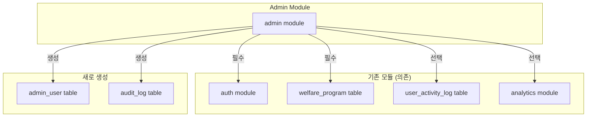

---

## 6. 구현 순서

### 6.1 Phase 1: 기반 구조 (Day 1-2)

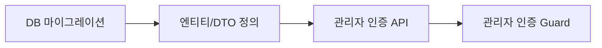

#### 작업 목록

| 순서 | 작업 | 파일 | 설명 |
|-----|------|------|------|
| 1.1 | DB 마이그레이션 생성 | `012_create_admin_user.sql` | 관리자 테이블 생성 |
| 1.2 | DB 마이그레이션 생성 | `013_create_audit_log.sql` | 감사 로그 테이블 생성 |
| 1.3 | DB 마이그레이션 생성 | `014_alter_welfare_program_soft_delete.sql` | 소프트 삭제 컬럼 추가 |
| 1.4 | 엔티티 정의 | `admin-user.entity.ts` | 관리자 엔티티 |
| 1.5 | 엔티티 정의 | `audit-log.entity.ts` | 감사 로그 엔티티 |
| 1.6 | DTO 정의 | `admin-login.dto.ts` | 로그인 DTO |
| 1.7 | 인증 서비스 | `admin-auth.service.ts` | 로그인/로그아웃 로직 |
| 1.8 | 인증 컨트롤러 | `admin-auth.controller.ts` | 인증 API 엔드포인트 |
| 1.9 | 인증 가드 | `admin-auth.guard.ts` | JWT 검증 가드 |
| 1.10 | 모듈 설정 | `admin.module.ts` | NestJS 모듈 구성 |

### 6.2 Phase 2: 프로그램 CRUD API (Day 3-4)

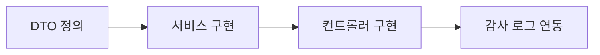

#### 작업 목록

| 순서 | 작업 | 파일 | 설명 |
|-----|------|------|------|
| 2.1 | DTO 정의 | `create-program.dto.ts` | 생성 DTO + 유효성 검사 |
| 2.2 | DTO 정의 | `update-program.dto.ts` | 수정 DTO + 버전 관리 |
| 2.3 | DTO 정의 | `program-query.dto.ts` | 조회 쿼리 DTO |
| 2.4 | 서비스 구현 | `admin-program.service.ts` | CRUD 비즈니스 로직 |
| 2.5 | 컨트롤러 구현 | `admin-program.controller.ts` | API 엔드포인트 |
| 2.6 | 감사 로그 서비스 | `admin-audit.service.ts` | 로그 기록 로직 |
| 2.7 | 감사 로그 인터셉터 | `audit-log.interceptor.ts` | 자동 로그 기록 |

### 6.3 Phase 3: Frontend 기반 (Day 5-6)

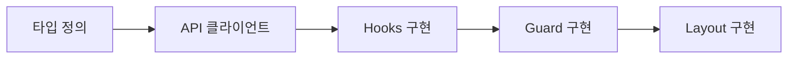

#### 작업 목록

| 순서 | 작업 | 파일 | 설명 |
|-----|------|------|------|
| 3.1 | 타입 정의 | `admin.types.ts` | 관리자 관련 타입 |
| 3.2 | 타입 정의 | `program.types.ts` | 프로그램 관련 타입 |
| 3.3 | 타입 정의 | `audit.types.ts` | 감사 로그 타입 |
| 3.4 | 상수 정의 | `constants/*.ts` | 카테고리, 라우트 상수 |
| 3.5 | API 클라이언트 | `adminAuthApi.ts` | 인증 API 호출 |
| 3.6 | API 클라이언트 | `programApi.ts` | 프로그램 API 호출 |
| 3.7 | 인증 훅 | `useAdminAuth.ts` | 인증 상태 관리 |
| 3.8 | 인증 가드 | `AdminGuard.tsx` | 라우트 보호 |
| 3.9 | 레이아웃 | `AdminLayout.tsx` | 관리자 레이아웃 |
| 3.10 | 사이드바 | `AdminSidebar.tsx` | 네비게이션 |
| 3.11 | 헤더 | `AdminHeader.tsx` | 상단 헤더 |

### 6.4 Phase 4: 프로그램 관리 UI (Day 7-9)

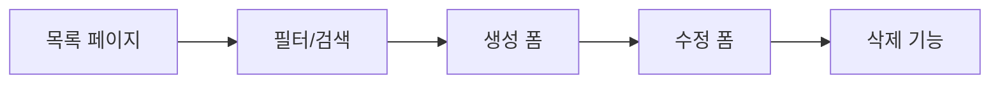

#### 작업 목록

| 순서 | 작업 | 파일 | 설명 |
|-----|------|------|------|
| 4.1 | 유효성 검사 | `validation.ts` | Zod 스키마 |
| 4.2 | 프로그램 훅 | `usePrograms.ts` | 목록 조회 훅 |
| 4.3 | 프로그램 훅 | `useProgramMutation.ts` | CRUD 훅 |
| 4.4 | 테이블 컴포넌트 | `ProgramTable.tsx` | 프로그램 테이블 |
| 4.5 | 필터 컴포넌트 | `ProgramFilters.tsx` | 검색/필터 |
| 4.6 | 페이지네이션 | `Pagination.tsx` | 페이지 이동 |
| 4.7 | 폼 컴포넌트 | `ProgramForm.tsx` | 생성/수정 폼 |
| 4.8 | 목록 페이지 | `ProgramListPage.tsx` | 목록 페이지 |
| 4.9 | 생성 페이지 | `ProgramCreatePage.tsx` | 생성 페이지 |
| 4.10 | 수정 페이지 | `ProgramEditPage.tsx` | 수정 페이지 |
| 4.11 | 상세 페이지 | `ProgramDetailPage.tsx` | 상세 보기 |
| 4.12 | 확인 다이얼로그 | `ConfirmDialog.tsx` | 삭제 확인 |

### 6.5 Phase 5: 대시보드 및 감사 로그 (Day 10)

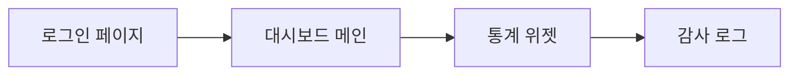

#### 작업 목록

| 순서 | 작업 | 파일 | 설명 |
|-----|------|------|------|
| 5.1 | 로그인 페이지 | `AdminLoginPage.tsx` | 관리자 로그인 |
| 5.2 | 통계 API | `statsApi.ts` | 통계 API 호출 |
| 5.3 | 통계 훅 | `useDashboardStats.ts` | 통계 데이터 |
| 5.4 | 통계 카드 | `StatsCard.tsx` | 통계 위젯 |
| 5.5 | 대시보드 페이지 | `AdminDashboardPage.tsx` | 메인 대시보드 |
| 5.6 | 감사 로그 API | `auditLogApi.ts` | 로그 API 호출 |
| 5.7 | 감사 로그 훅 | `useAuditLogs.ts` | 로그 데이터 |
| 5.8 | 감사 로그 테이블 | `AuditLogTable.tsx` | 로그 표시 |
| 5.9 | 감사 로그 페이지 | `AuditLogPage.tsx` | 로그 페이지 |

### 6.6 Phase 6: 라우팅 및 통합 (Day 11)


#### 작업 목록

| 순서 | 작업 | 파일 | 설명 |
|-----|------|------|------|
| 6.1 | 라우트 설정 | `src/app/routes.tsx` | 관리자 라우트 추가 |
| 6.2 | 모듈 내보내기 | `src/features/admin/index.ts` | public API 정의 |
| 6.3 | 통합 테스트 | - | E2E 테스트 수행 |
| 6.4 | 버그 수정 | - | 발견된 이슈 해결 |

---

## 7. UI/UX 설계

### 7.1 와이어프레임

#### 관리자 로그인 페이지

```
┌─────────────────────────────────────────────────────────┐
│                                                         │
│                    🔐 관리자 로그인                      │
│                                                         │
│              ┌─────────────────────────┐               │
│              │ 이메일                   │               │
│              │ admin@example.com       │               │
│              └─────────────────────────┘               │
│              ┌─────────────────────────┐               │
│              │ 비밀번호                 │               │
│              │ ••••••••                │               │
│              └─────────────────────────┘               │
│              ┌─────────────────────────┐               │
│              │        로그인           │               │
│              └─────────────────────────┘               │
│                                                         │
└─────────────────────────────────────────────────────────┘
```

#### 관리자 대시보드 레이아웃

```
┌─────────────────────────────────────────────────────────┐
│ 🏛️ 복지 관리자                    👤 관리자명  [로그아웃]│
├────────────┬────────────────────────────────────────────┤
│            │                                            │
│ 📊 대시보드 │  ┌──────┐ ┌──────┐ ┌──────┐ ┌──────┐     │
│            │  │ 총   │ │ 활성 │ │ 이번달│ │ 검색 │     │
│ 📋 프로그램│  │ 150  │ │ 142  │ │ +12  │ │ 3.2K │     │
│    관리    │  │ 프로그램│ │ 프로그램│ │ 신규 │ │ /일  │     │
│            │  └──────┘ └──────┘ └──────┘ └──────┘     │
│ 📝 감사    │                                            │
│    로그    │  ┌─────────────────────────────────────┐  │
│            │  │ 최근 변경 내역                        │  │
│ ⚙️ 설정    │  │ ─────────────────────────────────── │  │
│            │  │ 관리자A  | 수정 | 기초연금 | 10분전  │  │
│            │  │ 관리자B  | 생성 | 청년수당 | 1시간전 │  │
│            │  │ ...                                  │  │
│            │  └─────────────────────────────────────┘  │
│            │                                            │
└────────────┴────────────────────────────────────────────┘
```

#### 프로그램 목록 페이지

```
┌─────────────────────────────────────────────────────────┐
│ 복지 프로그램 관리                    [+ 새 프로그램]    │
├─────────────────────────────────────────────────────────┤
│ 🔍 [검색어 입력...        ]  카테고리 [전체 ▼]  상태 [▼]│
├─────────────────────────────────────────────────────────┤
│ □ │ 프로그램명        │ 카테고리 │ 상태  │ 수정일   │ ⋮│
├───┼──────────────────┼─────────┼──────┼─────────┼──┤
│ □ │ 기초연금         │ 복지    │ 🟢   │ 2024-01 │ ⋮│
│ □ │ 청년 월세 지원   │ 주거    │ 🟢   │ 2024-01 │ ⋮│
│ □ │ 국민취업지원제도 │ 고용    │ 🟡   │ 2024-01 │ ⋮│
│ □ │ ...              │ ...     │ ...  │ ...     │ ⋮│
├─────────────────────────────────────────────────────────┤
│              < 1 2 3 4 5 ... 10 >    20개씩 보기 [▼]   │
└─────────────────────────────────────────────────────────┘
```

#### 프로그램 생성/수정 폼

```
┌─────────────────────────────────────────────────────────┐
│ ← 프로그램 등록                         [취소] [저장]   │
├─────────────────────────────────────────────────────────┤
│                                                         │
│ ▼ 기본 정보                                             │
│ ┌─────────────────────────────────────────────────────┐│
│ │ 프로그램명 *                                        ││
│ │ [                                               ]   ││
│ │                                                     ││
│ │ 요약 설명 *                                         ││
│ │ [                                               ]   ││
│ │                                                     ││
│ │ 상세 설명 *                                         ││
│ │ ┌───────────────────────────────────────────────┐  ││
│ │ │                                               │  ││
│ │ │                                               │  ││
│ │ └───────────────────────────────────────────────┘  ││
│ │                                                     ││
│ │ 카테고리 *           대상 그룹 *                    ││
│ │ [고용 ▼]             [☑ 청년 ☑ 저소득...]         ││
│ └─────────────────────────────────────────────────────┘│
│                                                         │
│ ▶ 자격 조건                                             │
│ ▶ 신청 방법                                             │
│ ▶ 추가 정보                                             │
│                                                         │
└─────────────────────────────────────────────────────────┘
```

### 7.2 상태 관리 흐름

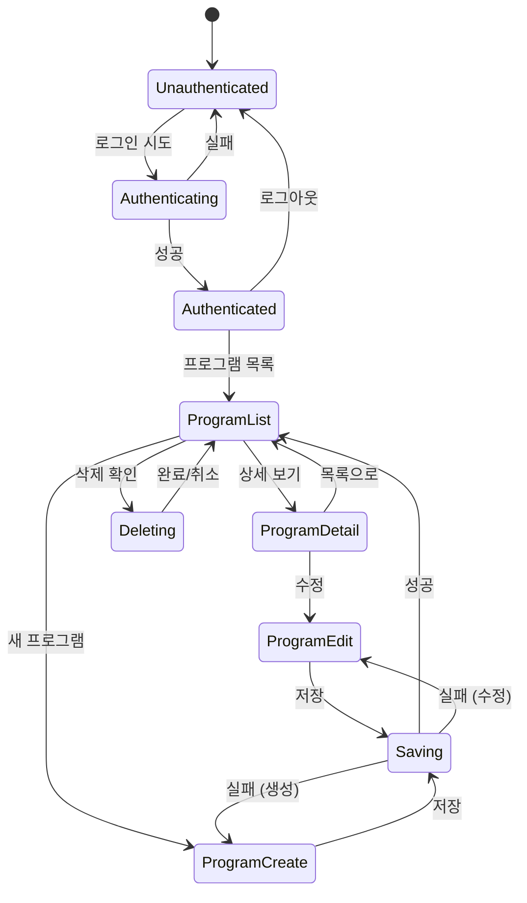

---

## 8. 보안 고려사항

### 8.1 인증/인가

| 항목 | 구현 방법 |
|------|----------|
| 비밀번호 저장 | bcrypt 해시 (salt rounds: 12) |
| 세션 관리 | JWT + HttpOnly Cookie |
| 토큰 만료 | Access: 1시간, Refresh: 7일 |
| 로그인 제한 | 5회 실패 시 15분 잠금 |
| CSRF 방지 | SameSite Cookie + CSRF Token |

### 8.2 API 보안

```typescript
// 모든 관리자 API에 적용되는 가드
@UseGuards(AdminAuthGuard)
@Controller('api/admin')
export class AdminController {
  // ...
}
```

### 8.3 데이터 검증

```typescript
// Zod 스키마 예시
const createProgramSchema = z.object({
  name: z.string().min(2).max(200),
  description: z.string().min(10),
  category: z.enum(['employment', 'housing', ...]),
  // ...
});
```

---

## 9. 테스트 전략

### 9.1 테스트 범위

| 영역 | 테스트 유형 | 도구 |
|------|------------|------|
| API 엔드포인트 | 통합 테스트 | Jest, Supertest |
| 서비스 로직 | 단위 테스트 | Jest |
| React 컴포넌트 | 컴포넌트 테스트 | Vitest, Testing Library |
| E2E 시나리오 | E2E 테스트 | Playwright |

### 9.2 주요 테스트 케이스

- [ ] 관리자 로그인 성공/실패
- [ ] 로그인 시도 제한 동작
- [ ] 프로그램 CRUD 전체 플로우
- [ ] 버전 충돌 처리
- [ ] 소프트 삭제 및 복구
- [ ] 감사 로그 자동 생성
- [ ] 페이지네이션 동작
- [ ] 필터링/검색 동작

---

## 10. 참고 자료

- Plan 문서: [admin-dashboard.plan.md](../01-plan/features/admin-dashboard.plan.md)
- 기존 auth 모듈: `server/src/modules/auth/`
- welfare_program 스키마: `server/migrations/007_create_welfare_program.sql`

---

*문서 버전: 1.0*  
*마지막 수정: 2026-02-04*
