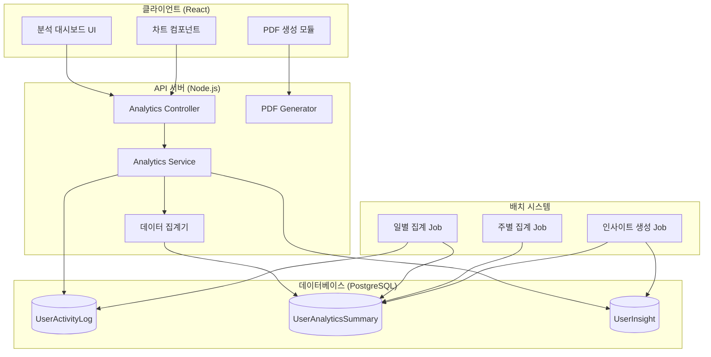
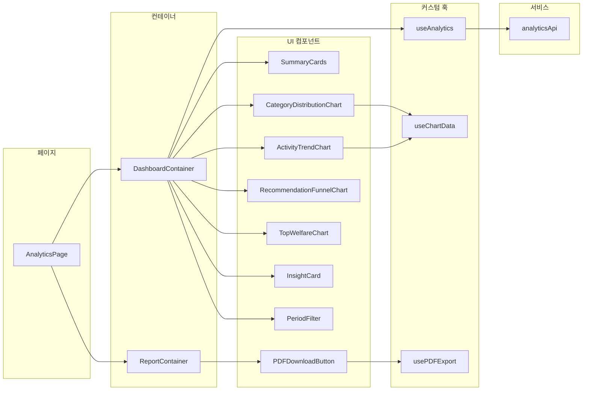
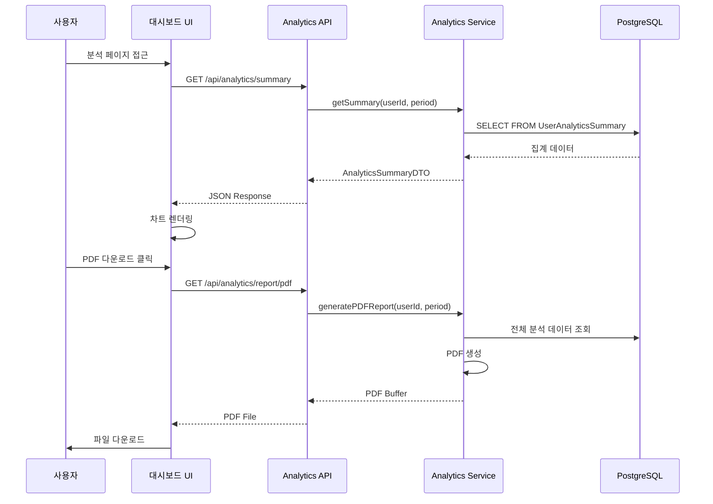
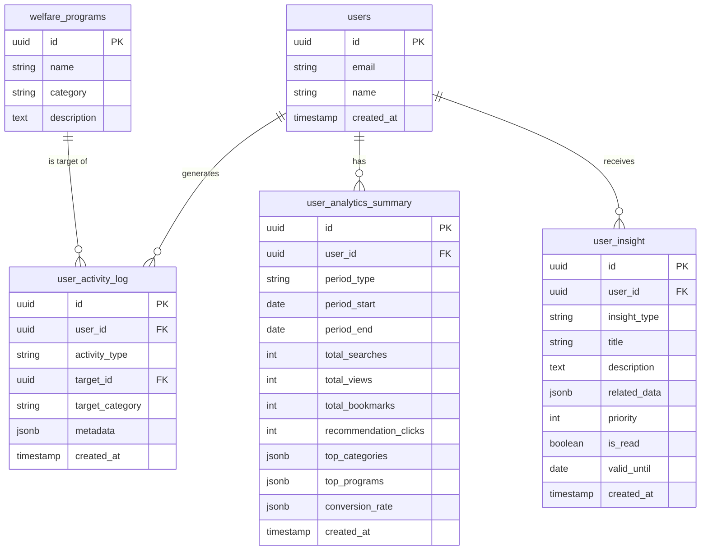
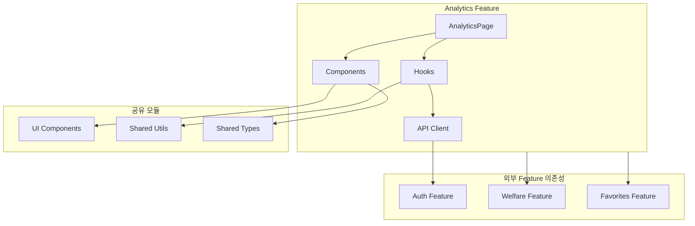
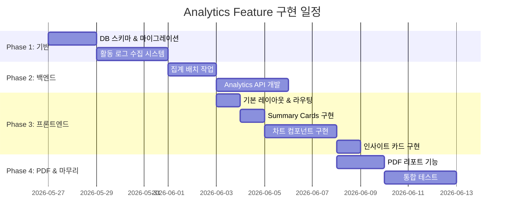

# 분석 리포트 (Analytics Report) - 설계 문서

> 작성일: 2026-02-03  
> 기반 문서: analytics-report.plan.md  
> 상태: 설계 중

---

## 1. 아키텍처 개요

### 1.1 시스템 아키텍처



### 1.2 컴포넌트 관계도



### 1.3 데이터 흐름



---

## 2. 데이터 모델

### 2.1 TypeScript 타입 정의

```typescript
// ==================== Enums ====================

/** 사용자 활동 유형 */
enum ActivityType {
  SEARCH = 'search',           // 검색
  VIEW = 'view',               // 복지 상세 조회
  BOOKMARK = 'bookmark',       // 즐겨찾기 추가
  UNBOOKMARK = 'unbookmark',   // 즐겨찾기 제거
  RECOMMENDATION_CLICK = 'recommendation_click', // 추천 복지 클릭
  RECOMMENDATION_VIEW = 'recommendation_view',   // 추천 목록 조회
}

/** 집계 기간 유형 */
enum PeriodType {
  DAILY = 'daily',
  WEEKLY = 'weekly',
  MONTHLY = 'monthly',
  YEARLY = 'yearly',
}

/** 인사이트 유형 */
enum InsightType {
  TOP_CATEGORY = 'top_category',           // 최다 관심 카테고리
  ACTIVITY_INCREASE = 'activity_increase', // 활동량 증가
  NEW_RECOMMENDATION = 'new_recommendation', // 새로운 추천
  BOOKMARK_REMINDER = 'bookmark_reminder', // 즐겨찾기 알림
  UNUSED_BENEFIT = 'unused_benefit',       // 미활용 혜택
}

// ==================== Entity Types ====================

/** 사용자 활동 로그 */
interface UserActivityLog {
  id: string;                  // UUID
  userId: string;              // 사용자 ID (FK)
  activityType: ActivityType;  // 활동 유형
  targetId: string;            // 대상 복지 프로그램 ID
  targetCategory: string;      // 대상 카테고리
  metadata: ActivityMetadata;  // 추가 정보
  createdAt: Date;             // 생성 시간
}

/** 활동 메타데이터 */
interface ActivityMetadata {
  searchQuery?: string;        // 검색어
  filters?: Record<string, string>; // 적용된 필터
  source?: 'search' | 'recommendation' | 'direct'; // 유입 경로
  sessionId?: string;          // 세션 ID
}

/** 사용자 분석 요약 (집계 테이블) */
interface UserAnalyticsSummary {
  id: string;
  userId: string;
  periodType: PeriodType;
  periodStart: Date;
  periodEnd: Date;
  totalSearches: number;
  totalViews: number;
  totalBookmarks: number;
  recommendationClicks: number;
  recommendationViews: number;
  topCategories: CategoryCount[];
  topPrograms: ProgramCount[];
  conversionRate: ConversionMetrics;
  createdAt: Date;
  updatedAt: Date;
}

/** 카테고리별 카운트 */
interface CategoryCount {
  category: string;
  count: number;
  percentage: number;
}

/** 프로그램별 카운트 */
interface ProgramCount {
  programId: string;
  programName: string;
  category: string;
  viewCount: number;
}

/** 전환율 메트릭 */
interface ConversionMetrics {
  recommendationToView: number;    // 추천 → 조회 전환율
  viewToBookmark: number;          // 조회 → 즐겨찾기 전환율
  recommendationToBookmark: number; // 추천 → 즐겨찾기 전환율
}

/** 사용자 인사이트 */
interface UserInsight {
  id: string;
  userId: string;
  insightType: InsightType;
  title: string;
  description: string;
  relatedData: InsightRelatedData;
  priority: number;            // 표시 우선순위 (1-10)
  isRead: boolean;
  validUntil: Date;
  createdAt: Date;
}

/** 인사이트 관련 데이터 */
interface InsightRelatedData {
  categoryName?: string;
  programIds?: string[];
  percentageChange?: number;
  comparisonPeriod?: string;
}

// ==================== DTO Types ====================

/** 분석 요약 응답 */
interface AnalyticsSummaryResponse {
  period: PeriodInfo;
  overview: OverviewStats;
  categoryDistribution: CategoryCount[];
  activityTrend: TrendDataPoint[];
  recommendationStats: RecommendationStats;
  topWelfarePrograms: ProgramCount[];
  insights: UserInsight[];
}

/** 기간 정보 */
interface PeriodInfo {
  type: PeriodType;
  startDate: string;
  endDate: string;
  label: string; // "최근 7일", "2026년 1월" 등
}

/** 개요 통계 */
interface OverviewStats {
  totalSearches: number;
  totalViews: number;
  totalBookmarks: number;
  activedays: number;
  searchesChange: number;      // 전 기간 대비 변화율 (%)
  viewsChange: number;
  bookmarksChange: number;
}

/** 트렌드 데이터 포인트 */
interface TrendDataPoint {
  date: string;
  searches: number;
  views: number;
  bookmarks: number;
}

/** 추천 통계 */
interface RecommendationStats {
  totalRecommendations: number;
  totalClicks: number;
  totalBookmarksFromRecommendation: number;
  clickRate: number;           // 클릭률 (%)
  bookmarkRate: number;        // 즐겨찾기 전환율 (%)
  funnel: FunnelStep[];
}

/** 퍼널 단계 */
interface FunnelStep {
  step: string;
  count: number;
  percentage: number;
}

/** PDF 리포트 요청 */
interface PDFReportRequest {
  periodType: PeriodType;
  startDate?: string;
  endDate?: string;
  includeInsights: boolean;
  includeCharts: boolean;
}
```

### 2.2 데이터베이스 스키마 (PostgreSQL)

```sql
-- 사용자 활동 로그 테이블
CREATE TABLE user_activity_log (
    id UUID PRIMARY KEY DEFAULT gen_random_uuid(),
    user_id UUID NOT NULL REFERENCES users(id) ON DELETE CASCADE,
    activity_type VARCHAR(50) NOT NULL,
    target_id UUID,
    target_category VARCHAR(100),
    metadata JSONB DEFAULT '{}',
    created_at TIMESTAMP WITH TIME ZONE DEFAULT NOW(),
    
    -- 인덱스
    CONSTRAINT valid_activity_type CHECK (
        activity_type IN ('search', 'view', 'bookmark', 'unbookmark', 
                          'recommendation_click', 'recommendation_view')
    )
);

-- 인덱스 생성
CREATE INDEX idx_activity_log_user_id ON user_activity_log(user_id);
CREATE INDEX idx_activity_log_created_at ON user_activity_log(created_at);
CREATE INDEX idx_activity_log_user_date ON user_activity_log(user_id, created_at);
CREATE INDEX idx_activity_log_type ON user_activity_log(activity_type);

-- 사용자 분석 요약 테이블 (집계)
CREATE TABLE user_analytics_summary (
    id UUID PRIMARY KEY DEFAULT gen_random_uuid(),
    user_id UUID NOT NULL REFERENCES users(id) ON DELETE CASCADE,
    period_type VARCHAR(20) NOT NULL,
    period_start DATE NOT NULL,
    period_end DATE NOT NULL,
    total_searches INTEGER DEFAULT 0,
    total_views INTEGER DEFAULT 0,
    total_bookmarks INTEGER DEFAULT 0,
    recommendation_clicks INTEGER DEFAULT 0,
    recommendation_views INTEGER DEFAULT 0,
    top_categories JSONB DEFAULT '[]',
    top_programs JSONB DEFAULT '[]',
    conversion_rate JSONB DEFAULT '{}',
    created_at TIMESTAMP WITH TIME ZONE DEFAULT NOW(),
    updated_at TIMESTAMP WITH TIME ZONE DEFAULT NOW(),
    
    -- 유니크 제약조건
    UNIQUE(user_id, period_type, period_start)
);

CREATE INDEX idx_summary_user_period ON user_analytics_summary(user_id, period_type, period_start);

-- 사용자 인사이트 테이블
CREATE TABLE user_insight (
    id UUID PRIMARY KEY DEFAULT gen_random_uuid(),
    user_id UUID NOT NULL REFERENCES users(id) ON DELETE CASCADE,
    insight_type VARCHAR(50) NOT NULL,
    title VARCHAR(200) NOT NULL,
    description TEXT,
    related_data JSONB DEFAULT '{}',
    priority INTEGER DEFAULT 5,
    is_read BOOLEAN DEFAULT FALSE,
    valid_until DATE,
    created_at TIMESTAMP WITH TIME ZONE DEFAULT NOW()
);

CREATE INDEX idx_insight_user_valid ON user_insight(user_id, valid_until);
CREATE INDEX idx_insight_user_unread ON user_insight(user_id, is_read) WHERE is_read = FALSE;
```

### 2.3 ERD (Entity Relationship Diagram)



---

## 3. API/인터페이스 설계

### 3.1 REST API 엔드포인트

| Method | Endpoint | 설명 | 인증 |
|--------|----------|------|------|
| GET | `/api/analytics/summary` | 전체 분석 요약 | Required |
| GET | `/api/analytics/category-distribution` | 카테고리별 분포 | Required |
| GET | `/api/analytics/activity-trend` | 활동 트렌드 | Required |
| GET | `/api/analytics/recommendation-stats` | 추천 통계 | Required |
| GET | `/api/analytics/favorites-summary` | 즐겨찾기 요약 | Required |
| GET | `/api/analytics/insights` | 개인화 인사이트 | Required |
| PATCH | `/api/analytics/insights/:id/read` | 인사이트 읽음 처리 | Required |
| GET | `/api/analytics/report/pdf` | PDF 리포트 다운로드 | Required |

### 3.2 API 상세 명세

#### 3.2.1 분석 요약 조회

```typescript
/**
 * GET /api/analytics/summary
 * 전체 분석 요약 데이터 조회
 */

// Request Query Parameters
interface SummaryQueryParams {
  period: 'week' | 'month' | 'quarter' | 'year'; // 기간 (기본: month)
  startDate?: string;  // ISO 8601 형식 (커스텀 기간)
  endDate?: string;    // ISO 8601 형식 (커스텀 기간)
}

// Response: AnalyticsSummaryResponse (위 DTO 참조)

// Example Request
// GET /api/analytics/summary?period=month

// Example Response
{
  "period": {
    "type": "monthly",
    "startDate": "2026-01-01",
    "endDate": "2026-01-31",
    "label": "2026년 1월"
  },
  "overview": {
    "totalSearches": 45,
    "totalViews": 128,
    "totalBookmarks": 12,
    "activeDays": 18,
    "searchesChange": 15.2,
    "viewsChange": 8.5,
    "bookmarksChange": -5.0
  },
  "categoryDistribution": [
    { "category": "주거지원", "count": 42, "percentage": 32.8 },
    { "category": "취업지원", "count": 35, "percentage": 27.3 },
    { "category": "교육지원", "count": 28, "percentage": 21.9 },
    { "category": "의료지원", "count": 15, "percentage": 11.7 },
    { "category": "기타", "count": 8, "percentage": 6.3 }
  ],
  "activityTrend": [...],
  "recommendationStats": {...},
  "topWelfarePrograms": [...],
  "insights": [...]
}
```

#### 3.2.2 활동 트렌드 조회

```typescript
/**
 * GET /api/analytics/activity-trend
 * 시간대별 활동 트렌드 조회
 */

// Request Query Parameters
interface TrendQueryParams {
  period: 'week' | 'month' | 'quarter' | 'year';
  granularity?: 'day' | 'week' | 'month'; // 데이터 단위 (기본: 기간에 따라 자동)
}

// Response
interface ActivityTrendResponse {
  period: PeriodInfo;
  granularity: string;
  data: TrendDataPoint[];
  summary: {
    peakDay: string;
    peakActivity: number;
    averageDaily: number;
  };
}
```

#### 3.2.3 PDF 리포트 다운로드

```typescript
/**
 * GET /api/analytics/report/pdf
 * PDF 형식의 분석 리포트 다운로드
 */

// Request Query Parameters
interface PDFReportParams {
  period: 'week' | 'month' | 'quarter' | 'year';
  startDate?: string;
  endDate?: string;
  includeInsights?: boolean; // 기본: true
  includeCharts?: boolean;   // 기본: true
  language?: 'ko' | 'en';    // 기본: ko
}

// Response
// Content-Type: application/pdf
// Content-Disposition: attachment; filename="welfare-analytics-2026-01.pdf"
```

### 3.3 서비스 인터페이스

```typescript
// ==================== Analytics Service ====================

interface IAnalyticsService {
  /**
   * 분석 요약 데이터 조회
   */
  getSummary(
    userId: string,
    period: PeriodType,
    startDate?: Date,
    endDate?: Date
  ): Promise<AnalyticsSummaryResponse>;

  /**
   * 카테고리별 분포 조회
   */
  getCategoryDistribution(
    userId: string,
    period: PeriodType
  ): Promise<CategoryCount[]>;

  /**
   * 활동 트렌드 조회
   */
  getActivityTrend(
    userId: string,
    period: PeriodType,
    granularity: 'day' | 'week' | 'month'
  ): Promise<TrendDataPoint[]>;

  /**
   * 추천 통계 조회
   */
  getRecommendationStats(
    userId: string,
    period: PeriodType
  ): Promise<RecommendationStats>;

  /**
   * 인사이트 목록 조회
   */
  getInsights(
    userId: string,
    limit?: number
  ): Promise<UserInsight[]>;

  /**
   * 인사이트 읽음 처리
   */
  markInsightAsRead(
    userId: string,
    insightId: string
  ): Promise<void>;

  /**
   * PDF 리포트 생성
   */
  generatePDFReport(
    userId: string,
    options: PDFReportRequest
  ): Promise<Buffer>;
}

// ==================== Activity Logger Service ====================

interface IActivityLoggerService {
  /**
   * 활동 로그 기록
   */
  logActivity(
    userId: string,
    activityType: ActivityType,
    targetId: string,
    targetCategory: string,
    metadata?: ActivityMetadata
  ): Promise<void>;

  /**
   * 배치: 일별 집계 수행
   */
  aggregateDailySummary(date: Date): Promise<void>;

  /**
   * 배치: 주별 집계 수행
   */
  aggregateWeeklySummary(weekStart: Date): Promise<void>;

  /**
   * 배치: 인사이트 생성
   */
  generateInsights(userId: string): Promise<void>;
}
```

### 3.4 React 커스텀 훅 인터페이스

```typescript
// ==================== useAnalytics Hook ====================

interface UseAnalyticsOptions {
  period: 'week' | 'month' | 'quarter' | 'year';
  autoRefresh?: boolean;
  refreshInterval?: number; // ms
}

interface UseAnalyticsReturn {
  // 데이터
  summary: AnalyticsSummaryResponse | null;
  isLoading: boolean;
  error: Error | null;
  
  // 액션
  refetch: () => Promise<void>;
  changePeriod: (period: UseAnalyticsOptions['period']) => void;
  
  // 상태
  currentPeriod: PeriodInfo | null;
}

function useAnalytics(options: UseAnalyticsOptions): UseAnalyticsReturn;

// ==================== useChartData Hook ====================

interface UseChartDataOptions<T> {
  data: T[] | null;
  chartType: 'pie' | 'line' | 'bar' | 'funnel';
  colorScheme?: string[];
}

interface UseChartDataReturn<T> {
  chartData: any; // 차트 라이브러리 호환 형식
  chartOptions: any;
  isEmpty: boolean;
}

function useChartData<T>(options: UseChartDataOptions<T>): UseChartDataReturn<T>;

// ==================== usePDFExport Hook ====================

interface UsePDFExportOptions {
  period: 'week' | 'month' | 'quarter' | 'year';
  includeCharts?: boolean;
}

interface UsePDFExportReturn {
  downloadPDF: () => Promise<void>;
  isGenerating: boolean;
  progress: number; // 0-100
  error: Error | null;
}

function usePDFExport(options: UsePDFExportOptions): UsePDFExportReturn;
```

---

## 4. 파일 구조

### 4.1 프로젝트 디렉토리 구조

```
src/
├── features/
│   └── analytics/
│       ├── index.ts                      # Public exports
│       │
│       ├── api/
│       │   ├── analyticsApi.ts           # API 클라이언트
│       │   └── analyticsApi.types.ts     # API 타입 정의
│       │
│       ├── components/
│       │   ├── AnalyticsDashboard/
│       │   │   ├── AnalyticsDashboard.tsx
│       │   │   ├── AnalyticsDashboard.styles.ts
│       │   │   └── index.ts
│       │   │
│       │   ├── SummaryCards/
│       │   │   ├── SummaryCards.tsx
│       │   │   ├── SummaryCard.tsx
│       │   │   └── index.ts
│       │   │
│       │   ├── charts/
│       │   │   ├── CategoryDistributionChart.tsx   # 도넛 차트
│       │   │   ├── ActivityTrendChart.tsx          # 라인 차트
│       │   │   ├── RecommendationFunnelChart.tsx   # 퍼널 차트
│       │   │   ├── TopWelfareChart.tsx             # 수평 바 차트
│       │   │   ├── ChartContainer.tsx              # 차트 공통 래퍼
│       │   │   └── index.ts
│       │   │
│       │   ├── InsightCard/
│       │   │   ├── InsightCard.tsx
│       │   │   ├── InsightList.tsx
│       │   │   └── index.ts
│       │   │
│       │   ├── PeriodFilter/
│       │   │   ├── PeriodFilter.tsx
│       │   │   └── index.ts
│       │   │
│       │   └── PDFDownloadButton/
│       │       ├── PDFDownloadButton.tsx
│       │       └── index.ts
│       │
│       ├── hooks/
│       │   ├── useAnalytics.ts
│       │   ├── useChartData.ts
│       │   ├── usePDFExport.ts
│       │   └── index.ts
│       │
│       ├── pages/
│       │   ├── AnalyticsPage.tsx
│       │   └── index.ts
│       │
│       ├── types/
│       │   ├── analytics.types.ts        # 도메인 타입
│       │   ├── chart.types.ts            # 차트 관련 타입
│       │   └── index.ts
│       │
│       ├── utils/
│       │   ├── chartHelpers.ts           # 차트 데이터 변환
│       │   ├── dateHelpers.ts            # 기간 계산
│       │   ├── formatters.ts             # 숫자, 퍼센트 포맷
│       │   └── index.ts
│       │
│       └── constants/
│           ├── chartColors.ts            # 차트 색상 팔레트
│           ├── periodOptions.ts          # 기간 선택 옵션
│           └── index.ts
│
├── shared/
│   └── components/
│       └── charts/                       # 공통 차트 컴포넌트 (재사용)
│           ├── BaseChart.tsx
│           └── ChartLegend.tsx
│
└── services/
    └── activityLogger.ts                 # 활동 로그 전송 서비스

# Backend (server/)
server/
├── src/
│   ├── modules/
│   │   └── analytics/
│   │       ├── analytics.module.ts
│   │       ├── analytics.controller.ts
│   │       ├── analytics.service.ts
│   │       ├── analytics.repository.ts
│   │       │
│   │       ├── dto/
│   │       │   ├── analytics-summary.dto.ts
│   │       │   ├── activity-trend.dto.ts
│   │       │   └── pdf-report.dto.ts
│   │       │
│   │       ├── entities/
│   │       │   ├── user-activity-log.entity.ts
│   │       │   ├── user-analytics-summary.entity.ts
│   │       │   └── user-insight.entity.ts
│   │       │
│   │       └── services/
│   │           ├── aggregation.service.ts    # 집계 로직
│   │           ├── insight-generator.service.ts  # 인사이트 생성
│   │           └── pdf-generator.service.ts  # PDF 생성
│   │
│   └── jobs/
│       ├── daily-aggregation.job.ts
│       ├── weekly-aggregation.job.ts
│       └── insight-generation.job.ts
│
└── migrations/
    ├── 001_create_user_activity_log.sql
    ├── 002_create_user_analytics_summary.sql
    └── 003_create_user_insight.sql
```

### 4.2 생성/수정 파일 목록

| 구분 | 파일 경로 | 작업 | 설명 |
|------|----------|------|------|
| 🆕 | `src/features/analytics/` | 생성 | 전체 feature 폴더 |
| 🆕 | `src/features/analytics/api/analyticsApi.ts` | 생성 | API 클라이언트 |
| 🆕 | `src/features/analytics/components/**` | 생성 | UI 컴포넌트 |
| 🆕 | `src/features/analytics/hooks/**` | 생성 | 커스텀 훅 |
| 🆕 | `src/features/analytics/pages/AnalyticsPage.tsx` | 생성 | 메인 페이지 |
| 🆕 | `src/services/activityLogger.ts` | 생성 | 활동 로그 서비스 |
| ✏️ | `src/app/routes.tsx` | 수정 | 라우트 추가 |
| ✏️ | `src/app/navigation.tsx` | 수정 | 네비게이션 메뉴 추가 |
| 🆕 | `server/src/modules/analytics/**` | 생성 | 백엔드 모듈 |
| 🆕 | `server/migrations/001-003` | 생성 | DB 마이그레이션 |

---

## 5. 의존성

### 5.1 Frontend 의존성

```json
{
  "dependencies": {
    "recharts": "^2.12.0",        // 차트 라이브러리 (권장)
    "date-fns": "^3.3.0",          // 날짜 처리
    "jspdf": "^2.5.1",             // PDF 생성 (클라이언트)
    "html2canvas": "^1.4.1",       // PDF용 차트 캡처
    "@tanstack/react-query": "^5.0.0"  // 데이터 페칭 (기존 사용 중이면)
  },
  "devDependencies": {
    "@types/recharts": "^1.8.0"
  }
}
```

### 5.2 Backend 의존성

```json
{
  "dependencies": {
    "puppeteer": "^22.0.0",        // PDF 생성 (서버사이드)
    "node-cron": "^3.0.3",         // 배치 스케줄링
    "pg": "^8.11.0"                // PostgreSQL 드라이버
  }
}
```

### 5.3 내부 모듈 의존성



### 5.4 기능 의존성 (다른 Feature)

| 의존 Feature | 필요 데이터 | 연동 방식 |
|-------------|------------|----------|
| **Auth** | 사용자 ID, 인증 토큰 | API 헤더에 토큰 포함 |
| **Welfare Recommendation** | 추천 이력 데이터 | ActivityLog에서 추천 클릭 추적 |
| **Search Welfare** | 검색 이력 데이터 | ActivityLog에서 검색 활동 추적 |
| **Save Favorites** | 즐겨찾기 데이터 | ActivityLog에서 북마크 활동 추적 |

---

## 6. 구현 순서

### 6.1 구현 단계 개요



### 6.2 단계별 상세 구현 계획

#### Phase 1: 기반 구축 (3일)

**Step 1.1: 데이터베이스 스키마 생성**
```
- [ ] user_activity_log 테이블 생성
- [ ] user_analytics_summary 테이블 생성
- [ ] user_insight 테이블 생성
- [ ] 필요한 인덱스 생성
- [ ] 마이그레이션 스크립트 작성
```

**Step 1.2: 활동 로그 수집 시스템**
```
- [ ] ActivityLoggerService 구현 (Backend)
- [ ] activityLogger 클라이언트 구현 (Frontend)
- [ ] 기존 검색/조회/즐겨찾기 기능에 로깅 연동
- [ ] 로그 수집 테스트
```

#### Phase 2: 백엔드 API (5일)

**Step 2.1: 집계 배치 작업**
```
- [ ] DailyAggregationJob 구현
- [ ] WeeklyAggregationJob 구현
- [ ] InsightGenerationJob 구현
- [ ] 스케줄러 설정 (Cron)
```

**Step 2.2: Analytics API 개발**
```
- [ ] AnalyticsController 구현
- [ ] AnalyticsService 구현
- [ ] AnalyticsRepository 구현
- [ ] DTO 클래스 정의
- [ ] API 엔드포인트 테스트
```

#### Phase 3: 프론트엔드 개발 (5일)

**Step 3.1: 기본 구조 설정**
```
- [ ] Feature 폴더 구조 생성
- [ ] 타입 정의 파일 작성
- [ ] API 클라이언트 구현
- [ ] 라우트 설정
```

**Step 3.2: 커스텀 훅 구현**
```
- [ ] useAnalytics 훅 구현
- [ ] useChartData 훅 구현
- [ ] usePDFExport 훅 구현
```

**Step 3.3: UI 컴포넌트 구현**
```
- [ ] AnalyticsPage 레이아웃
- [ ] PeriodFilter 컴포넌트
- [ ] SummaryCards 컴포넌트
- [ ] CategoryDistributionChart (도넛)
- [ ] ActivityTrendChart (라인)
- [ ] RecommendationFunnelChart (퍼널)
- [ ] TopWelfareChart (바)
- [ ] InsightCard 컴포넌트
```

#### Phase 4: PDF & 마무리 (5일)

**Step 4.1: PDF 리포트 기능**
```
- [ ] PDFGeneratorService 구현 (Backend - Puppeteer)
- [ ] PDF 템플릿 HTML 작성
- [ ] PDFDownloadButton 컴포넌트
- [ ] 다운로드 프로그레스 UI
```

**Step 4.2: 테스트 & QA**
```
- [ ] 단위 테스트 작성
- [ ] 통합 테스트 수행
- [ ] 성능 테스트 (대용량 데이터)
- [ ] 크로스 브라우저 테스트
- [ ] 접근성 검토
```

### 6.3 체크리스트

```markdown
## 구현 완료 체크리스트

### 기반
- [ ] DB 마이그레이션 완료
- [ ] 활동 로그 수집 동작 확인
- [ ] 배치 작업 스케줄 등록

### API
- [ ] GET /api/analytics/summary 동작
- [ ] GET /api/analytics/category-distribution 동작
- [ ] GET /api/analytics/activity-trend 동작
- [ ] GET /api/analytics/recommendation-stats 동작
- [ ] GET /api/analytics/insights 동작
- [ ] GET /api/analytics/report/pdf 동작

### UI
- [ ] 분석 페이지 접근 가능
- [ ] 기간 필터 동작
- [ ] 모든 차트 렌더링 확인
- [ ] 인사이트 카드 표시
- [ ] PDF 다운로드 동작
- [ ] 로딩/에러 상태 처리
- [ ] 반응형 레이아웃

### 품질
- [ ] 테스트 커버리지 80% 이상
- [ ] Lighthouse 성능 점수 90+
- [ ] 접근성 검사 통과
```

---

## 7. UI/UX 와이어프레임

### 7.1 대시보드 레이아웃

```
┌─────────────────────────────────────────────────────────────────┐
│  📊 나의 복지 분석 리포트                    [기간: 최근 30일 ▼]  │
├─────────────────────────────────────────────────────────────────┤
│                                                                 │
│  ┌──────────┐  ┌──────────┐  ┌──────────┐  ┌──────────┐        │
│  │ 🔍 검색  │  │ 👁 조회   │  │ ⭐ 즐겨찾기│  │ 📅 활동일 │        │
│  │   45회   │  │  128회   │  │   12개   │  │   18일   │        │
│  │  +15.2%  │  │  +8.5%   │  │  -5.0%   │  │          │        │
│  └──────────┘  └──────────┘  └──────────┘  └──────────┘        │
│                                                                 │
├─────────────────────────────────┬───────────────────────────────┤
│  관심 카테고리 분포              │  활동 트렌드                   │
│  ┌─────────────────────────┐   │  ┌─────────────────────────┐   │
│  │      [도넛 차트]         │   │  │      [라인 차트]         │   │
│  │   주거지원 32.8%        │   │  │  검색 ─── 조회 ─── 즐겨찾기│   │
│  │   취업지원 27.3%        │   │  │                         │   │
│  │   교육지원 21.9%        │   │  │  ^                      │   │
│  │   기타     18.0%        │   │  │  │    /\    /\          │   │
│  │                         │   │  │  │   /  \  /  \    /    │   │
│  │                         │   │  │  │  /    \/    \  /     │   │
│  └─────────────────────────┘   │  │  └──────────────────────│   │
│                                │  │   1주  2주  3주  4주      │   │
│                                │  └─────────────────────────┘   │
├────────────────────────────────┴────────────────────────────────┤
│  추천 전환 분석                                                  │
│  ┌─────────────────────────────────────────────────────────┐   │
│  │  추천 노출 (150) ──▶ 클릭 (45) ──▶ 즐겨찾기 (8)         │   │
│  │  [=========================================]  30%  17.8% │   │
│  └─────────────────────────────────────────────────────────┘   │
│                                                                 │
├─────────────────────────────────┬───────────────────────────────┤
│  가장 많이 본 복지 TOP 5        │  💡 맞춤 인사이트              │
│  ┌─────────────────────────┐   │  ┌─────────────────────────┐   │
│  │ 1. 청년월세지원 ████████│   │  │ 🏠 주거지원에 관심이     │   │
│  │ 2. 취업성공패키지 ██████│   │  │    높으시네요!           │   │
│  │ 3. 국민취업지원 █████   │   │  │    새로운 주거 복지 3건  │   │
│  │ 4. 교육바우처 ████      │   │  │    확인해보세요 →        │   │
│  │ 5. 건강검진 ███         │   │  ├─────────────────────────┤   │
│  └─────────────────────────┘   │  │ 📈 지난주 대비 활동량이  │   │
│                                │  │    25% 증가했어요!       │   │
│                                │  └─────────────────────────┘   │
├─────────────────────────────────────────────────────────────────┤
│                                        [📄 PDF 리포트 다운로드]  │
└─────────────────────────────────────────────────────────────────┘
```

---

## 8. 참고 자료

### 8.1 관련 문서
- [analytics-report.plan.md](../01-plan/features/analytics-report.plan.md) - 기능 계획서
- [save-favorites.design.md](save-favorites.design.md) - 즐겨찾기 설계 (의존)
- [welfare-recommendation.design.md](welfare-recommendation.design.md) - 추천 설계 (의존)

### 8.2 기술 참고
- [Recharts Documentation](https://recharts.org/en-US/)
- [Puppeteer PDF Generation](https://pptr.dev/)
- [PostgreSQL JSONB](https://www.postgresql.org/docs/current/datatype-json.html)

---

**다음 단계**: Phase 1 구현 시작 - DB 스키마 마이그레이션
