# 알림 시스템 (Notification System) - 설계 문서

> 작성일: 2026-02-05  
> 기반 문서: notification-system.plan.md  
> 상태: 설계 중

---

## 1. 아키텍처 개요

### 1.1 시스템 아키텍처

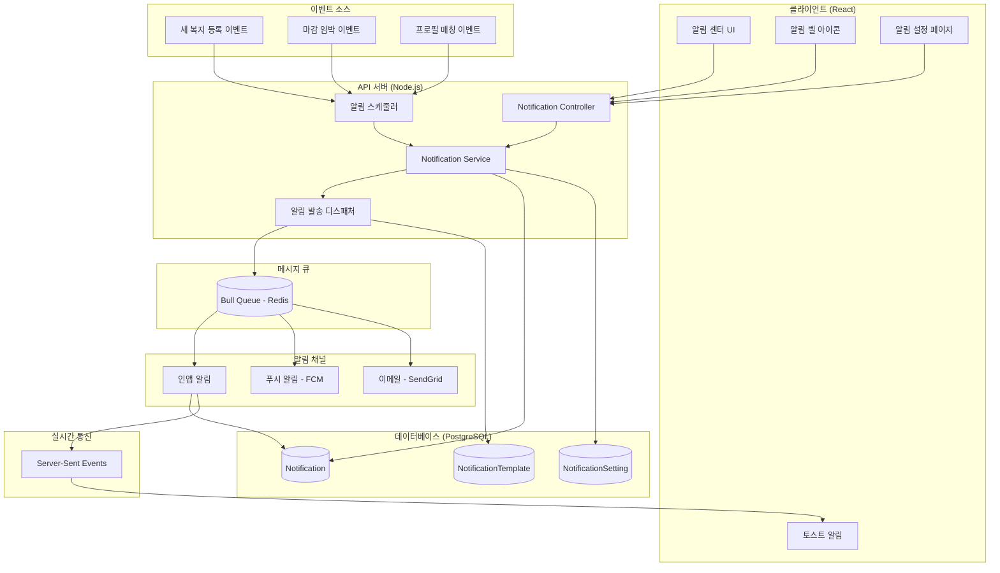

### 1.2 컴포넌트 관계도

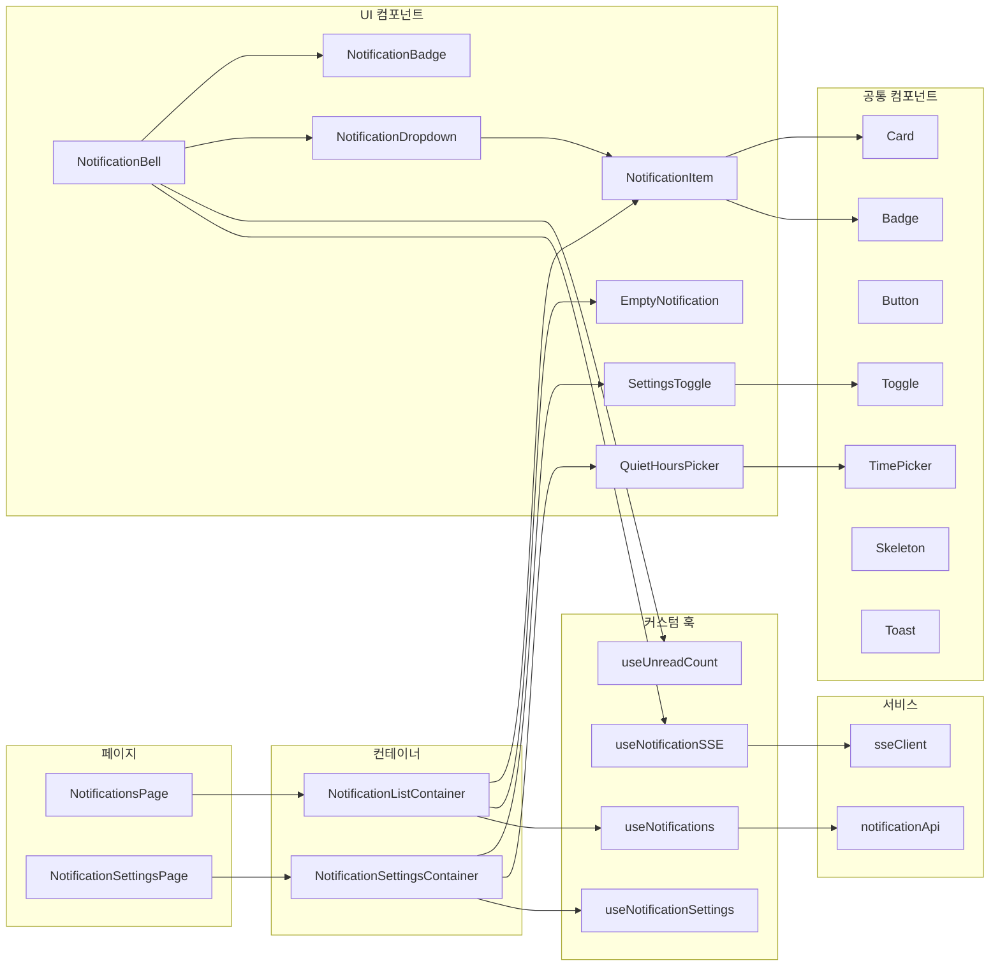

### 1.3 알림 발송 흐름

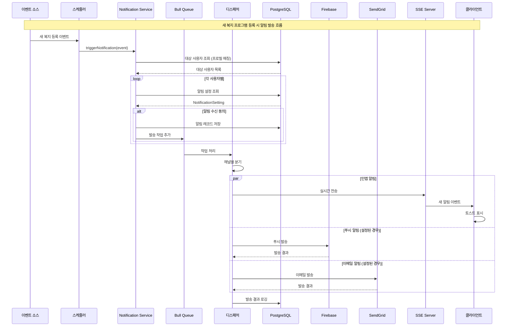

### 1.4 알림 조회 흐름

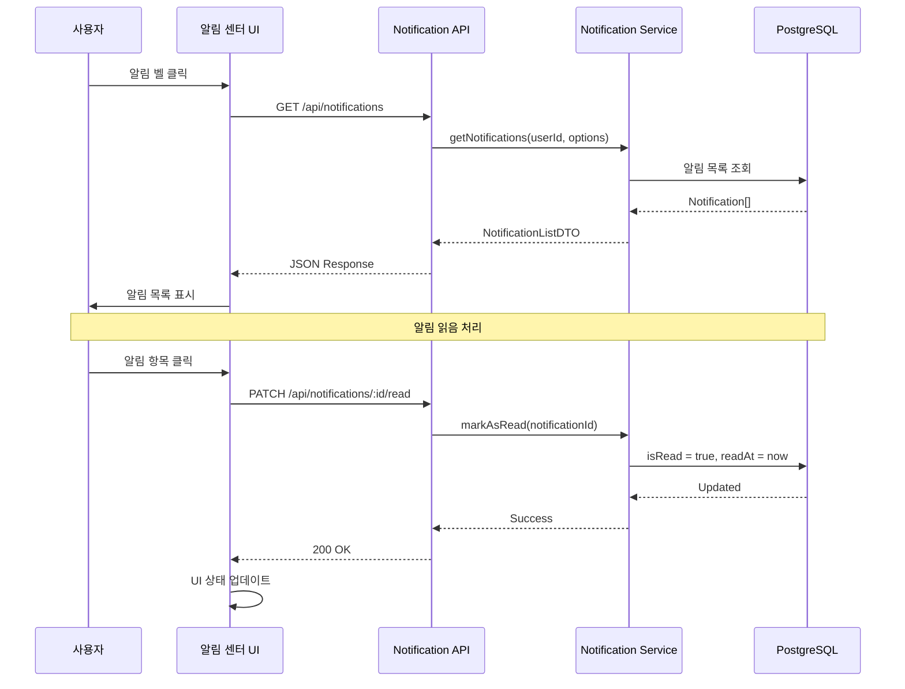

### 1.5 실시간 알림 연결 흐름

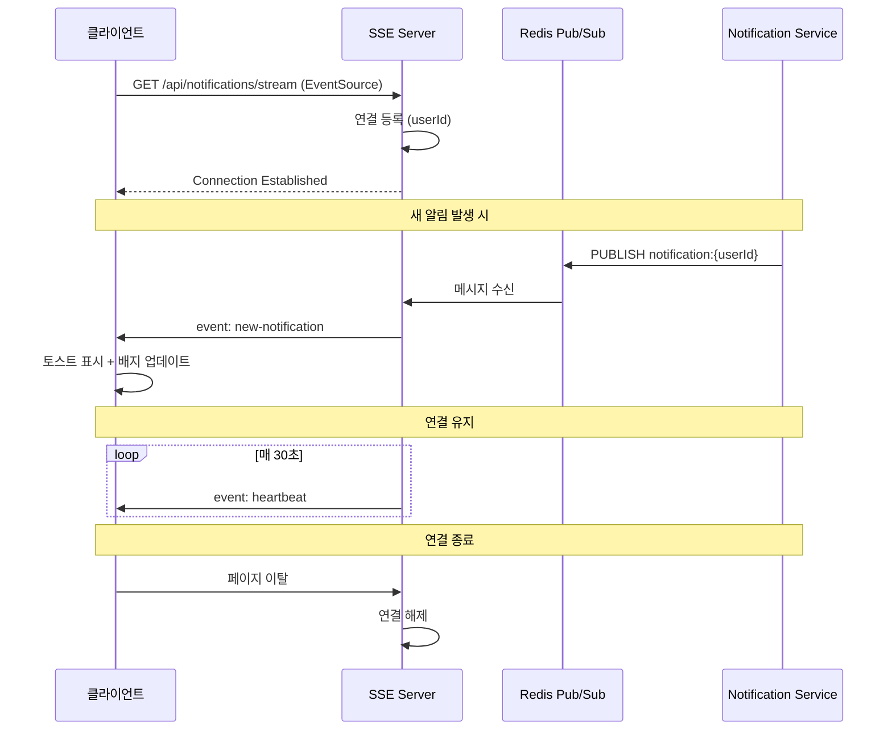

---

## 2. 데이터 모델

### 2.1 TypeScript 타입 정의

```typescript
// ==================== Enums ====================

/** 알림 유형 */
enum NotificationType {
  NEW_WELFARE = 'new_welfare',           // 새 복지 프로그램 등록
  DEADLINE_ALERT = 'deadline_alert',     // 마감 임박 알림
  PROFILE_MATCH = 'profile_match',       // 프로필 매칭 복지 발견
  RECOMMENDATION = 'recommendation',     // 맞춤 추천 알림
  SYSTEM = 'system'                      // 시스템 공지
}

/** 알림 채널 */
enum NotificationChannel {
  IN_APP = 'in_app',                     // 인앱 알림
  PUSH = 'push',                         // 푸시 알림 (FCM)
  EMAIL = 'email'                        // 이메일 알림
}

/** 알림 우선순위 */
enum NotificationPriority {
  LOW = 'low',                           // 낮음
  NORMAL = 'normal',                     // 보통
  HIGH = 'high',                         // 높음 (즉시 발송)
  URGENT = 'urgent'                      // 긴급 (모든 채널 발송)
}

/** 알림 상태 (발송 관련) */
enum NotificationStatus {
  PENDING = 'pending',                   // 발송 대기
  SENT = 'sent',                         // 발송 완료
  FAILED = 'failed',                     // 발송 실패
  CANCELLED = 'cancelled'                // 발송 취소
}

// ==================== 알림 엔티티 ====================

/** 알림 엔티티 */
interface Notification {
  id: string;
  userId: string;
  type: NotificationType;
  title: string;
  message: string;
  linkUrl?: string;                      // 클릭 시 이동할 URL
  metadata?: NotificationMetadata;       // 추가 데이터
  isRead: boolean;
  readAt?: Date;
  createdAt: Date;
}

/** 알림 메타데이터 */
interface NotificationMetadata {
  programId?: string;                    // 연관 복지 프로그램 ID
  programName?: string;                  // 복지 프로그램 이름
  matchScore?: number;                   // 매칭 점수
  deadline?: Date;                       // 마감일
  category?: string;                     // 카테고리
  [key: string]: any;
}

/** 알림 설정 엔티티 */
interface NotificationSetting {
  id: string;
  userId: string;
  
  // 채널별 설정
  inAppEnabled: boolean;                 // 인앱 알림 활성화
  pushEnabled: boolean;                  // 푸시 알림 활성화
  emailEnabled: boolean;                 // 이메일 알림 활성화
  
  // 유형별 설정
  newWelfareEnabled: boolean;            // 새 복지 알림
  deadlineAlertEnabled: boolean;         // 마감 임박 알림
  recommendationEnabled: boolean;        // 추천 알림
  
  // 방해금지 시간
  quietHoursEnabled: boolean;
  quietHoursStart?: string;              // HH:mm 형식
  quietHoursEnd?: string;                // HH:mm 형식
  
  // 이메일 수신 빈도
  emailDigestFrequency: EmailDigestFrequency;
  
  createdAt: Date;
  updatedAt: Date;
}

/** 이메일 수신 빈도 */
enum EmailDigestFrequency {
  REALTIME = 'realtime',                 // 즉시
  DAILY = 'daily',                       // 일간 요약
  WEEKLY = 'weekly',                     // 주간 요약
  NONE = 'none'                          // 수신 안함
}

/** 알림 템플릿 */
interface NotificationTemplate {
  id: string;
  type: NotificationType;
  channel: NotificationChannel;
  titleTemplate: string;                 // 제목 템플릿 (변수 포함)
  messageTemplate: string;               // 본문 템플릿
  isActive: boolean;
  createdAt: Date;
  updatedAt: Date;
}

/** 발송 로그 */
interface NotificationLog {
  id: string;
  notificationId: string;
  channel: NotificationChannel;
  status: NotificationStatus;
  errorMessage?: string;
  sentAt?: Date;
  createdAt: Date;
}

/** FCM 토큰 */
interface UserFcmToken {
  id: string;
  userId: string;
  token: string;
  deviceType: 'web' | 'android' | 'ios';
  isActive: boolean;
  lastUsedAt: Date;
  createdAt: Date;
}

// ==================== DTO ====================

/** 알림 목록 요청 */
interface GetNotificationsRequest {
  type?: NotificationType;               // 유형 필터
  isRead?: boolean;                      // 읽음 상태 필터
  page?: number;
  limit?: number;
}

/** 알림 목록 응답 */
interface GetNotificationsResponse {
  notifications: NotificationItem[];
  totalCount: number;
  unreadCount: number;
  page: number;
  limit: number;
  hasMore: boolean;
}

/** 알림 아이템 (목록용) */
interface NotificationItem {
  id: string;
  type: NotificationType;
  title: string;
  message: string;
  linkUrl?: string;
  isRead: boolean;
  createdAt: Date;
  metadata?: NotificationMetadata;
}

/** 읽지 않은 알림 개수 응답 */
interface UnreadCountResponse {
  count: number;
}

/** 알림 설정 조회 응답 */
interface GetSettingsResponse {
  settings: NotificationSetting;
}

/** 알림 설정 업데이트 요청 */
interface UpdateSettingsRequest {
  inAppEnabled?: boolean;
  pushEnabled?: boolean;
  emailEnabled?: boolean;
  newWelfareEnabled?: boolean;
  deadlineAlertEnabled?: boolean;
  recommendationEnabled?: boolean;
  quietHoursEnabled?: boolean;
  quietHoursStart?: string;
  quietHoursEnd?: string;
  emailDigestFrequency?: EmailDigestFrequency;
}

/** 알림 읽음 처리 요청 */
interface MarkAsReadRequest {
  notificationIds: string[];             // 빈 배열이면 전체 읽음 처리
}

/** 알림 삭제 요청 */
interface DeleteNotificationsRequest {
  notificationIds: string[];             // 빈 배열이면 전체 삭제
}

/** FCM 토큰 등록 요청 */
interface RegisterFcmTokenRequest {
  token: string;
  deviceType: 'web' | 'android' | 'ios';
}

/** 알림 발송 요청 (내부용) */
interface SendNotificationRequest {
  userId: string;
  type: NotificationType;
  title: string;
  message: string;
  linkUrl?: string;
  metadata?: NotificationMetadata;
  priority?: NotificationPriority;
  channels?: NotificationChannel[];      // 지정하지 않으면 설정에 따름
  scheduledAt?: Date;                    // 예약 발송 시간
}

/** 대량 알림 발송 요청 (내부용) */
interface BulkSendNotificationRequest {
  userIds: string[];
  type: NotificationType;
  title: string;
  message: string;
  linkUrl?: string;
  metadata?: NotificationMetadata;
  priority?: NotificationPriority;
}

/** SSE 이벤트 */
interface SSENotificationEvent {
  event: 'new-notification' | 'heartbeat';
  data: NotificationItem | null;
}
```

### 2.2 데이터베이스 스키마

```sql
-- 알림 테이블
CREATE TABLE notification (
    id UUID PRIMARY KEY DEFAULT gen_random_uuid(),
    user_id UUID NOT NULL REFERENCES user_profile(id) ON DELETE CASCADE,
    type VARCHAR(50) NOT NULL,
    title VARCHAR(200) NOT NULL,
    message TEXT NOT NULL,
    link_url VARCHAR(500),
    metadata JSONB,
    is_read BOOLEAN DEFAULT FALSE,
    read_at TIMESTAMP WITH TIME ZONE,
    created_at TIMESTAMP WITH TIME ZONE DEFAULT CURRENT_TIMESTAMP
);

-- 인덱스
CREATE INDEX idx_notification_user_id ON notification(user_id);
CREATE INDEX idx_notification_user_unread ON notification(user_id, is_read) WHERE is_read = FALSE;
CREATE INDEX idx_notification_user_created ON notification(user_id, created_at DESC);
CREATE INDEX idx_notification_type ON notification(type);

-- 알림 설정 테이블
CREATE TABLE notification_setting (
    id UUID PRIMARY KEY DEFAULT gen_random_uuid(),
    user_id UUID NOT NULL UNIQUE REFERENCES user_profile(id) ON DELETE CASCADE,
    
    -- 채널별 설정
    in_app_enabled BOOLEAN DEFAULT TRUE,
    push_enabled BOOLEAN DEFAULT TRUE,
    email_enabled BOOLEAN DEFAULT TRUE,
    
    -- 유형별 설정
    new_welfare_enabled BOOLEAN DEFAULT TRUE,
    deadline_alert_enabled BOOLEAN DEFAULT TRUE,
    recommendation_enabled BOOLEAN DEFAULT TRUE,
    
    -- 방해금지 시간
    quiet_hours_enabled BOOLEAN DEFAULT FALSE,
    quiet_hours_start TIME,
    quiet_hours_end TIME,
    
    -- 이메일 수신 빈도
    email_digest_frequency VARCHAR(20) DEFAULT 'daily',
    
    created_at TIMESTAMP WITH TIME ZONE DEFAULT CURRENT_TIMESTAMP,
    updated_at TIMESTAMP WITH TIME ZONE DEFAULT CURRENT_TIMESTAMP
);

CREATE INDEX idx_notification_setting_user ON notification_setting(user_id);

-- 알림 템플릿 테이블
CREATE TABLE notification_template (
    id UUID PRIMARY KEY DEFAULT gen_random_uuid(),
    type VARCHAR(50) NOT NULL,
    channel VARCHAR(20) NOT NULL,
    title_template VARCHAR(200) NOT NULL,
    message_template TEXT NOT NULL,
    is_active BOOLEAN DEFAULT TRUE,
    created_at TIMESTAMP WITH TIME ZONE DEFAULT CURRENT_TIMESTAMP,
    updated_at TIMESTAMP WITH TIME ZONE DEFAULT CURRENT_TIMESTAMP,
    
    UNIQUE(type, channel)
);

-- 발송 로그 테이블
CREATE TABLE notification_log (
    id UUID PRIMARY KEY DEFAULT gen_random_uuid(),
    notification_id UUID NOT NULL REFERENCES notification(id) ON DELETE CASCADE,
    channel VARCHAR(20) NOT NULL,
    status VARCHAR(20) NOT NULL,
    error_message TEXT,
    sent_at TIMESTAMP WITH TIME ZONE,
    created_at TIMESTAMP WITH TIME ZONE DEFAULT CURRENT_TIMESTAMP
);

CREATE INDEX idx_notification_log_notification ON notification_log(notification_id);
CREATE INDEX idx_notification_log_status ON notification_log(status, created_at);

-- FCM 토큰 테이블
CREATE TABLE user_fcm_token (
    id UUID PRIMARY KEY DEFAULT gen_random_uuid(),
    user_id UUID NOT NULL REFERENCES user_profile(id) ON DELETE CASCADE,
    token VARCHAR(500) NOT NULL UNIQUE,
    device_type VARCHAR(20) NOT NULL,
    is_active BOOLEAN DEFAULT TRUE,
    last_used_at TIMESTAMP WITH TIME ZONE DEFAULT CURRENT_TIMESTAMP,
    created_at TIMESTAMP WITH TIME ZONE DEFAULT CURRENT_TIMESTAMP
);

CREATE INDEX idx_fcm_token_user ON user_fcm_token(user_id);
CREATE INDEX idx_fcm_token_active ON user_fcm_token(user_id, is_active) WHERE is_active = TRUE;

-- 알림 예약 테이블
CREATE TABLE scheduled_notification (
    id UUID PRIMARY KEY DEFAULT gen_random_uuid(),
    user_id UUID REFERENCES user_profile(id) ON DELETE CASCADE,
    user_ids UUID[], -- 대량 발송용
    type VARCHAR(50) NOT NULL,
    title VARCHAR(200) NOT NULL,
    message TEXT NOT NULL,
    link_url VARCHAR(500),
    metadata JSONB,
    priority VARCHAR(20) DEFAULT 'normal',
    scheduled_at TIMESTAMP WITH TIME ZONE NOT NULL,
    status VARCHAR(20) DEFAULT 'pending',
    processed_at TIMESTAMP WITH TIME ZONE,
    created_at TIMESTAMP WITH TIME ZONE DEFAULT CURRENT_TIMESTAMP
);

CREATE INDEX idx_scheduled_notification_status ON scheduled_notification(status, scheduled_at) 
    WHERE status = 'pending';
```

### 2.3 알림 템플릿 초기 데이터

```sql
-- 새 복지 프로그램 알림 템플릿
INSERT INTO notification_template (type, channel, title_template, message_template) VALUES
('new_welfare', 'in_app', '새로운 복지 혜택 안내', '{{programName}} 혜택이 새로 등록되었습니다. 지금 확인해보세요!'),
('new_welfare', 'push', '🎉 새 복지 혜택!', '{{programName}} - 회원님께 맞는 새 혜택이 등록되었어요'),
('new_welfare', 'email', '{{programName}} - 새로운 복지 혜택을 확인하세요', '안녕하세요, {{userName}}님!\n\n회원님의 프로필과 매칭되는 새로운 복지 혜택이 등록되었습니다.\n\n■ {{programName}}\n{{programSummary}}\n\n자세한 내용은 아래 링크를 통해 확인해주세요.');

-- 마감 임박 알림 템플릿
INSERT INTO notification_template (type, channel, title_template, message_template) VALUES
('deadline_alert', 'in_app', '마감 임박 알림', '{{programName}} 신청 마감이 {{daysLeft}}일 남았습니다!'),
('deadline_alert', 'push', '⏰ 마감 임박!', '{{programName}} 신청 마감 {{daysLeft}}일 전'),
('deadline_alert', 'email', '{{programName}} 신청 마감이 다가옵니다', '안녕하세요, {{userName}}님!\n\n관심 있으셨던 복지 혜택의 신청 마감이 다가오고 있습니다.\n\n■ {{programName}}\n■ 마감일: {{deadline}}\n\n서둘러 신청해주세요!');

-- 프로필 매칭 알림 템플릿
INSERT INTO notification_template (type, channel, title_template, message_template) VALUES
('profile_match', 'in_app', '맞춤 복지 추천', '회원님의 프로필과 {{matchScore}}% 일치하는 {{count}}개의 복지 혜택을 발견했습니다.'),
('profile_match', 'push', '💡 맞춤 추천', '{{matchScore}}% 일치! {{programName}} 확인해보세요'),
('profile_match', 'email', '회원님을 위한 맞춤 복지 추천', '안녕하세요, {{userName}}님!\n\n회원님의 프로필을 분석한 결과, 아래 복지 혜택들이 적합할 것으로 예상됩니다.\n\n{{recommendationList}}\n\n지금 바로 확인해보세요!');
```

---

## 3. API/인터페이스 설계

### 3.1 REST API 명세

#### 알림 목록 조회
```
GET /api/notifications

Query Parameters:
  - type: NotificationType (optional) - 알림 유형 필터
  - isRead: boolean (optional) - 읽음 상태 필터
  - page: number (optional, default: 1) - 페이지 번호
  - limit: number (optional, default: 20, max: 50) - 페이지당 개수

Headers:
  - Authorization: Bearer {token}

Response: 200 OK
{
  "notifications": [
    {
      "id": "uuid",
      "type": "new_welfare",
      "title": "새로운 복지 혜택 안내",
      "message": "청년 월세 지원 혜택이 새로 등록되었습니다.",
      "linkUrl": "/recommendations/uuid",
      "isRead": false,
      "createdAt": "2026-02-05T10:00:00Z",
      "metadata": {
        "programId": "uuid",
        "programName": "청년 월세 지원",
        "matchScore": 95
      }
    }
  ],
  "totalCount": 45,
  "unreadCount": 12,
  "page": 1,
  "limit": 20,
  "hasMore": true
}

Error Responses:
  - 401 Unauthorized: 인증 실패
```

#### 읽지 않은 알림 개수 조회
```
GET /api/notifications/unread-count

Headers:
  - Authorization: Bearer {token}

Response: 200 OK
{
  "count": 12
}
```

#### 알림 읽음 처리
```
PATCH /api/notifications/read

Headers:
  - Authorization: Bearer {token}
  - Content-Type: application/json

Request Body:
{
  "notificationIds": ["uuid1", "uuid2"]  // 빈 배열이면 전체 읽음 처리
}

Response: 200 OK
{
  "success": true,
  "updatedCount": 2
}
```

#### 단일 알림 읽음 처리
```
PATCH /api/notifications/:id/read

Path Parameters:
  - id: string (required) - 알림 ID

Headers:
  - Authorization: Bearer {token}

Response: 200 OK
{
  "success": true,
  "readAt": "2026-02-05T10:30:00Z"
}

Error Responses:
  - 401 Unauthorized: 인증 실패
  - 404 Not Found: 알림 없음
```

#### 알림 삭제
```
DELETE /api/notifications

Headers:
  - Authorization: Bearer {token}
  - Content-Type: application/json

Request Body:
{
  "notificationIds": ["uuid1", "uuid2"]  // 빈 배열이면 전체 삭제
}

Response: 200 OK
{
  "success": true,
  "deletedCount": 2
}
```

#### 단일 알림 삭제
```
DELETE /api/notifications/:id

Path Parameters:
  - id: string (required) - 알림 ID

Headers:
  - Authorization: Bearer {token}

Response: 200 OK
{
  "success": true
}

Error Responses:
  - 401 Unauthorized: 인증 실패
  - 404 Not Found: 알림 없음
```

#### 알림 설정 조회
```
GET /api/notifications/settings

Headers:
  - Authorization: Bearer {token}

Response: 200 OK
{
  "settings": {
    "id": "uuid",
    "userId": "uuid",
    "inAppEnabled": true,
    "pushEnabled": true,
    "emailEnabled": true,
    "newWelfareEnabled": true,
    "deadlineAlertEnabled": true,
    "recommendationEnabled": true,
    "quietHoursEnabled": false,
    "quietHoursStart": null,
    "quietHoursEnd": null,
    "emailDigestFrequency": "daily",
    "createdAt": "2026-02-01T00:00:00Z",
    "updatedAt": "2026-02-05T10:00:00Z"
  }
}
```

#### 알림 설정 업데이트
```
PATCH /api/notifications/settings

Headers:
  - Authorization: Bearer {token}
  - Content-Type: application/json

Request Body:
{
  "pushEnabled": false,
  "quietHoursEnabled": true,
  "quietHoursStart": "22:00",
  "quietHoursEnd": "08:00",
  "emailDigestFrequency": "weekly"
}

Response: 200 OK
{
  "success": true,
  "settings": { ... }
}

Error Responses:
  - 400 Bad Request: 유효하지 않은 시간 형식
  - 401 Unauthorized: 인증 실패
```

#### FCM 토큰 등록
```
POST /api/notifications/fcm-token

Headers:
  - Authorization: Bearer {token}
  - Content-Type: application/json

Request Body:
{
  "token": "fcm_token_string",
  "deviceType": "web"
}

Response: 200 OK
{
  "success": true
}

Error Responses:
  - 400 Bad Request: 유효하지 않은 토큰
  - 401 Unauthorized: 인증 실패
```

#### FCM 토큰 삭제
```
DELETE /api/notifications/fcm-token

Headers:
  - Authorization: Bearer {token}
  - Content-Type: application/json

Request Body:
{
  "token": "fcm_token_string"
}

Response: 200 OK
{
  "success": true
}
```

#### 실시간 알림 스트림 (SSE)
```
GET /api/notifications/stream

Headers:
  - Authorization: Bearer {token}
  - Accept: text/event-stream

Response: 200 OK (Event Stream)
Content-Type: text/event-stream

event: new-notification
data: {"id":"uuid","type":"new_welfare","title":"새로운 복지 혜택","message":"...","createdAt":"..."}

event: heartbeat
data: null
```

### 3.2 내부 서비스 인터페이스

```typescript
// ==================== Notification Service ====================

interface INotificationService {
  // 알림 조회
  getNotifications(userId: string, options: GetNotificationsRequest): Promise<GetNotificationsResponse>;
  getUnreadCount(userId: string): Promise<number>;
  getNotificationById(notificationId: string, userId: string): Promise<Notification | null>;
  
  // 알림 상태 관리
  markAsRead(userId: string, notificationIds: string[]): Promise<number>;
  markAllAsRead(userId: string): Promise<number>;
  deleteNotifications(userId: string, notificationIds: string[]): Promise<number>;
  deleteAllNotifications(userId: string): Promise<number>;
  
  // 알림 발송
  sendNotification(request: SendNotificationRequest): Promise<Notification>;
  sendBulkNotification(request: BulkSendNotificationRequest): Promise<number>;
  scheduleNotification(request: SendNotificationRequest): Promise<string>;
  
  // 설정 관리
  getSettings(userId: string): Promise<NotificationSetting>;
  updateSettings(userId: string, settings: UpdateSettingsRequest): Promise<NotificationSetting>;
  initializeSettings(userId: string): Promise<NotificationSetting>;
}

// ==================== Notification Dispatcher ====================

interface INotificationDispatcher {
  dispatch(notification: Notification, channels: NotificationChannel[]): Promise<void>;
  dispatchToChannel(notification: Notification, channel: NotificationChannel): Promise<boolean>;
}

// ==================== Channel Adapters ====================

interface IInAppNotificationAdapter {
  send(notification: Notification): Promise<void>;
  broadcast(userIds: string[], notification: Notification): Promise<void>;
}

interface IPushNotificationAdapter {
  send(userId: string, notification: Notification): Promise<boolean>;
  sendBulk(userIds: string[], notification: Notification): Promise<Map<string, boolean>>;
  registerToken(userId: string, token: string, deviceType: string): Promise<void>;
  removeToken(token: string): Promise<void>;
}

interface IEmailNotificationAdapter {
  send(userId: string, notification: Notification): Promise<boolean>;
  sendBulk(userIds: string[], notification: Notification): Promise<Map<string, boolean>>;
  sendDigest(userId: string, notifications: Notification[]): Promise<boolean>;
}

// ==================== SSE Manager ====================

interface ISSEManager {
  addConnection(userId: string, response: Response): void;
  removeConnection(userId: string, response: Response): void;
  sendToUser(userId: string, event: SSENotificationEvent): void;
  broadcast(event: SSENotificationEvent): void;
  getActiveConnections(): number;
}

// ==================== Scheduler ====================

interface INotificationScheduler {
  scheduleNewWelfareNotification(programId: string): Promise<void>;
  scheduleDeadlineAlerts(): Promise<void>;
  processScheduledNotifications(): Promise<number>;
}
```

### 3.3 이벤트 인터페이스

```typescript
// ==================== Event Types ====================

/** 새 복지 프로그램 등록 이벤트 */
interface NewWelfareProgramEvent {
  type: 'NEW_WELFARE_PROGRAM';
  programId: string;
  programName: string;
  category: string;
  targetGroups: string[];
  createdAt: Date;
}

/** 복지 프로그램 마감 임박 이벤트 */
interface WelfareDeadlineEvent {
  type: 'WELFARE_DEADLINE';
  programId: string;
  programName: string;
  deadline: Date;
  daysLeft: number;
}

/** 프로필 업데이트 이벤트 */
interface ProfileUpdatedEvent {
  type: 'PROFILE_UPDATED';
  userId: string;
  updatedFields: string[];
}

// ==================== Event Handler ====================

interface INotificationEventHandler {
  handleNewWelfareProgram(event: NewWelfareProgramEvent): Promise<void>;
  handleWelfareDeadline(event: WelfareDeadlineEvent): Promise<void>;
  handleProfileUpdated(event: ProfileUpdatedEvent): Promise<void>;
}
```

---

## 4. 파일 구조

### 4.1 프론트엔드 (src/features/notification)

```
src/features/notification/
├── index.ts                          # Public exports
├── api/
│   ├── index.ts
│   ├── notificationApi.ts            # API 클라이언트
│   └── sseClient.ts                  # SSE 클라이언트
├── components/
│   ├── index.ts
│   ├── NotificationBell/
│   │   ├── NotificationBell.tsx      # 알림 벨 아이콘 + 배지
│   │   ├── NotificationBell.test.tsx
│   │   └── index.ts
│   ├── NotificationDropdown/
│   │   ├── NotificationDropdown.tsx  # 드롭다운 알림 목록
│   │   ├── NotificationDropdown.test.tsx
│   │   └── index.ts
│   ├── NotificationItem/
│   │   ├── NotificationItem.tsx      # 알림 항목
│   │   ├── NotificationItem.test.tsx
│   │   └── index.ts
│   ├── NotificationList/
│   │   ├── NotificationList.tsx      # 알림 목록 컨테이너
│   │   ├── NotificationList.test.tsx
│   │   └── index.ts
│   ├── NotificationToast/
│   │   ├── NotificationToast.tsx     # 토스트 알림
│   │   ├── NotificationToast.test.tsx
│   │   └── index.ts
│   ├── NotificationSettings/
│   │   ├── NotificationSettings.tsx  # 알림 설정 폼
│   │   ├── SettingsToggle.tsx        # 토글 설정 항목
│   │   ├── QuietHoursPicker.tsx      # 방해금지 시간 설정
│   │   ├── NotificationSettings.test.tsx
│   │   └── index.ts
│   └── EmptyNotification/
│       ├── EmptyNotification.tsx     # 빈 상태 UI
│       └── index.ts
├── hooks/
│   ├── index.ts
│   ├── useNotifications.ts           # 알림 목록 훅
│   ├── useNotificationSettings.ts    # 알림 설정 훅
│   ├── useNotificationSSE.ts         # SSE 연결 훅
│   ├── useUnreadCount.ts             # 읽지 않은 개수 훅
│   └── useNotificationToast.ts       # 토스트 표시 훅
├── pages/
│   ├── index.ts
│   ├── NotificationsPage.tsx         # 알림 센터 페이지
│   └── NotificationSettingsPage.tsx  # 알림 설정 페이지
├── types/
│   ├── index.ts
│   └── notification.types.ts         # 타입 정의
├── constants/
│   ├── index.ts
│   └── notification.constants.ts     # 상수 정의
├── utils/
│   ├── index.ts
│   ├── notificationHelpers.ts        # 헬퍼 함수
│   └── timeAgo.ts                    # 시간 포맷팅
└── schemas/
    ├── index.ts
    └── notification.schemas.ts       # Zod 스키마
```

### 4.2 백엔드 (server/src/modules/notification)

```
server/src/modules/notification/
├── notification.module.ts            # 모듈 정의
├── notification.controller.ts        # REST API 컨트롤러
├── notification.service.ts           # 비즈니스 로직
├── notification.repository.ts        # DB 접근
├── controllers/
│   └── sse.controller.ts             # SSE 엔드포인트
├── services/
│   ├── dispatcher.service.ts         # 알림 발송 디스패처
│   ├── scheduler.service.ts          # 스케줄러 서비스
│   └── template.service.ts           # 템플릿 처리 서비스
├── adapters/
│   ├── inApp.adapter.ts              # 인앱 알림 어댑터
│   ├── push.adapter.ts               # FCM 푸시 어댑터
│   └── email.adapter.ts              # 이메일 어댑터
├── handlers/
│   └── event.handler.ts              # 이벤트 핸들러
├── dto/
│   ├── index.ts
│   ├── get-notifications.dto.ts
│   ├── update-settings.dto.ts
│   ├── mark-as-read.dto.ts
│   └── register-fcm-token.dto.ts
├── entities/
│   ├── index.ts
│   ├── notification.entity.ts
│   ├── notification-setting.entity.ts
│   ├── notification-template.entity.ts
│   ├── notification-log.entity.ts
│   └── user-fcm-token.entity.ts
├── interfaces/
│   ├── index.ts
│   ├── notification.interface.ts
│   └── dispatcher.interface.ts
├── constants/
│   └── notification.constants.ts
├── managers/
│   └── sse.manager.ts                # SSE 연결 관리
├── jobs/
│   ├── deadline-alert.job.ts         # 마감 임박 알림 작업
│   ├── email-digest.job.ts           # 이메일 요약 발송 작업
│   └── cleanup.job.ts                # 오래된 알림 정리 작업
└── __tests__/
    ├── notification.service.test.ts
    ├── dispatcher.service.test.ts
    └── notification.controller.test.ts
```

### 4.3 데이터베이스 마이그레이션

```
server/migrations/
├── 015_create_notification.sql
├── 016_create_notification_setting.sql
├── 017_create_notification_template.sql
├── 018_create_notification_log.sql
├── 019_create_user_fcm_token.sql
├── 020_create_scheduled_notification.sql
└── 021_seed_notification_templates.sql
```

---

## 5. 의존성

### 5.1 프론트엔드 의존성

```json
{
  "dependencies": {
    "react": "^18.2.0",
    "react-dom": "^18.2.0",
    "@tanstack/react-query": "^5.0.0",
    "axios": "^1.6.0",
    "date-fns": "^3.0.0",
    "zod": "^3.22.0",
    "zustand": "^4.4.0",
    "react-hot-toast": "^2.4.0",
    "clsx": "^2.0.0",
    "@headlessui/react": "^1.7.0",
    "@heroicons/react": "^2.0.0"
  },
  "devDependencies": {
    "@testing-library/react": "^14.0.0",
    "@testing-library/jest-dom": "^6.0.0",
    "vitest": "^1.0.0"
  }
}
```

### 5.2 백엔드 의존성

```json
{
  "dependencies": {
    "express": "^4.18.0",
    "pg": "^8.11.0",
    "firebase-admin": "^12.0.0",
    "@sendgrid/mail": "^8.0.0",
    "bull": "^4.12.0",
    "ioredis": "^5.3.0",
    "node-cron": "^3.0.0",
    "handlebars": "^4.7.0",
    "uuid": "^9.0.0",
    "date-fns": "^3.0.0",
    "zod": "^3.22.0"
  },
  "devDependencies": {
    "@types/express": "^4.17.0",
    "@types/node": "^20.0.0",
    "jest": "^29.0.0",
    "ts-jest": "^29.0.0"
  }
}
```

### 5.3 외부 서비스

| 서비스 | 용도 | 설정 필요 항목 |
|--------|------|---------------|
| Firebase Cloud Messaging | 푸시 알림 | Service Account JSON, VAPID 키 |
| SendGrid | 이메일 발송 | API Key, 발신자 이메일, 템플릿 |
| Redis | Bull Queue, SSE Pub/Sub | Host, Port, Password |

### 5.4 내부 모듈 의존성

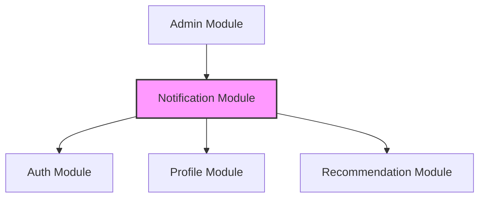

---

## 6. 구현 순서

### 6.1 Phase 1: 기반 구축 (1주)

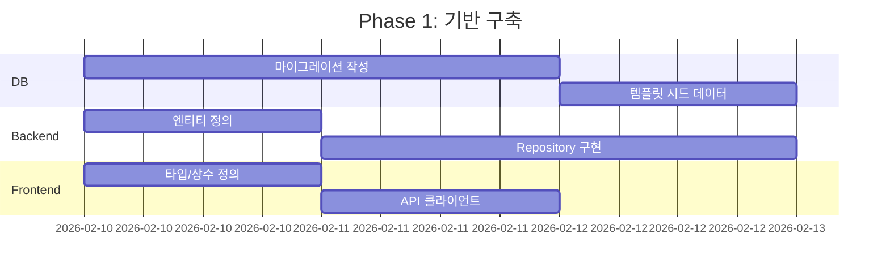

**작업 목록:**
1. [ ] 데이터베이스 마이그레이션 파일 작성 (015-021)
2. [ ] 알림 템플릿 초기 데이터 삽입
3. [ ] 백엔드 엔티티 및 인터페이스 정의
4. [ ] NotificationRepository 구현
5. [ ] 프론트엔드 타입, 상수, 스키마 정의
6. [ ] API 클라이언트 (notificationApi.ts) 구현

### 6.2 Phase 2: 핵심 API 개발 (1.5주)

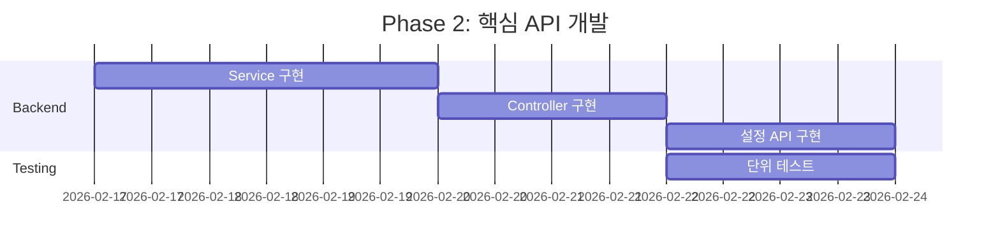

**작업 목록:**
1. [ ] NotificationService 구현
   - getNotifications, getUnreadCount
   - markAsRead, markAllAsRead
   - deleteNotifications, deleteAllNotifications
2. [ ] NotificationController 구현 (REST API)
3. [ ] 알림 설정 API 구현 (getSettings, updateSettings)
4. [ ] DTO 및 입력 검증 구현
5. [ ] 단위 테스트 작성

### 6.3 Phase 3: 프론트엔드 UI 개발 (1.5주)

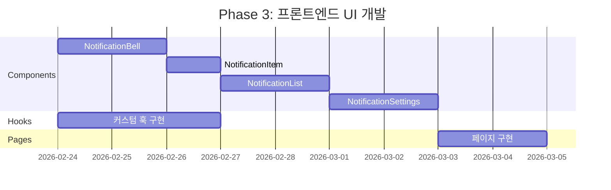

**작업 목록:**
1. [ ] 커스텀 훅 구현
   - useNotifications (목록 조회, 무한 스크롤)
   - useUnreadCount (읽지 않은 개수)
   - useNotificationSettings (설정 관리)
2. [ ] UI 컴포넌트 구현
   - NotificationBell (배지 포함)
   - NotificationDropdown
   - NotificationItem
   - NotificationList
   - EmptyNotification
3. [ ] 알림 설정 컴포넌트 구현
   - NotificationSettings
   - SettingsToggle
   - QuietHoursPicker
4. [ ] 페이지 구현
   - NotificationsPage
   - NotificationSettingsPage
5. [ ] 라우팅 설정 추가

### 6.4 Phase 4: 실시간 알림 (1주)

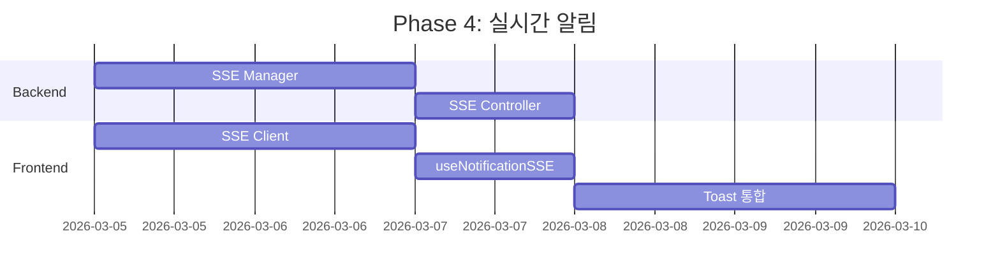

**작업 목록:**
1. [ ] SSE Manager 구현 (연결 관리, 메시지 발송)
2. [ ] SSE Controller 구현 (/api/notifications/stream)
3. [ ] Redis Pub/Sub 연동
4. [ ] SSE Client 구현 (sseClient.ts)
5. [ ] useNotificationSSE 훅 구현
6. [ ] NotificationToast 컴포넌트 구현
7. [ ] 헤더/레이아웃에 실시간 알림 통합

### 6.5 Phase 5: 알림 발송 시스템 (1.5주)

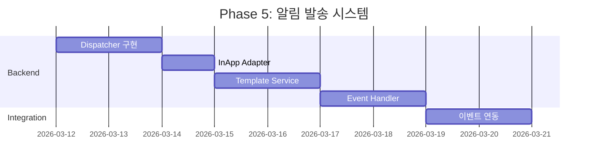

**작업 목록:**
1. [ ] DispatcherService 구현
2. [ ] InAppNotificationAdapter 구현
3. [ ] TemplateService 구현 (Handlebars 템플릿)
4. [ ] 알림 발송 메서드 구현 (sendNotification, sendBulkNotification)
5. [ ] Bull Queue 설정 및 Worker 구현
6. [ ] EventHandler 구현
7. [ ] 새 복지 프로그램 등록 이벤트 연동

### 6.6 Phase 6: 푸시/이메일 알림 (1주, 선택)

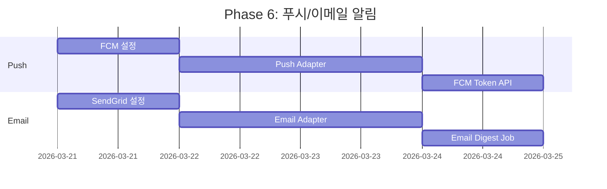

**작업 목록:**
1. [ ] Firebase Admin SDK 설정
2. [ ] PushNotificationAdapter 구현
3. [ ] FCM 토큰 등록/삭제 API
4. [ ] SendGrid 설정
5. [ ] EmailNotificationAdapter 구현
6. [ ] 이메일 요약 발송 Job 구현

### 6.7 Phase 7: 스케줄러 및 마무리 (1주)

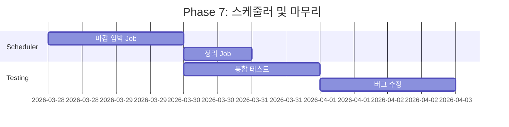

**작업 목록:**
1. [ ] DeadlineAlertJob 구현 (마감 3일/7일 전 알림)
2. [ ] CleanupJob 구현 (30일 이상 지난 알림 정리)
3. [ ] node-cron 스케줄 설정
4. [ ] 통합 테스트 수행
5. [ ] 버그 수정 및 최적화
6. [ ] 문서 업데이트

---

## 7. 추가 고려사항

### 7.1 성능 최적화

- **알림 조회 최적화**: 사용자별 인덱스 활용, 커서 기반 페이지네이션 고려
- **대량 발송 처리**: Bull Queue를 통한 비동기 처리, 배치 크기 조절
- **SSE 연결 관리**: 최대 연결 수 제한, 비활성 연결 정리

### 7.2 보안 고려사항

- FCM 토큰 검증 및 사용자 소유권 확인
- 알림 조회/수정 시 사용자 권한 검증
- 이메일 발송 시 스팸 방지 정책 준수

### 7.3 모니터링

- 알림 발송 성공/실패율 모니터링
- SSE 연결 수 모니터링
- Queue 적체 상태 모니터링

### 7.4 확장 계획

| 단계 | 기능 | 예상 시기 |
|------|------|----------|
| 2차 | SMS 알림 채널 추가 | 추후 |
| 2차 | 카카오 알림톡 연동 | 추후 |
| 3차 | 알림 A/B 테스트 | 추후 |
| 3차 | 알림 통계 대시보드 | 추후 |
