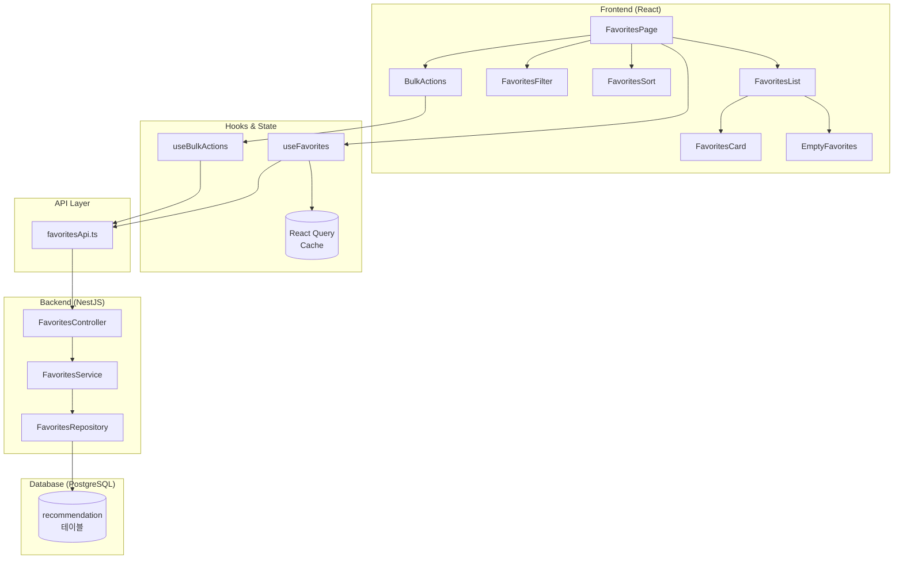
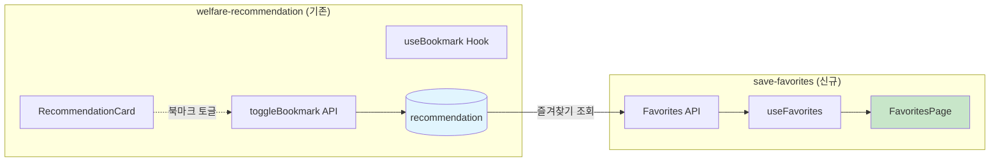
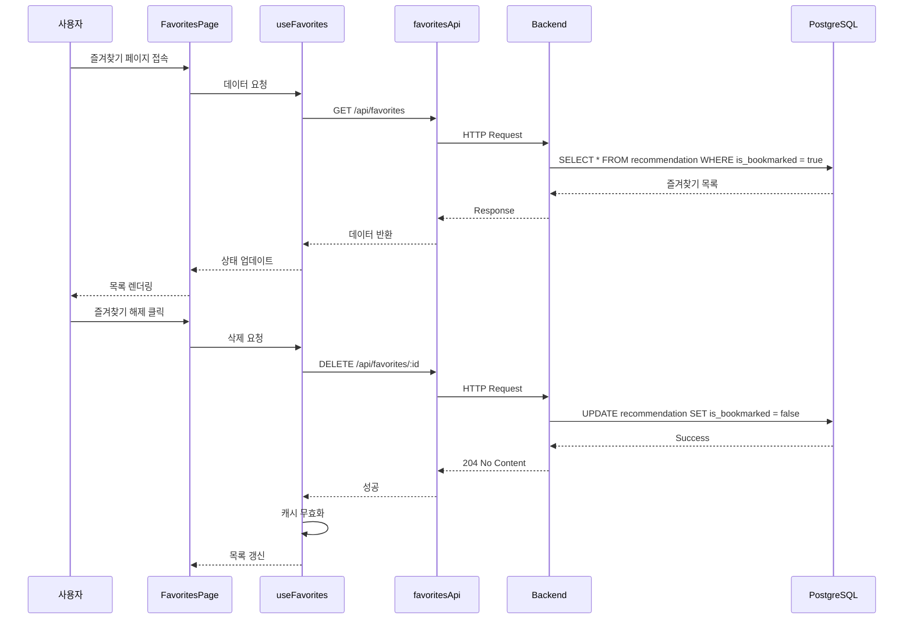
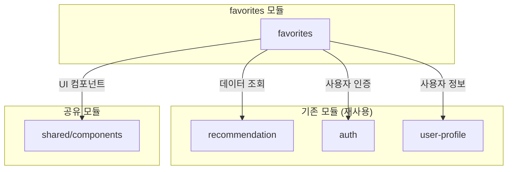
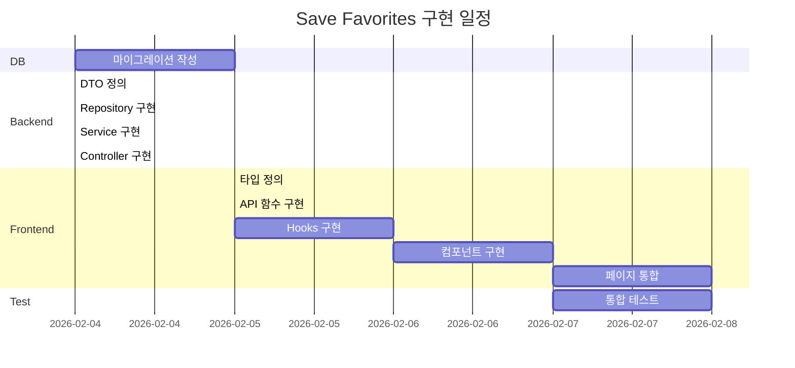

# 즐겨찾기 저장 (Save Favorites) - 설계 문서

> 작성일: 2026-02-03  
> 작성자: AI Assistant  
> 상태: 설계 완료

---

## 1. 아키텍처 개요

### 1.1 전체 시스템 구조



### 1.2 기존 시스템 연동



### 1.3 데이터 흐름



---

## 2. 데이터 모델

### 2.1 데이터베이스 스키마

#### 기존 테이블 수정 (recommendation)

```sql
-- bookmarked_at 컬럼 추가 (마이그레이션)
ALTER TABLE recommendation 
ADD COLUMN bookmarked_at TIMESTAMP DEFAULT NULL;

-- 인덱스 추가 (즐겨찾기 조회 최적화)
CREATE INDEX idx_recommendation_bookmarked 
ON recommendation(user_id, is_bookmarked) 
WHERE is_bookmarked = true;

-- 기존 북마크 데이터 bookmarked_at 초기화
UPDATE recommendation 
SET bookmarked_at = updated_at 
WHERE is_bookmarked = true AND bookmarked_at IS NULL;
```

#### 최종 recommendation 테이블 구조

```sql
recommendation (
  id              UUID PRIMARY KEY DEFAULT gen_random_uuid(),
  user_id         UUID NOT NULL REFERENCES user_profile(id),
  program_id      VARCHAR(100) NOT NULL,
  program_name    VARCHAR(255) NOT NULL,
  program_summary TEXT,
  category        VARCHAR(50),
  match_score     DECIMAL(5,2),
  match_reasons   JSONB,
  deadline        DATE,
  
  -- 즐겨찾기 관련
  is_bookmarked   BOOLEAN DEFAULT false,
  bookmarked_at   TIMESTAMP DEFAULT NULL,
  
  created_at      TIMESTAMP DEFAULT CURRENT_TIMESTAMP,
  updated_at      TIMESTAMP DEFAULT CURRENT_TIMESTAMP,
  
  UNIQUE(user_id, program_id)
)
```

### 2.2 TypeScript 타입 정의

#### favorites.types.ts

```typescript
// ============================================
// 즐겨찾기 핵심 타입
// ============================================

/**
 * 즐겨찾기 아이템 (조회용)
 */
export interface Favorite {
  id: string;
  programId: string;
  programName: string;
  programSummary: string;
  category: FavoriteCategory;
  matchScore: number;
  matchReasons: MatchReason[];
  deadline: string | null;
  bookmarkedAt: string;
  daysUntilDeadline: number | null;
  isDeadlineNear: boolean; // 7일 이내
}

/**
 * 매칭 사유
 */
export interface MatchReason {
  field: string;
  description: string;
  impact: 'high' | 'medium' | 'low';
}

/**
 * 즐겨찾기 카테고리
 */
export type FavoriteCategory = 
  | 'employment'      // 취업·창업
  | 'housing'         // 주거·금융
  | 'education'       // 교육
  | 'healthcare'      // 건강·의료
  | 'childcare'       // 임신·육아
  | 'culture'         // 문화·생활
  | 'safety'          // 안전·환경
  | 'other';          // 기타

// ============================================
// API 요청/응답 타입
// ============================================

/**
 * 즐겨찾기 목록 조회 파라미터
 */
export interface GetFavoritesParams {
  category?: FavoriteCategory;
  sortBy?: FavoriteSortOption;
  sortOrder?: 'asc' | 'desc';
  search?: string;
  page?: number;
  limit?: number;
  deadlineWithin?: number; // N일 이내 마감
}

/**
 * 정렬 옵션
 */
export type FavoriteSortOption = 
  | 'bookmarkedAt'  // 저장일순 (기본)
  | 'deadline'      // 마감일순
  | 'matchScore'    // 매칭률순
  | 'programName';  // 이름순

/**
 * 즐겨찾기 목록 응답
 */
export interface GetFavoritesResponse {
  favorites: Favorite[];
  pagination: {
    page: number;
    limit: number;
    totalCount: number;
    totalPages: number;
    hasNext: boolean;
    hasPrev: boolean;
  };
  meta: {
    categories: CategoryCount[];
    upcomingDeadlines: number; // 7일 이내 마감 수
  };
}

/**
 * 카테고리별 개수
 */
export interface CategoryCount {
  category: FavoriteCategory;
  count: number;
  label: string;
}

/**
 * 일괄 삭제 요청
 */
export interface BulkDeleteRequest {
  ids: string[];
}

/**
 * 즐겨찾기 통계 응답
 */
export interface FavoritesStatsResponse {
  total: number;
  byCategory: CategoryCount[];
  upcomingDeadlines: {
    within7Days: number;
    within30Days: number;
  };
  averageMatchScore: number;
}

// ============================================
// UI 상태 타입
// ============================================

/**
 * 즐겨찾기 페이지 상태
 */
export interface FavoritesPageState {
  selectedIds: Set<string>;
  isSelectionMode: boolean;
  activeFilters: GetFavoritesParams;
  viewMode: 'grid' | 'list';
}

/**
 * 필터 UI 상태
 */
export interface FilterState {
  category: FavoriteCategory | 'all';
  sortBy: FavoriteSortOption;
  sortOrder: 'asc' | 'desc';
  search: string;
  showDeadlineOnly: boolean;
}
```

### 2.3 카테고리 매핑

```typescript
// constants/categories.ts

export const CATEGORY_CONFIG: Record<FavoriteCategory, {
  label: string;
  icon: string;
  color: string;
}> = {
  employment: { label: '취업·창업', icon: 'briefcase', color: '#3B82F6' },
  housing: { label: '주거·금융', icon: 'home', color: '#10B981' },
  education: { label: '교육', icon: 'academic-cap', color: '#8B5CF6' },
  healthcare: { label: '건강·의료', icon: 'heart', color: '#EF4444' },
  childcare: { label: '임신·육아', icon: 'users', color: '#F59E0B' },
  culture: { label: '문화·생활', icon: 'sparkles', color: '#EC4899' },
  safety: { label: '안전·환경', icon: 'shield-check', color: '#06B6D4' },
  other: { label: '기타', icon: 'dots-horizontal', color: '#6B7280' },
};
```

---

## 3. API/인터페이스 설계

### 3.1 REST API 명세

#### GET /api/favorites

즐겨찾기 목록을 조회합니다.

```typescript
// Request
GET /api/favorites?category=employment&sortBy=deadline&page=1&limit=20

// Query Parameters
interface QueryParams {
  category?: FavoriteCategory;  // 카테고리 필터
  sortBy?: FavoriteSortOption;  // 정렬 기준 (default: 'bookmarkedAt')
  sortOrder?: 'asc' | 'desc';   // 정렬 순서 (default: 'desc')
  search?: string;              // 검색어 (프로그램명)
  page?: number;                // 페이지 번호 (default: 1)
  limit?: number;               // 페이지 크기 (default: 20, max: 100)
  deadlineWithin?: number;      // N일 이내 마감 필터
}

// Response 200 OK
{
  "favorites": [
    {
      "id": "uuid-1234",
      "programId": "WF-2026-001",
      "programName": "청년 주거 지원금",
      "programSummary": "만 19~34세 청년 대상 월세 지원",
      "category": "housing",
      "matchScore": 92.5,
      "matchReasons": [
        { "field": "age", "description": "연령 조건 충족", "impact": "high" }
      ],
      "deadline": "2026-02-28",
      "bookmarkedAt": "2026-02-01T10:30:00Z",
      "daysUntilDeadline": 25,
      "isDeadlineNear": false
    }
  ],
  "pagination": {
    "page": 1,
    "limit": 20,
    "totalCount": 45,
    "totalPages": 3,
    "hasNext": true,
    "hasPrev": false
  },
  "meta": {
    "categories": [
      { "category": "housing", "count": 12, "label": "주거·금융" },
      { "category": "employment", "count": 8, "label": "취업·창업" }
    ],
    "upcomingDeadlines": 5
  }
}
```

#### DELETE /api/favorites/:id

개별 즐겨찾기를 해제합니다.

```typescript
// Request
DELETE /api/favorites/uuid-1234

// Response 204 No Content
// (본문 없음)

// Error Response 404 Not Found
{
  "statusCode": 404,
  "message": "즐겨찾기를 찾을 수 없습니다.",
  "error": "Not Found"
}
```

#### DELETE /api/favorites/bulk

여러 즐겨찾기를 일괄 해제합니다.

```typescript
// Request
DELETE /api/favorites/bulk
Content-Type: application/json

{
  "ids": ["uuid-1234", "uuid-5678", "uuid-9012"]
}

// Response 200 OK
{
  "deletedCount": 3,
  "failedIds": []
}

// Partial Success Response 207 Multi-Status
{
  "deletedCount": 2,
  "failedIds": ["uuid-9012"]
}
```

#### GET /api/favorites/stats

즐겨찾기 통계를 조회합니다.

```typescript
// Request
GET /api/favorites/stats

// Response 200 OK
{
  "total": 45,
  "byCategory": [
    { "category": "housing", "count": 12, "label": "주거·금융" },
    { "category": "employment", "count": 8, "label": "취업·창업" }
  ],
  "upcomingDeadlines": {
    "within7Days": 5,
    "within30Days": 15
  },
  "averageMatchScore": 78.5
}
```

### 3.2 Frontend Hook 인터페이스

#### useFavorites Hook

```typescript
interface UseFavoritesOptions {
  initialParams?: GetFavoritesParams;
  enabled?: boolean;
}

interface UseFavoritesReturn {
  // 데이터
  favorites: Favorite[];
  pagination: PaginationInfo;
  meta: FavoritesMeta;
  
  // 상태
  isLoading: boolean;
  isFetching: boolean;
  isError: boolean;
  error: Error | null;
  
  // 액션
  refetch: () => void;
  setParams: (params: Partial<GetFavoritesParams>) => void;
  goToPage: (page: number) => void;
  
  // 삭제
  removeFavorite: (id: string) => Promise<void>;
  isRemoving: boolean;
}

function useFavorites(options?: UseFavoritesOptions): UseFavoritesReturn;
```

#### useBulkActions Hook

```typescript
interface UseBulkActionsReturn {
  // 선택 상태
  selectedIds: Set<string>;
  selectedCount: number;
  isAllSelected: boolean;
  
  // 선택 액션
  toggleSelect: (id: string) => void;
  selectAll: (ids: string[]) => void;
  clearSelection: () => void;
  
  // 일괄 삭제
  bulkRemove: () => Promise<BulkDeleteResult>;
  isBulkRemoving: boolean;
}

function useBulkActions(): UseBulkActionsReturn;
```

### 3.3 Backend Service 인터페이스

```typescript
// FavoritesService
interface IFavoritesService {
  // 조회
  getFavorites(userId: string, params: GetFavoritesParams): Promise<GetFavoritesResponse>;
  getStats(userId: string): Promise<FavoritesStatsResponse>;
  
  // 삭제 (북마크 해제)
  removeFavorite(userId: string, favoriteId: string): Promise<void>;
  bulkRemoveFavorites(userId: string, ids: string[]): Promise<BulkDeleteResult>;
}

// FavoritesRepository
interface IFavoritesRepository {
  findByUserId(userId: string, params: GetFavoritesParams): Promise<{
    data: FavoriteEntity[];
    total: number;
  }>;
  
  countByCategory(userId: string): Promise<CategoryCount[]>;
  countUpcomingDeadlines(userId: string, days: number): Promise<number>;
  
  updateBookmarkStatus(id: string, isBookmarked: boolean): Promise<void>;
  bulkUpdateBookmarkStatus(ids: string[], isBookmarked: boolean): Promise<number>;
}
```

---

## 4. 파일 구조

### 4.1 Frontend 파일 구조

```
src/features/favorites/
├── index.ts                          # 모듈 진입점 (export)
│
├── api/
│   ├── index.ts                      # API export
│   ├── favoritesApi.ts               # API 함수 정의
│   └── favoritesApi.types.ts         # API 타입 정의
│
├── components/
│   ├── index.ts                      # 컴포넌트 export
│   │
│   ├── FavoritesList/
│   │   ├── FavoritesList.tsx         # 즐겨찾기 목록 컨테이너
│   │   ├── FavoritesList.test.tsx    # 테스트
│   │   └── index.ts
│   │
│   ├── FavoritesCard/
│   │   ├── FavoritesCard.tsx         # 즐겨찾기 카드 아이템
│   │   ├── FavoritesCard.skeleton.tsx # 로딩 스켈레톤
│   │   └── index.ts
│   │
│   ├── FavoritesFilter/
│   │   ├── FavoritesFilter.tsx       # 카테고리 필터
│   │   ├── CategoryChip.tsx          # 카테고리 칩
│   │   └── index.ts
│   │
│   ├── FavoritesSort/
│   │   ├── FavoritesSort.tsx         # 정렬 드롭다운
│   │   └── index.ts
│   │
│   ├── FavoritesSearch/
│   │   ├── FavoritesSearch.tsx       # 검색 입력
│   │   └── index.ts
│   │
│   ├── BulkActions/
│   │   ├── BulkActions.tsx           # 일괄 작업 툴바
│   │   ├── SelectionCheckbox.tsx     # 선택 체크박스
│   │   └── index.ts
│   │
│   ├── EmptyFavorites/
│   │   ├── EmptyFavorites.tsx        # 빈 상태 UI
│   │   └── index.ts
│   │
│   └── DeadlineAlert/
│       ├── DeadlineAlert.tsx         # 마감 임박 알림 배너
│       └── index.ts
│
├── hooks/
│   ├── index.ts                      # Hook export
│   ├── useFavorites.ts               # 즐겨찾기 조회/삭제 Hook
│   ├── useBulkActions.ts             # 일괄 선택/삭제 Hook
│   └── useFavoritesStats.ts          # 통계 조회 Hook
│
├── pages/
│   ├── index.ts                      # Page export
│   └── FavoritesPage.tsx             # 즐겨찾기 메인 페이지
│
├── constants/
│   ├── index.ts
│   ├── categories.ts                 # 카테고리 설정
│   └── sortOptions.ts                # 정렬 옵션
│
├── types/
│   ├── index.ts                      # Type export
│   └── favorites.types.ts            # 타입 정의
│
└── utils/
    ├── index.ts
    ├── deadlineHelpers.ts            # 마감일 계산 유틸
    └── filterHelpers.ts              # 필터 유틸
```

### 4.2 Backend 파일 구조

```
server/src/modules/favorites/
├── favorites.module.ts               # NestJS 모듈
├── favorites.controller.ts           # REST 컨트롤러
├── favorites.service.ts              # 비즈니스 로직
├── favorites.repository.ts           # 데이터 접근
│
├── dto/
│   ├── index.ts
│   ├── get-favorites.dto.ts          # 조회 요청 DTO
│   ├── bulk-delete.dto.ts            # 일괄 삭제 요청 DTO
│   └── favorites-response.dto.ts     # 응답 DTO
│
└── entities/
    └── index.ts                      # 엔티티 (recommendation 재사용)

server/migrations/
└── 007_add_bookmarked_at_column.sql  # 마이그레이션
```

### 4.3 라우팅 설정

```typescript
// src/app/routes.tsx 수정
import { FavoritesPage } from '@/features/favorites';

// 추가할 라우트
{
  path: '/favorites',
  element: <FavoritesPage />,
  meta: {
    title: '내 즐겨찾기',
    requireAuth: true,
  }
}
```

---

## 5. 의존성

### 5.1 Frontend 의존성

| 패키지 | 버전 | 용도 | 설치 필요 |
|--------|------|------|----------|
| react | ^18.x | UI 라이브러리 | ✅ 설치됨 |
| @tanstack/react-query | ^5.x | 서버 상태 관리 | ✅ 설치됨 |
| tailwindcss | ^3.x | 스타일링 | ✅ 설치됨 |
| lucide-react | ^0.x | 아이콘 | ✅ 설치됨 |
| date-fns | ^3.x | 날짜 처리 | ✅ 설치됨 |
| clsx | ^2.x | 클래스 조합 | ✅ 설치됨 |

### 5.2 Backend 의존성

| 패키지 | 버전 | 용도 | 설치 필요 |
|--------|------|------|----------|
| @nestjs/common | ^10.x | NestJS 코어 | ✅ 설치됨 |
| class-validator | ^0.14.x | DTO 검증 | ✅ 설치됨 |
| class-transformer | ^0.5.x | DTO 변환 | ✅ 설치됨 |
| pg | ^8.x | PostgreSQL 드라이버 | ✅ 설치됨 |

### 5.3 내부 모듈 의존성



| 모듈 | 재사용 항목 |
|------|------------|
| recommendation | `recommendation` 테이블, `Recommendation` 엔티티 |
| auth | `@UseGuards(AuthGuard)`, `@CurrentUser()` 데코레이터 |
| user-profile | 사용자 ID 참조 |
| shared/components | `Button`, `Card`, `Modal`, `Pagination` 등 |

---

## 6. 구현 순서

### 6.1 구현 로드맵



### 6.2 단계별 구현 상세

#### Phase 1: 데이터베이스 (0.5일)

| 순서 | 작업 | 산출물 |
|------|------|--------|
| 1-1 | `bookmarked_at` 컬럼 추가 마이그레이션 | `007_add_bookmarked_at_column.sql` |
| 1-2 | 인덱스 추가 | 조회 성능 최적화 |
| 1-3 | 기존 데이터 마이그레이션 | `bookmarked_at` 초기값 설정 |

#### Phase 2: Backend API (1일)

| 순서 | 작업 | 산출물 |
|------|------|--------|
| 2-1 | DTO 클래스 정의 | `get-favorites.dto.ts`, `bulk-delete.dto.ts` |
| 2-2 | Repository 메서드 구현 | `favorites.repository.ts` |
| 2-3 | Service 비즈니스 로직 구현 | `favorites.service.ts` |
| 2-4 | Controller 엔드포인트 구현 | `favorites.controller.ts` |
| 2-5 | Module 등록 | `favorites.module.ts` |

#### Phase 3: Frontend 기반 (0.5일)

| 순서 | 작업 | 산출물 |
|------|------|--------|
| 3-1 | TypeScript 타입 정의 | `favorites.types.ts` |
| 3-2 | API 함수 구현 | `favoritesApi.ts` |
| 3-3 | 상수 정의 | `categories.ts`, `sortOptions.ts` |
| 3-4 | 유틸리티 함수 구현 | `deadlineHelpers.ts` |

#### Phase 4: Frontend Hooks (0.5일)

| 순서 | 작업 | 산출물 |
|------|------|--------|
| 4-1 | `useFavorites` Hook | 조회, 삭제, 페이지네이션 |
| 4-2 | `useBulkActions` Hook | 다중 선택, 일괄 삭제 |
| 4-3 | `useFavoritesStats` Hook | 통계 조회 |

#### Phase 5: Frontend 컴포넌트 (1일)

| 순서 | 작업 | 우선순위 |
|------|------|----------|
| 5-1 | `FavoritesCard` | 필수 |
| 5-2 | `FavoritesList` | 필수 |
| 5-3 | `EmptyFavorites` | 필수 |
| 5-4 | `FavoritesFilter` | 필수 |
| 5-5 | `FavoritesSort` | 필수 |
| 5-6 | `FavoritesSearch` | 필수 |
| 5-7 | `BulkActions` | 선택 |
| 5-8 | `DeadlineAlert` | 선택 |

#### Phase 6: 페이지 통합 (0.5일)

| 순서 | 작업 | 산출물 |
|------|------|--------|
| 6-1 | `FavoritesPage` 구현 | 메인 페이지 |
| 6-2 | 라우트 추가 | `/favorites` 경로 |
| 6-3 | 네비게이션 연결 | 메뉴/탭 추가 |

#### Phase 7: 테스트 (0.5일)

| 순서 | 작업 | 범위 |
|------|------|------|
| 7-1 | API 통합 테스트 | 엔드포인트 검증 |
| 7-2 | 컴포넌트 테스트 | 주요 컴포넌트 |
| 7-3 | E2E 시나리오 테스트 | 사용자 플로우 |

### 6.3 체크리스트

```markdown
## 구현 체크리스트

### Database
- [ ] 007_add_bookmarked_at_column.sql 마이그레이션 실행
- [ ] 인덱스 생성 확인
- [ ] 기존 데이터 bookmarked_at 초기화

### Backend
- [ ] GetFavoritesDto 구현
- [ ] BulkDeleteDto 구현
- [ ] FavoritesRepository 구현
- [ ] FavoritesService 구현
- [ ] FavoritesController 구현
- [ ] FavoritesModule 등록
- [ ] AppModule에 import

### Frontend - 기반
- [ ] favorites.types.ts
- [ ] favoritesApi.ts
- [ ] categories.ts
- [ ] sortOptions.ts
- [ ] deadlineHelpers.ts

### Frontend - Hooks
- [ ] useFavorites.ts
- [ ] useBulkActions.ts
- [ ] useFavoritesStats.ts

### Frontend - 컴포넌트
- [ ] FavoritesCard
- [ ] FavoritesList
- [ ] EmptyFavorites
- [ ] FavoritesFilter
- [ ] FavoritesSort
- [ ] FavoritesSearch
- [ ] BulkActions
- [ ] DeadlineAlert

### Frontend - 페이지
- [ ] FavoritesPage.tsx
- [ ] routes.tsx 라우트 추가
- [ ] navigation 메뉴 추가

### 테스트
- [ ] API 엔드포인트 테스트
- [ ] Hook 단위 테스트
- [ ] 컴포넌트 테스트
- [ ] E2E 테스트
```

---

## 7. UI/UX 와이어프레임

### 7.1 페이지 레이아웃

```
┌──────────────────────────────────────────────────────────┐
│  ← 뒤로    내 즐겨찾기                         [통계]    │
├──────────────────────────────────────────────────────────┤
│  🔍 저장된 복지 검색...                                  │
├──────────────────────────────────────────────────────────┤
│  ⚠️ 마감 임박 5건                        [자세히 보기 →] │
├──────────────────────────────────────────────────────────┤
│  [전체] [취업·창업] [주거·금융] [교육] [건강·의료] ...   │
├──────────────────────────────────────────────────────────┤
│  📋 45건  │  정렬: [저장일순 ▼]  │  [선택 모드]          │
├──────────────────────────────────────────────────────────┤
│                                                          │
│  ┌─────────────────────────────────────────────────┐    │
│  │ □ 청년 주거 지원금                    ⭐ 92%    │    │
│  │   주거·금융 │ 마감 D-25                         │    │
│  │   만 19~34세 청년 대상 월세 지원...             │    │
│  │                                    [상세보기]   │    │
│  └─────────────────────────────────────────────────┘    │
│                                                          │
│  ┌─────────────────────────────────────────────────┐    │
│  │ □ 청년 취업 성공 패키지              ⭐ 88%    │    │
│  │   취업·창업 │ 마감 D-7 ⚠️                       │    │
│  │   취업 지원 서비스 및 수당 지급...              │    │
│  │                                    [상세보기]   │    │
│  └─────────────────────────────────────────────────┘    │
│                                                          │
│  ... (더 많은 카드)                                      │
│                                                          │
├──────────────────────────────────────────────────────────┤
│            < 1  2  3 >                                   │
└──────────────────────────────────────────────────────────┘
```

### 7.2 선택 모드

```
┌──────────────────────────────────────────────────────────┐
│  [취소]    3개 선택됨                     [전체 선택]    │
├──────────────────────────────────────────────────────────┤
│  ┌─────────────────────────────────────────────────┐    │
│  │ ✓ 청년 주거 지원금                    ⭐ 92%    │    │
│  │   ...                                           │    │
│  └─────────────────────────────────────────────────┘    │
│  ┌─────────────────────────────────────────────────┐    │
│  │ ✓ 청년 취업 성공 패키지              ⭐ 88%    │    │
│  │   ...                                           │    │
│  └─────────────────────────────────────────────────┘    │
├──────────────────────────────────────────────────────────┤
│           [🗑️ 선택 항목 삭제 (3)]                        │
└──────────────────────────────────────────────────────────┘
```

### 7.3 빈 상태

```
┌──────────────────────────────────────────────────────────┐
│                                                          │
│                    📁                                    │
│                                                          │
│            저장된 복지가 없습니다                        │
│                                                          │
│     맞춤 추천에서 관심있는 복지를 저장해보세요          │
│                                                          │
│              [맞춤 추천 보러가기 →]                      │
│                                                          │
└──────────────────────────────────────────────────────────┘
```

---

## 8. 다음 단계

본 설계 문서를 바탕으로 구현을 시작합니다.

`Cmd+Shift+P` → `BKIT: 코드 구현`을 실행하여 구현을 진행하세요.

---
*설계 완료일: 2026-02-03*  
*예상 구현 기간: 4일*  
*담당: 풀스택 개발팀*
