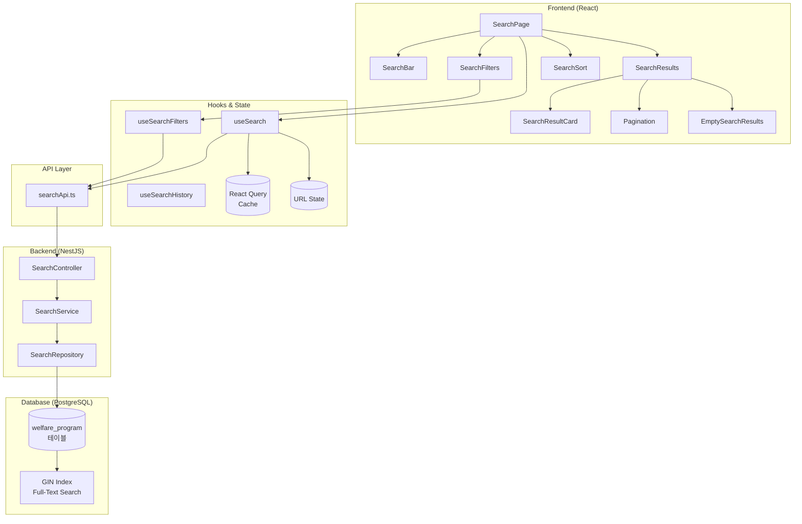
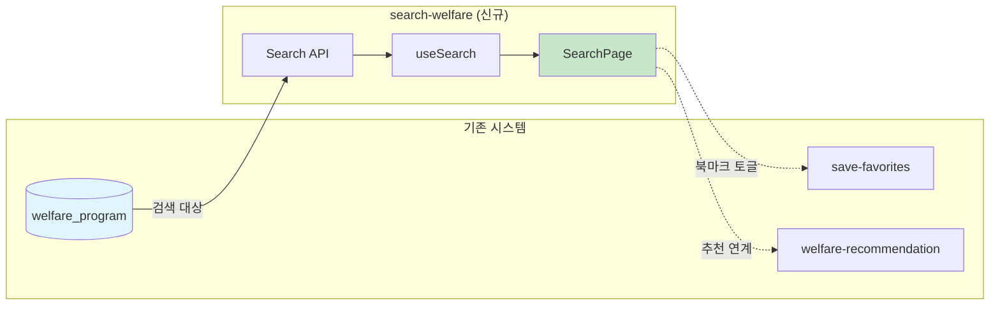
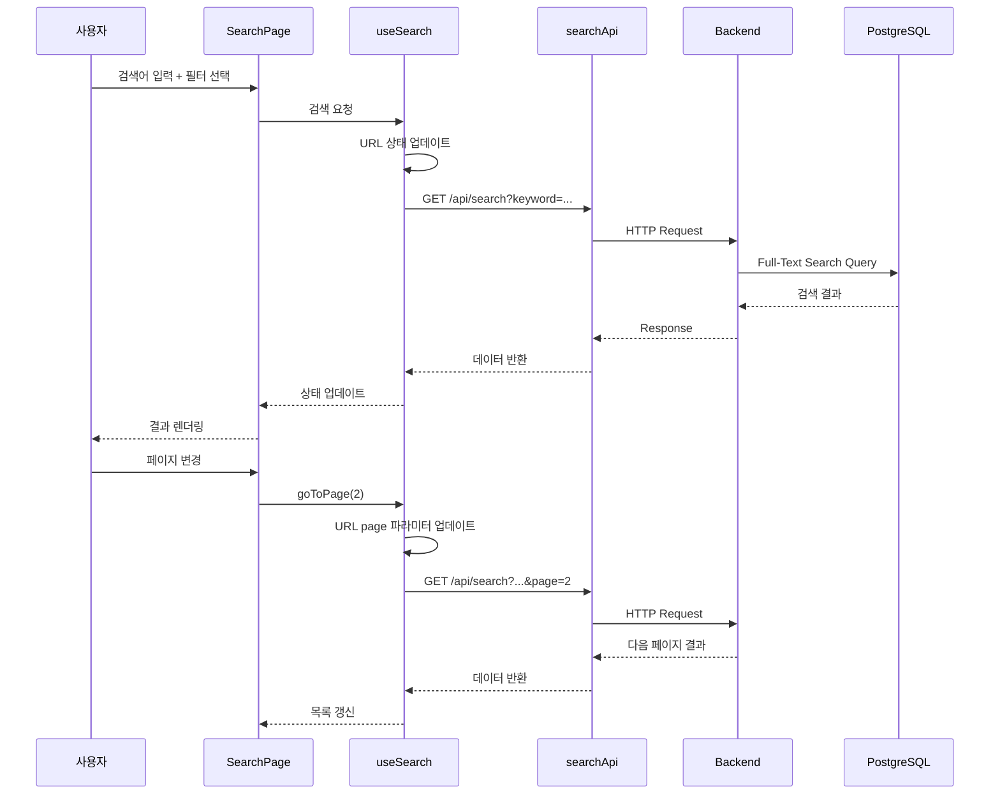
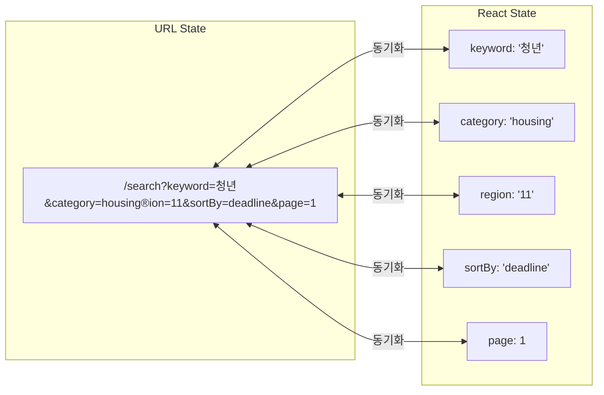
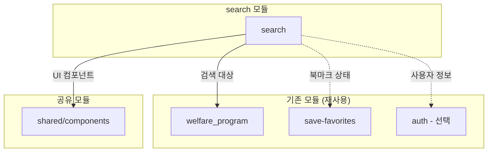
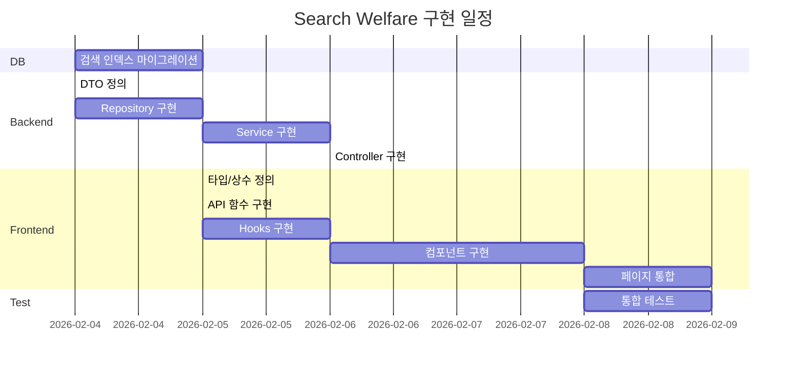

# 복지 검색 (Search Welfare) - 설계 문서

> 작성일: 2026-02-04  
> 작성자: AI Assistant  
> 상태: 설계 완료

---

## 1. 아키텍처 개요

### 1.1 전체 시스템 구조



### 1.2 기존 시스템 연동



### 1.3 데이터 흐름



### 1.4 URL 상태 동기화



---

## 2. 데이터 모델

### 2.1 데이터베이스 스키마

#### 기존 welfare_program 테이블 (변경 없음)

```sql
welfare_program (
  id              VARCHAR(100) PRIMARY KEY,
  name            VARCHAR(255) NOT NULL,
  summary         TEXT,
  description     TEXT,
  category        VARCHAR(50),
  organization    VARCHAR(255),
  region_code     VARCHAR(10),
  eligibility     JSONB,
  benefits        JSONB,
  deadline        DATE,
  application_url VARCHAR(500),
  view_count      INTEGER DEFAULT 0,
  created_at      TIMESTAMP DEFAULT CURRENT_TIMESTAMP,
  updated_at      TIMESTAMP DEFAULT CURRENT_TIMESTAMP
)
```

#### 검색 최적화 인덱스 추가 (마이그레이션)

```sql
-- 011_add_search_indexes.sql

-- 1. Full-Text Search 인덱스 (GIN)
-- 한글 검색을 위해 'simple' 설정 사용
DROP INDEX IF EXISTS idx_welfare_program_search;

CREATE INDEX idx_welfare_program_search 
ON welfare_program 
USING GIN(
  to_tsvector('simple', 
    COALESCE(name, '') || ' ' || 
    COALESCE(summary, '') || ' ' || 
    COALESCE(organization, '')
  )
);

-- 2. ILIKE 검색용 trigram 인덱스 (선택)
CREATE EXTENSION IF NOT EXISTS pg_trgm;

CREATE INDEX idx_welfare_program_name_trgm 
ON welfare_program 
USING GIN(name gin_trgm_ops);

-- 3. 카테고리 + 지역 복합 인덱스
DROP INDEX IF EXISTS idx_welfare_program_filter;

CREATE INDEX idx_welfare_program_filter 
ON welfare_program(category, region_code);

-- 4. 마감일 정렬용 인덱스
DROP INDEX IF EXISTS idx_welfare_program_deadline;

CREATE INDEX idx_welfare_program_deadline 
ON welfare_program(deadline NULLS LAST);

-- 5. 최신순 정렬용 인덱스
CREATE INDEX idx_welfare_program_created 
ON welfare_program(created_at DESC);

-- 6. 인기순(조회수) 정렬용 인덱스
CREATE INDEX idx_welfare_program_views 
ON welfare_program(view_count DESC);
```

### 2.2 TypeScript 타입 정의

#### search.types.ts

```typescript
// ============================================
// 검색 핵심 타입
// ============================================

/**
 * 복지 프로그램 검색 결과 아이템
 */
export interface WelfareProgram {
  id: string;
  name: string;
  summary: string;
  description: string;
  category: WelfareCategory;
  organization: string;
  regionCode: string;
  regionName: string;
  eligibility: EligibilityInfo;
  benefits: BenefitInfo;
  deadline: string | null;
  applicationUrl: string;
  viewCount: number;
  createdAt: string;
  // 검색 관련 추가 필드
  isBookmarked?: boolean;
  relevanceScore?: number;
}

/**
 * 복지 카테고리
 */
export type WelfareCategory =
  | 'employment'   // 취업·창업
  | 'housing'      // 주거·금융
  | 'education'    // 교육
  | 'healthcare'   // 건강·의료
  | 'childcare'    // 임신·육아
  | 'culture'      // 문화·생활
  | 'safety'       // 안전·환경
  | 'other';       // 기타

/**
 * 자격 조건 정보
 */
export interface EligibilityInfo {
  ageRange?: { min?: number; max?: number };
  incomeLevel?: string;
  targetGroups?: string[];
  conditions?: string[];
}

/**
 * 혜택 정보
 */
export interface BenefitInfo {
  type: 'cash' | 'service' | 'voucher' | 'mixed';
  amount?: string;
  description: string;
}

// ============================================
// API 요청/응답 타입
// ============================================

/**
 * 검색 파라미터
 */
export interface SearchParams {
  keyword?: string;
  category?: WelfareCategory;
  region?: string;          // 지역 코드 (시도: 2자리, 시군구: 5자리)
  sortBy?: SearchSortOption;
  sortOrder?: 'asc' | 'desc';
  page?: number;
  limit?: number;
}

/**
 * 정렬 옵션
 */
export type SearchSortOption =
  | 'relevance'    // 관련도순 (기본)
  | 'deadline'     // 마감일순
  | 'latest'       // 최신순
  | 'popular';     // 인기순 (조회수)

/**
 * 검색 결과 응답
 */
export interface SearchResponse {
  results: WelfareProgram[];
  pagination: {
    page: number;
    limit: number;
    totalCount: number;
    totalPages: number;
    hasNext: boolean;
    hasPrev: boolean;
  };
  meta: {
    keyword: string;
    appliedFilters: AppliedFilters;
    searchTime: number; // ms
  };
}

/**
 * 적용된 필터
 */
export interface AppliedFilters {
  category?: WelfareCategory;
  region?: RegionInfo;
  sortBy: SearchSortOption;
}

/**
 * 지역 정보
 */
export interface RegionInfo {
  code: string;
  name: string;
  type: 'sido' | 'sigungu';
}

/**
 * 필터 옵션 응답
 */
export interface FilterOptionsResponse {
  categories: CategoryOption[];
  regions: RegionOption[];
}

/**
 * 카테고리 옵션
 */
export interface CategoryOption {
  value: WelfareCategory;
  label: string;
  count: number; // 해당 카테고리 복지 수
}

/**
 * 지역 옵션
 */
export interface RegionOption {
  code: string;
  name: string;
  type: 'sido' | 'sigungu';
  parentCode?: string; // 시군구의 경우 시도 코드
}

/**
 * 자동완성 응답
 */
export interface SuggestionsResponse {
  suggestions: Suggestion[];
}

/**
 * 자동완성 항목
 */
export interface Suggestion {
  text: string;
  type: 'program' | 'category' | 'organization';
  highlightRanges?: [number, number][];
}

// ============================================
// UI 상태 타입
// ============================================

/**
 * 검색 페이지 상태
 */
export interface SearchPageState {
  keyword: string;
  filters: SearchFilters;
  isFilterOpen: boolean;  // 모바일 필터 열림 상태
  viewMode: 'list' | 'grid';
}

/**
 * 검색 필터 상태
 */
export interface SearchFilters {
  category: WelfareCategory | 'all';
  region: string;  // 'all' 또는 지역 코드
  sortBy: SearchSortOption;
  sortOrder: 'asc' | 'desc';
}

/**
 * 검색 히스토리 항목
 */
export interface SearchHistoryItem {
  keyword: string;
  timestamp: number;
}
```

### 2.3 카테고리 및 지역 상수

```typescript
// constants/categories.ts
export const WELFARE_CATEGORIES: Record<WelfareCategory, {
  label: string;
  icon: string;
  color: string;
}> = {
  employment: { label: '취업·창업', icon: 'briefcase', color: '#3B82F6' },
  housing: { label: '주거·금융', icon: 'home', color: '#10B981' },
  education: { label: '교육', icon: 'graduation-cap', color: '#8B5CF6' },
  healthcare: { label: '건강·의료', icon: 'heart', color: '#EF4444' },
  childcare: { label: '임신·육아', icon: 'baby', color: '#F59E0B' },
  culture: { label: '문화·생활', icon: 'sparkles', color: '#EC4899' },
  safety: { label: '안전·환경', icon: 'shield-check', color: '#06B6D4' },
  other: { label: '기타', icon: 'more-horizontal', color: '#6B7280' },
};

// constants/sortOptions.ts
export const SORT_OPTIONS: Record<SearchSortOption, {
  label: string;
  defaultOrder: 'asc' | 'desc';
}> = {
  relevance: { label: '관련도순', defaultOrder: 'desc' },
  deadline: { label: '마감일순', defaultOrder: 'asc' },
  latest: { label: '최신순', defaultOrder: 'desc' },
  popular: { label: '인기순', defaultOrder: 'desc' },
};

// constants/regions.ts
export const SIDO_LIST: RegionOption[] = [
  { code: '11', name: '서울특별시', type: 'sido' },
  { code: '26', name: '부산광역시', type: 'sido' },
  { code: '27', name: '대구광역시', type: 'sido' },
  { code: '28', name: '인천광역시', type: 'sido' },
  { code: '29', name: '광주광역시', type: 'sido' },
  { code: '30', name: '대전광역시', type: 'sido' },
  { code: '31', name: '울산광역시', type: 'sido' },
  { code: '36', name: '세종특별자치시', type: 'sido' },
  { code: '41', name: '경기도', type: 'sido' },
  { code: '42', name: '강원도', type: 'sido' },
  { code: '43', name: '충청북도', type: 'sido' },
  { code: '44', name: '충청남도', type: 'sido' },
  { code: '45', name: '전라북도', type: 'sido' },
  { code: '46', name: '전라남도', type: 'sido' },
  { code: '47', name: '경상북도', type: 'sido' },
  { code: '48', name: '경상남도', type: 'sido' },
  { code: '50', name: '제주특별자치도', type: 'sido' },
];
```

---

## 3. API/인터페이스 설계

### 3.1 REST API 명세

#### GET /api/search

복지 프로그램을 검색합니다.

```typescript
// Request
GET /api/search?keyword=청년&category=housing&region=11&sortBy=deadline&page=1&limit=20

// Query Parameters
interface QueryParams {
  keyword?: string;           // 검색어 (프로그램명, 설명, 기관명)
  category?: WelfareCategory; // 카테고리 필터
  region?: string;            // 지역 코드 필터
  sortBy?: SearchSortOption;  // 정렬 기준 (default: 'relevance')
  sortOrder?: 'asc' | 'desc'; // 정렬 순서
  page?: number;              // 페이지 번호 (default: 1)
  limit?: number;             // 페이지 크기 (default: 20, max: 100)
}

// Response 200 OK
{
  "results": [
    {
      "id": "WF-2026-001",
      "name": "청년 주거 지원금",
      "summary": "만 19~34세 청년 대상 월세 지원",
      "description": "...",
      "category": "housing",
      "organization": "국토교통부",
      "regionCode": "11",
      "regionName": "서울특별시",
      "eligibility": {
        "ageRange": { "min": 19, "max": 34 },
        "incomeLevel": "중위소득 150% 이하"
      },
      "benefits": {
        "type": "cash",
        "amount": "월 최대 20만원",
        "description": "최대 12개월 지원"
      },
      "deadline": "2026-03-31",
      "applicationUrl": "https://...",
      "viewCount": 1234,
      "createdAt": "2026-01-15T00:00:00Z",
      "isBookmarked": false,
      "relevanceScore": 0.95
    }
  ],
  "pagination": {
    "page": 1,
    "limit": 20,
    "totalCount": 156,
    "totalPages": 8,
    "hasNext": true,
    "hasPrev": false
  },
  "meta": {
    "keyword": "청년",
    "appliedFilters": {
      "category": "housing",
      "region": { "code": "11", "name": "서울특별시", "type": "sido" },
      "sortBy": "deadline"
    },
    "searchTime": 45
  }
}
```

#### GET /api/search/filters

필터 옵션을 조회합니다.

```typescript
// Request
GET /api/search/filters

// Response 200 OK
{
  "categories": [
    { "value": "employment", "label": "취업·창업", "count": 245 },
    { "value": "housing", "label": "주거·금융", "count": 189 },
    { "value": "education", "label": "교육", "count": 312 }
    // ...
  ],
  "regions": [
    { "code": "11", "name": "서울특별시", "type": "sido" },
    { "code": "11110", "name": "종로구", "type": "sigungu", "parentCode": "11" }
    // ...
  ]
}
```

#### GET /api/search/suggestions

자동완성 제안을 조회합니다 (v1.5 선택).

```typescript
// Request
GET /api/search/suggestions?keyword=청년

// Response 200 OK
{
  "suggestions": [
    { "text": "청년 주거 지원", "type": "program" },
    { "text": "청년 취업 지원", "type": "program" },
    { "text": "청년", "type": "category" }
  ]
}
```

#### POST /api/search/log (선택)

검색 로그를 기록합니다 (분석용).

```typescript
// Request
POST /api/search/log
{
  "keyword": "청년",
  "filters": { "category": "housing" },
  "resultCount": 156
}

// Response 201 Created
```

### 3.2 Frontend Hook 인터페이스

#### useSearch Hook

```typescript
interface UseSearchOptions {
  initialParams?: SearchParams;
  syncWithUrl?: boolean;  // URL 상태 동기화 여부 (default: true)
}

interface UseSearchReturn {
  // 데이터
  results: WelfareProgram[];
  pagination: PaginationInfo;
  meta: SearchMeta;
  
  // 상태
  isLoading: boolean;
  isFetching: boolean;
  isError: boolean;
  error: Error | null;
  
  // 검색 파라미터
  params: SearchParams;
  setKeyword: (keyword: string) => void;
  setCategory: (category: WelfareCategory | 'all') => void;
  setRegion: (region: string) => void;
  setSortBy: (sortBy: SearchSortOption) => void;
  setParams: (params: Partial<SearchParams>) => void;
  resetParams: () => void;
  
  // 페이지네이션
  goToPage: (page: number) => void;
  nextPage: () => void;
  prevPage: () => void;
  
  // 액션
  search: (keyword?: string) => void;
  refetch: () => void;
}

function useSearch(options?: UseSearchOptions): UseSearchReturn;
```

#### useSearchFilters Hook

```typescript
interface UseSearchFiltersReturn {
  // 필터 옵션
  categories: CategoryOption[];
  regions: RegionOption[];
  
  // 상태
  isLoading: boolean;
  
  // 유틸
  getCategoryLabel: (value: WelfareCategory) => string;
  getRegionName: (code: string) => string;
  getSigunguList: (sidoCode: string) => RegionOption[];
}

function useSearchFilters(): UseSearchFiltersReturn;
```

#### useSearchHistory Hook

```typescript
interface UseSearchHistoryReturn {
  // 데이터
  history: SearchHistoryItem[];
  
  // 액션
  addToHistory: (keyword: string) => void;
  removeFromHistory: (keyword: string) => void;
  clearHistory: () => void;
}

function useSearchHistory(): UseSearchHistoryReturn;
```

### 3.3 Backend Service 인터페이스

```typescript
// SearchService
interface ISearchService {
  // 검색
  search(params: SearchParams, userId?: string): Promise<SearchResponse>;
  
  // 필터 옵션
  getFilterOptions(): Promise<FilterOptionsResponse>;
  
  // 자동완성
  getSuggestions(keyword: string): Promise<SuggestionsResponse>;
  
  // 검색 로그 (선택)
  logSearch(data: SearchLogData): Promise<void>;
}

// SearchRepository
interface ISearchRepository {
  // Full-Text Search
  searchPrograms(params: SearchParams): Promise<{
    data: WelfareProgramEntity[];
    total: number;
  }>;
  
  // 카테고리별 개수
  countByCategory(): Promise<CategoryCount[]>;
  
  // 자동완성 후보
  findSuggestions(keyword: string, limit: number): Promise<string[]>;
}
```

---

## 4. 파일 구조

### 4.1 Frontend 파일 구조

```
src/features/search/
├── index.ts                          # 모듈 진입점 (export)
│
├── api/
│   ├── index.ts                      # API export
│   ├── searchApi.ts                  # API 함수 정의
│   └── searchApi.types.ts            # API 타입 정의
│
├── components/
│   ├── index.ts                      # 컴포넌트 export
│   │
│   ├── SearchBar/
│   │   ├── SearchBar.tsx             # 검색 입력 바
│   │   ├── SearchInput.tsx           # 검색 입력 필드
│   │   ├── SearchButton.tsx          # 검색 버튼
│   │   └── index.ts
│   │
│   ├── SearchFilters/
│   │   ├── SearchFilters.tsx         # 필터 컨테이너
│   │   ├── CategoryFilter.tsx        # 카테고리 필터
│   │   ├── RegionFilter.tsx          # 지역 필터
│   │   ├── FilterChips.tsx           # 적용된 필터 칩
│   │   ├── MobileFilterSheet.tsx     # 모바일 필터 바텀시트
│   │   └── index.ts
│   │
│   ├── SearchResults/
│   │   ├── SearchResults.tsx         # 결과 목록 컨테이너
│   │   ├── SearchResultsHeader.tsx   # 결과 헤더 (개수, 정렬)
│   │   └── index.ts
│   │
│   ├── SearchResultCard/
│   │   ├── SearchResultCard.tsx      # 검색 결과 카드
│   │   ├── SearchResultCard.skeleton.tsx # 로딩 스켈레톤
│   │   └── index.ts
│   │
│   ├── SearchSort/
│   │   ├── SearchSort.tsx            # 정렬 드롭다운
│   │   └── index.ts
│   │
│   ├── SearchPagination/
│   │   ├── SearchPagination.tsx      # 페이지네이션
│   │   └── index.ts
│   │
│   ├── EmptySearchResults/
│   │   ├── EmptySearchResults.tsx    # 결과 없음 UI
│   │   └── index.ts
│   │
│   └── RecentSearches/
│       ├── RecentSearches.tsx        # 최근 검색어
│       └── index.ts
│
├── hooks/
│   ├── index.ts                      # Hook export
│   ├── useSearch.ts                  # 검색 메인 Hook
│   ├── useSearchFilters.ts           # 필터 옵션 Hook
│   ├── useSearchHistory.ts           # 검색 기록 Hook
│   └── useSearchUrl.ts               # URL 상태 동기화 Hook
│
├── pages/
│   ├── index.ts                      # Page export
│   └── SearchPage.tsx                # 검색 메인 페이지
│
├── constants/
│   ├── index.ts
│   ├── categories.ts                 # 카테고리 설정
│   ├── sortOptions.ts                # 정렬 옵션
│   └── regions.ts                    # 지역 코드
│
├── types/
│   ├── index.ts                      # Type export
│   └── search.types.ts               # 타입 정의
│
└── utils/
    ├── index.ts
    ├── searchHelpers.ts              # 검색 유틸리티
    ├── urlHelpers.ts                 # URL 파라미터 유틸
    └── highlightHelpers.ts           # 하이라이팅 유틸
```

### 4.2 Backend 파일 구조

```
server/src/modules/search/
├── search.module.ts                  # NestJS 모듈
├── search.controller.ts              # REST 컨트롤러
├── search.service.ts                 # 비즈니스 로직
├── search.repository.ts              # 데이터 접근
│
├── dto/
│   ├── index.ts
│   ├── search-query.dto.ts           # 검색 요청 DTO
│   └── search-response.dto.ts        # 응답 DTO
│
└── entities/
    └── index.ts                      # 엔티티 (welfare_program 재사용)

server/migrations/
└── 011_add_search_indexes.sql        # 검색 인덱스 마이그레이션
```

### 4.3 라우팅 설정

```typescript
// src/app/routes.tsx 수정
import { SearchPage } from '@/features/search';

// 추가할 라우트
{
  path: '/search',
  element: <SearchPage />,
  meta: {
    title: '복지 검색',
    requireAuth: false,  // 비로그인도 검색 가능
  }
}
```

---

## 5. 의존성

### 5.1 Frontend 의존성

| 패키지 | 버전 | 용도 | 설치 필요 |
|--------|------|------|----------|
| react | ^18.x | UI 라이브러리 | ✅ 설치됨 |
| @tanstack/react-query | ^5.x | 서버 상태 관리 | ✅ 설치됨 |
| tailwindcss | ^3.x | 스타일링 | ✅ 설치됨 |
| lucide-react | ^0.x | 아이콘 | ✅ 설치됨 |
| use-debounce | ^10.x | 검색 디바운스 | ⚠️ 설치 필요 |
| clsx | ^2.x | 클래스 조합 | ✅ 설치됨 |

### 5.2 Backend 의존성

| 패키지 | 버전 | 용도 | 설치 필요 |
|--------|------|------|----------|
| @nestjs/common | ^10.x | NestJS 코어 | ✅ 설치됨 |
| class-validator | ^0.14.x | DTO 검증 | ✅ 설치됨 |
| class-transformer | ^0.5.x | DTO 변환 | ✅ 설치됨 |
| pg | ^8.x | PostgreSQL 드라이버 | ✅ 설치됨 |

### 5.3 내부 모듈 의존성



| 모듈 | 재사용 항목 | 필수 여부 |
|------|------------|----------|
| welfare_program | 테이블, 엔티티 | 필수 |
| save-favorites | 북마크 상태 표시 | 선택 |
| auth | 사용자 기반 지역 기본값 | 선택 |
| shared/components | `Button`, `Input`, `Card`, `Pagination` | 필수 |

---

## 6. 구현 순서

### 6.1 구현 로드맵



### 6.2 단계별 구현 상세

#### Phase 1: 데이터베이스 (0.5일)

| 순서 | 작업 | 산출물 |
|------|------|--------|
| 1-1 | 검색 인덱스 마이그레이션 작성 | `011_add_search_indexes.sql` |
| 1-2 | GIN 인덱스 (Full-Text Search) | 검색 성능 최적화 |
| 1-3 | 복합 인덱스 (필터, 정렬) | 필터/정렬 성능 최적화 |

#### Phase 2: Backend API (1.5일)

| 순서 | 작업 | 산출물 |
|------|------|--------|
| 2-1 | DTO 클래스 정의 | `search-query.dto.ts`, `search-response.dto.ts` |
| 2-2 | Repository 메서드 구현 | `search.repository.ts` |
| 2-3 | Service 비즈니스 로직 구현 | `search.service.ts` |
| 2-4 | Controller 엔드포인트 구현 | `search.controller.ts` |
| 2-5 | Module 등록 | `search.module.ts` |

#### Phase 3: Frontend 기반 (0.5일)

| 순서 | 작업 | 산출물 |
|------|------|--------|
| 3-1 | TypeScript 타입 정의 | `search.types.ts` |
| 3-2 | API 함수 구현 | `searchApi.ts` |
| 3-3 | 상수 정의 | `categories.ts`, `sortOptions.ts`, `regions.ts` |
| 3-4 | 유틸리티 함수 구현 | `searchHelpers.ts`, `urlHelpers.ts` |

#### Phase 4: Frontend Hooks (0.5일)

| 순서 | 작업 | 산출물 |
|------|------|--------|
| 4-1 | `useSearch` Hook | 검색 메인 로직 |
| 4-2 | `useSearchFilters` Hook | 필터 옵션 |
| 4-3 | `useSearchUrl` Hook | URL 상태 동기화 |
| 4-4 | `useSearchHistory` Hook | 검색 기록 |

#### Phase 5: Frontend 컴포넌트 (1.5일)

| 순서 | 작업 | 우선순위 |
|------|------|----------|
| 5-1 | `SearchBar` | 필수 |
| 5-2 | `SearchResultCard` | 필수 |
| 5-3 | `SearchResults` | 필수 |
| 5-4 | `EmptySearchResults` | 필수 |
| 5-5 | `SearchFilters` (CategoryFilter, RegionFilter) | 필수 |
| 5-6 | `SearchSort` | 필수 |
| 5-7 | `SearchPagination` | 필수 |
| 5-8 | `MobileFilterSheet` | 필수 |
| 5-9 | `RecentSearches` | 선택 |
| 5-10 | `FilterChips` | 선택 |

#### Phase 6: 페이지 통합 (0.5일)

| 순서 | 작업 | 산출물 |
|------|------|--------|
| 6-1 | `SearchPage` 구현 | 메인 페이지 |
| 6-2 | 라우트 추가 | `/search` 경로 |
| 6-3 | 네비게이션 연결 | 메뉴/탭 추가 |

#### Phase 7: 테스트 (0.5일)

| 순서 | 작업 | 범위 |
|------|------|------|
| 7-1 | API 통합 테스트 | 엔드포인트 검증 |
| 7-2 | 검색 쿼리 테스트 | Full-Text Search 검증 |
| 7-3 | URL 상태 테스트 | 파라미터 동기화 검증 |

### 6.3 체크리스트

```markdown
## 구현 체크리스트

### Database
- [ ] 011_add_search_indexes.sql 마이그레이션 실행
- [ ] GIN 인덱스 생성 확인
- [ ] 복합 인덱스 생성 확인

### Backend
- [ ] SearchQueryDto 구현
- [ ] SearchResponseDto 구현
- [ ] SearchRepository 구현
- [ ] SearchService 구현
- [ ] SearchController 구현
- [ ] SearchModule 등록
- [ ] AppModule에 import

### Frontend - 기반
- [ ] search.types.ts
- [ ] searchApi.ts
- [ ] categories.ts
- [ ] sortOptions.ts
- [ ] regions.ts
- [ ] searchHelpers.ts
- [ ] urlHelpers.ts

### Frontend - Hooks
- [ ] useSearch.ts
- [ ] useSearchFilters.ts
- [ ] useSearchUrl.ts
- [ ] useSearchHistory.ts

### Frontend - 컴포넌트
- [ ] SearchBar
- [ ] SearchResultCard
- [ ] SearchResults
- [ ] EmptySearchResults
- [ ] SearchFilters (CategoryFilter, RegionFilter)
- [ ] SearchSort
- [ ] SearchPagination
- [ ] MobileFilterSheet
- [ ] RecentSearches (선택)
- [ ] FilterChips (선택)

### Frontend - 페이지
- [ ] SearchPage.tsx
- [ ] routes.tsx 라우트 추가
- [ ] navigation 메뉴 추가

### 테스트
- [ ] API 엔드포인트 테스트
- [ ] Full-Text Search 테스트
- [ ] URL 파라미터 테스트
- [ ] 모바일 UI 테스트
```

---

## 7. UI/UX 와이어프레임

### 7.1 검색 페이지 레이아웃

```
┌──────────────────────────────────────────────────────────┐
│  ← 뒤로    복지 검색                                     │
├──────────────────────────────────────────────────────────┤
│  ┌────────────────────────────────────────────┐ [검색]  │
│  │ 🔍 복지 프로그램을 검색하세요...           │          │
│  └────────────────────────────────────────────┘          │
├──────────────────────────────────────────────────────────┤
│  [전체] [취업·창업] [주거·금융] [교육] ...    [필터 ▼]  │
├──────────────────────────────────────────────────────────┤
│  📋 156건  │  정렬: [관련도순 ▼]  │  🗺️ 서울특별시      │
├──────────────────────────────────────────────────────────┤
│                                                          │
│  ┌─────────────────────────────────────────────────┐    │
│  │ 청년 주거 지원금                                 │    │
│  │ 주거·금융 │ 국토교통부 │ 서울특별시             │    │
│  │ 만 19~34세 <mark>청년</mark> 대상 월세 지원...  │    │
│  │ 마감 D-55              [상세보기] [⭐ 저장]     │    │
│  └─────────────────────────────────────────────────┘    │
│                                                          │
│  ┌─────────────────────────────────────────────────┐    │
│  │ 청년 취업 성공 패키지                            │    │
│  │ 취업·창업 │ 고용노동부 │ 전국                   │    │
│  │ <mark>청년</mark> 취업 지원 서비스...           │    │
│  │ 마감 D-30              [상세보기] [⭐ 저장]     │    │
│  └─────────────────────────────────────────────────┘    │
│                                                          │
│  ... (더 많은 결과)                                      │
│                                                          │
├──────────────────────────────────────────────────────────┤
│            < 1  2  3  4  5  ...  8 >                     │
└──────────────────────────────────────────────────────────┘
```

### 7.2 필터 바텀시트 (모바일)

```
┌──────────────────────────────────────────────────────────┐
│                         ───                              │
│                                                          │
│  필터                                      [초기화]      │
│  ─────────────────────────────────────────────────────   │
│                                                          │
│  카테고리                                                │
│  ○ 전체  ● 주거·금융  ○ 취업·창업  ○ 교육  ...        │
│                                                          │
│  ─────────────────────────────────────────────────────   │
│                                                          │
│  지역                                                    │
│  [서울특별시        ▼]                                  │
│  [전체 (시/군/구)   ▼]                                  │
│                                                          │
│  ─────────────────────────────────────────────────────   │
│                                                          │
│  정렬                                                    │
│  ○ 관련도순  ● 마감일순  ○ 최신순  ○ 인기순           │
│                                                          │
│                                                          │
│           [156건의 결과 보기]                           │
│                                                          │
└──────────────────────────────────────────────────────────┘
```

### 7.3 검색 결과 없음

```
┌──────────────────────────────────────────────────────────┐
│                                                          │
│                    🔍                                    │
│                                                          │
│         '청년 창업 지원금'에 대한                        │
│         검색 결과가 없습니다                             │
│                                                          │
│   • 다른 검색어를 입력해보세요                          │
│   • 필터 조건을 변경해보세요                            │
│                                                          │
│         [필터 초기화]  [전체 복지 보기]                  │
│                                                          │
│  ─────────────────────────────────────────────────────   │
│                                                          │
│  📌 인기 검색어                                         │
│  청년 주거  |  육아 지원  |  노인 복지  |  장애인       │
│                                                          │
└──────────────────────────────────────────────────────────┘
```

---

## 8. 다음 단계

본 설계 문서를 바탕으로 구현을 시작합니다.

`Cmd+Shift+P` → `BKIT: 코드 구현`을 실행하여 구현을 진행하세요.

---
*설계 완료일: 2026-02-04*  
*예상 구현 기간: 5일*  
*담당: 풀스택 개발팀*
