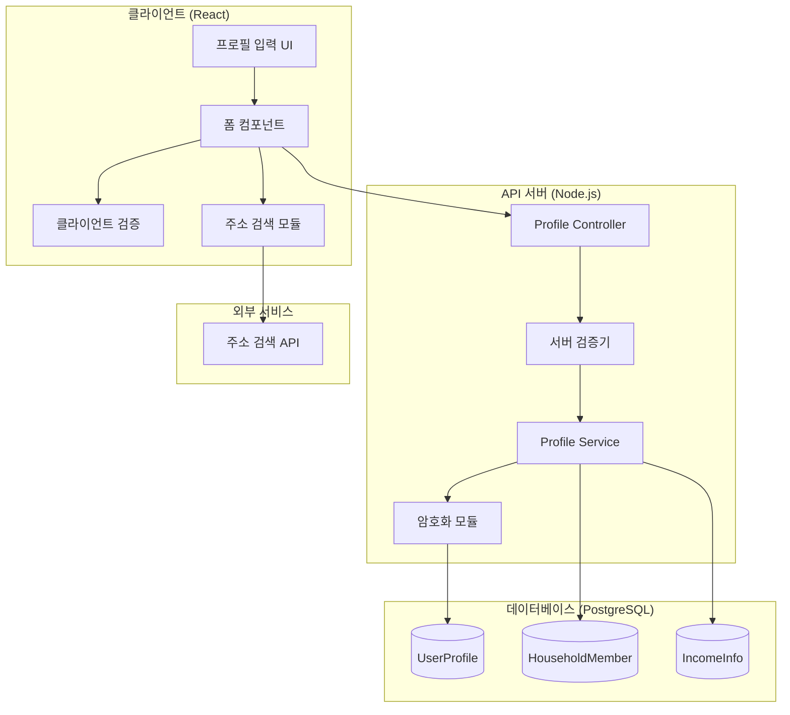
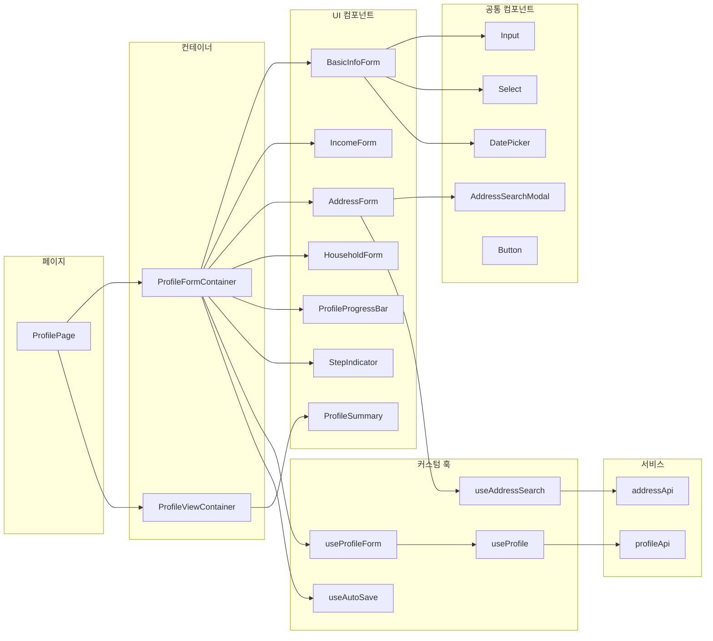
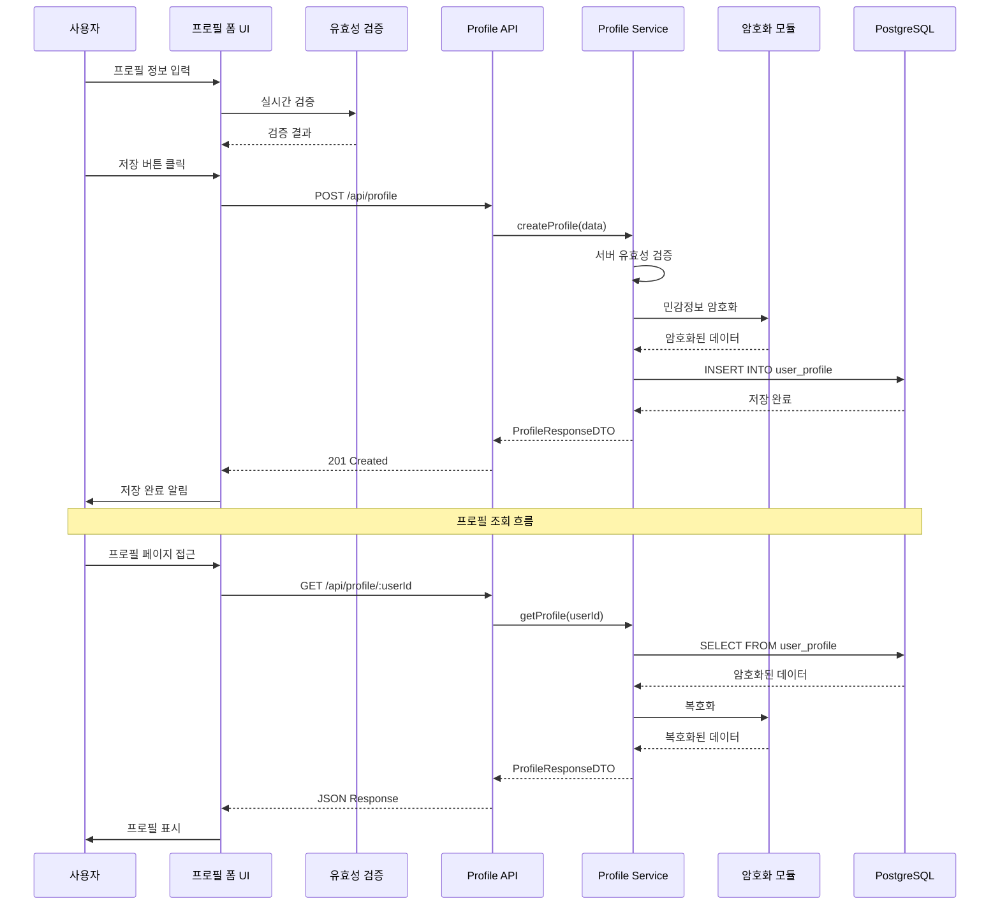
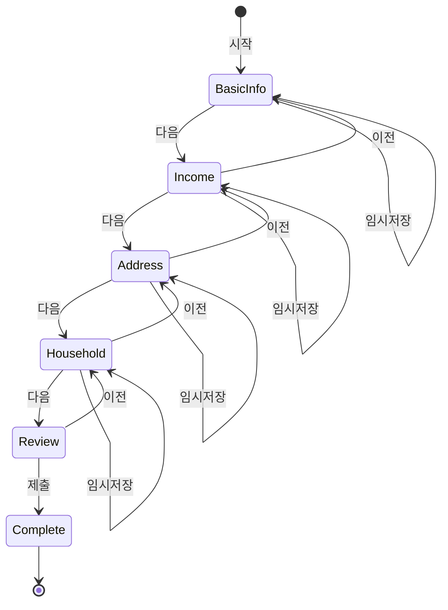
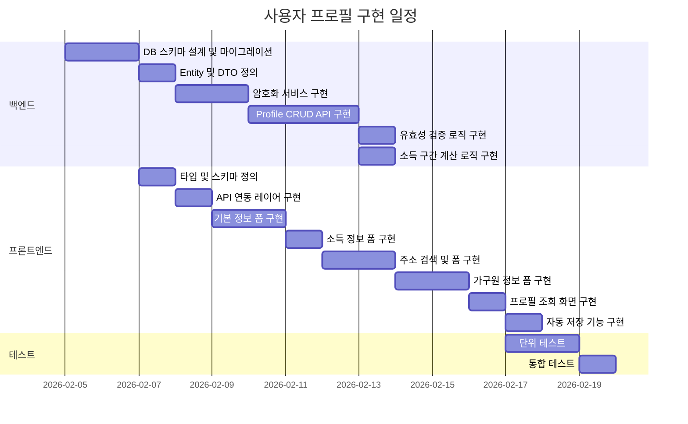
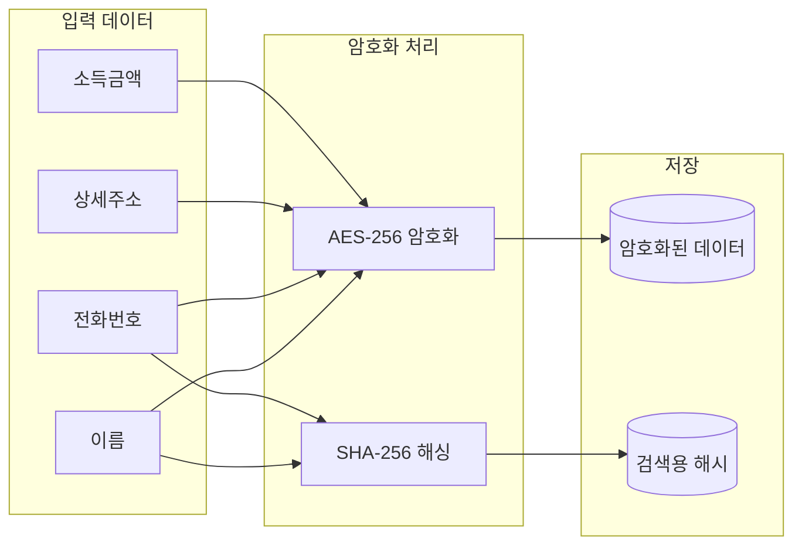

# 사용자 프로필 (User Profile) - 설계 문서

> 작성일: 2026-02-03  
> 기반 문서: user-profile.plan.md  
> 상태: 설계 완료

---

## 1. 아키텍처 개요

### 1.1 시스템 아키텍처



### 1.2 컴포넌트 관계도



### 1.3 데이터 흐름



### 1.4 단계별 입력 흐름



---

## 2. 데이터 모델

### 2.1 TypeScript 타입 정의

```typescript
// ==================== Enums ====================

/** 성별 */
enum Gender {
  MALE = 'male',
  FEMALE = 'female',
  OTHER = 'other',
}

/** 소득 유형 */
enum IncomeType {
  EMPLOYMENT = 'employment',     // 근로소득
  BUSINESS = 'business',         // 사업소득
  PROPERTY = 'property',         // 재산소득
  PENSION = 'pension',           // 연금소득
  OTHER = 'other',               // 기타소득
  NONE = 'none',                 // 소득 없음
}

/** 소득 구간 (기준 중위소득 대비) */
enum IncomeBracket {
  BELOW_50 = 'below_50',         // 50% 이하
  BELOW_75 = 'below_75',         // 50% ~ 75%
  BELOW_100 = 'below_100',       // 75% ~ 100%
  BELOW_150 = 'below_150',       // 100% ~ 150%
  ABOVE_150 = 'above_150',       // 150% 초과
}

/** 가구원 관계 */
enum FamilyRelation {
  SELF = 'self',                 // 본인
  SPOUSE = 'spouse',             // 배우자
  CHILD = 'child',               // 자녀
  PARENT = 'parent',             // 부모
  GRANDPARENT = 'grandparent',   // 조부모
  SIBLING = 'sibling',           // 형제자매
  OTHER = 'other',               // 기타
}

/** 프로필 완성 단계 */
enum ProfileStep {
  BASIC_INFO = 'basic_info',
  INCOME = 'income',
  ADDRESS = 'address',
  HOUSEHOLD = 'household',
  COMPLETE = 'complete',
}

// ==================== Entity Types ====================

/** 사용자 프로필 */
interface UserProfile {
  id: string;                    // UUID
  userId: string;                // 사용자 ID (FK)
  
  // 기본 정보
  name: string;                  // 이름 (암호화)
  birthDate: Date;               // 생년월일
  gender: Gender;                // 성별
  phone: string;                 // 전화번호 (암호화)
  email?: string;                // 이메일 (선택)
  
  // 주소 정보
  address: Address;              // 주소
  
  // 소득 정보
  income: IncomeInfo;            // 소득
  
  // 가구 정보
  householdSize: number;         // 가구원 수
  householdMembers: HouseholdMember[]; // 가구원 목록
  
  // 메타 정보
  completionRate: number;        // 프로필 완성도 (0-100)
  currentStep: ProfileStep;      // 현재 입력 단계
  isComplete: boolean;           // 완료 여부
  
  createdAt: Date;
  updatedAt: Date;
}

/** 주소 정보 */
interface Address {
  zipCode: string;               // 우편번호
  sido: string;                  // 시/도
  sigungu: string;               // 시/군/구
  roadAddress: string;           // 도로명 주소
  jibunAddress?: string;         // 지번 주소
  detail: string;                // 상세 주소 (암호화)
  buildingName?: string;         // 건물명
}

/** 소득 정보 */
interface IncomeInfo {
  type: IncomeType;              // 소득 유형
  annualAmount: number;          // 연간 소득 (암호화)
  monthlyAmount: number;         // 월 소득 (자동 계산)
  bracket: IncomeBracket;        // 소득 구간 (자동 분류)
  hasVerification: boolean;      // 소득 증빙 여부
}

/** 가구원 정보 */
interface HouseholdMember {
  id: string;                    // UUID
  profileId: string;             // 프로필 ID (FK)
  relation: FamilyRelation;      // 관계
  name: string;                  // 이름 (암호화)
  birthDate: Date;               // 생년월일
  gender: Gender;                // 성별
  hasDisability: boolean;        // 장애 여부
  hasIncome: boolean;            // 소득 유무
  order: number;                 // 표시 순서
}

// ==================== DTO Types ====================

/** 프로필 생성/수정 요청 */
interface ProfileFormData {
  // 기본 정보 (Step 1)
  basicInfo: {
    name: string;
    birthDate: string;           // ISO 8601 형식
    gender: Gender;
    phone: string;
    email?: string;
  };
  
  // 소득 정보 (Step 2)
  income: {
    type: IncomeType;
    annualAmount: number;
  };
  
  // 주소 정보 (Step 3)
  address: {
    zipCode: string;
    sido: string;
    sigungu: string;
    roadAddress: string;
    jibunAddress?: string;
    detail: string;
    buildingName?: string;
  };
  
  // 가구원 정보 (Step 4)
  household: {
    size: number;
    members: HouseholdMemberInput[];
  };
}

/** 가구원 입력 */
interface HouseholdMemberInput {
  relation: FamilyRelation;
  name: string;
  birthDate: string;
  gender: Gender;
  hasDisability: boolean;
  hasIncome: boolean;
}

/** 프로필 응답 */
interface ProfileResponse {
  id: string;
  basicInfo: {
    name: string;                // 마스킹 처리된 이름
    nameFull?: string;           // 전체 이름 (본인 조회 시)
    birthDate: string;
    age: number;                 // 계산된 나이
    gender: Gender;
    phone: string;               // 마스킹 처리
    phoneFull?: string;          // 전체 번호 (본인 조회 시)
    email?: string;
  };
  income: {
    type: IncomeType;
    bracket: IncomeBracket;
    bracketLabel: string;        // "중위소득 50% 이하"
  };
  address: {
    zipCode: string;
    sido: string;
    sigungu: string;
    roadAddress: string;
    detail?: string;             // 본인 조회 시만 포함
  };
  household: {
    size: number;
    members: HouseholdMemberResponse[];
  };
  meta: {
    completionRate: number;
    currentStep: ProfileStep;
    isComplete: boolean;
    createdAt: string;
    updatedAt: string;
  };
}

/** 가구원 응답 */
interface HouseholdMemberResponse {
  id: string;
  relation: FamilyRelation;
  relationLabel: string;         // "배우자", "자녀" 등
  name: string;                  // 마스킹 처리
  age: number;
  gender: Gender;
  hasDisability: boolean;
  hasIncome: boolean;
}

/** 프로필 완성도 응답 */
interface ProfileCompletionResponse {
  overall: number;               // 전체 완성도 (0-100)
  steps: {
    step: ProfileStep;
    label: string;
    isComplete: boolean;
    completionRate: number;
    missingFields: string[];
  }[];
}

/** 임시 저장 요청/응답 */
interface ProfileDraftData {
  currentStep: ProfileStep;
  formData: Partial<ProfileFormData>;
  savedAt: string;
}
```

### 2.2 유효성 검증 스키마 (Zod)

```typescript
import { z } from 'zod';

// 기본 정보 검증
const basicInfoSchema = z.object({
  name: z
    .string()
    .min(2, '이름은 2자 이상이어야 합니다')
    .max(50, '이름은 50자 이하여야 합니다')
    .regex(/^[가-힣a-zA-Z\s]+$/, '이름은 한글 또는 영문만 입력 가능합니다'),
  
  birthDate: z
    .string()
    .regex(/^\d{4}-\d{2}-\d{2}$/, '올바른 날짜 형식이 아닙니다')
    .refine((date) => {
      const birth = new Date(date);
      const now = new Date();
      const age = now.getFullYear() - birth.getFullYear();
      return age >= 0 && age <= 150;
    }, '올바른 생년월일을 입력해주세요'),
  
  gender: z.nativeEnum(Gender, {
    errorMap: () => ({ message: '성별을 선택해주세요' }),
  }),
  
  phone: z
    .string()
    .regex(/^01[0-9]-?\d{3,4}-?\d{4}$/, '올바른 전화번호 형식이 아닙니다'),
  
  email: z
    .string()
    .email('올바른 이메일 형식이 아닙니다')
    .optional()
    .or(z.literal('')),
});

// 소득 정보 검증
const incomeSchema = z.object({
  type: z.nativeEnum(IncomeType, {
    errorMap: () => ({ message: '소득 유형을 선택해주세요' }),
  }),
  
  annualAmount: z
    .number()
    .min(0, '소득은 0 이상이어야 합니다')
    .max(10000000000, '올바른 소득 금액을 입력해주세요'),
});

// 주소 정보 검증
const addressSchema = z.object({
  zipCode: z
    .string()
    .regex(/^\d{5}$/, '올바른 우편번호 형식이 아닙니다'),
  
  sido: z
    .string()
    .min(1, '시/도를 선택해주세요'),
  
  sigungu: z
    .string()
    .min(1, '시/군/구를 선택해주세요'),
  
  roadAddress: z
    .string()
    .min(1, '도로명 주소를 입력해주세요'),
  
  jibunAddress: z.string().optional(),
  
  detail: z
    .string()
    .min(1, '상세 주소를 입력해주세요')
    .max(200, '상세 주소는 200자 이하여야 합니다'),
  
  buildingName: z.string().optional(),
});

// 가구원 정보 검증
const householdMemberSchema = z.object({
  relation: z.nativeEnum(FamilyRelation),
  name: z.string().min(2).max(50),
  birthDate: z.string().regex(/^\d{4}-\d{2}-\d{2}$/),
  gender: z.nativeEnum(Gender),
  hasDisability: z.boolean(),
  hasIncome: z.boolean(),
});

const householdSchema = z.object({
  size: z.number().min(1).max(20),
  members: z.array(householdMemberSchema).max(19),
});

// 전체 프로필 검증
export const profileFormSchema = z.object({
  basicInfo: basicInfoSchema,
  income: incomeSchema,
  address: addressSchema,
  household: householdSchema,
});
```

### 2.3 데이터베이스 스키마 (PostgreSQL)

```sql
-- 사용자 프로필 테이블
CREATE TABLE user_profile (
    id UUID PRIMARY KEY DEFAULT gen_random_uuid(),
    user_id UUID NOT NULL UNIQUE REFERENCES users(id) ON DELETE CASCADE,
    
    -- 기본 정보 (암호화 필드는 bytea 타입)
    name_encrypted BYTEA NOT NULL,
    name_hash VARCHAR(64) NOT NULL,  -- 검색용 해시
    birth_date DATE NOT NULL,
    gender VARCHAR(10) NOT NULL,
    phone_encrypted BYTEA NOT NULL,
    phone_hash VARCHAR(64) NOT NULL,
    email VARCHAR(255),
    
    -- 주소 정보
    zip_code VARCHAR(10) NOT NULL,
    sido VARCHAR(20) NOT NULL,
    sigungu VARCHAR(50) NOT NULL,
    road_address VARCHAR(200) NOT NULL,
    jibun_address VARCHAR(200),
    detail_encrypted BYTEA NOT NULL,
    building_name VARCHAR(100),
    
    -- 소득 정보
    income_type VARCHAR(20) NOT NULL,
    annual_amount_encrypted BYTEA NOT NULL,
    income_bracket VARCHAR(20) NOT NULL,
    has_income_verification BOOLEAN DEFAULT FALSE,
    
    -- 가구 정보
    household_size INTEGER NOT NULL DEFAULT 1,
    
    -- 메타 정보
    completion_rate INTEGER DEFAULT 0,
    current_step VARCHAR(20) DEFAULT 'basic_info',
    is_complete BOOLEAN DEFAULT FALSE,
    
    -- 타임스탬프
    created_at TIMESTAMP WITH TIME ZONE DEFAULT NOW(),
    updated_at TIMESTAMP WITH TIME ZONE DEFAULT NOW(),
    
    -- 제약 조건
    CONSTRAINT valid_gender CHECK (gender IN ('male', 'female', 'other')),
    CONSTRAINT valid_income_type CHECK (
        income_type IN ('employment', 'business', 'property', 'pension', 'other', 'none')
    ),
    CONSTRAINT valid_income_bracket CHECK (
        income_bracket IN ('below_50', 'below_75', 'below_100', 'below_150', 'above_150')
    ),
    CONSTRAINT valid_completion_rate CHECK (completion_rate >= 0 AND completion_rate <= 100),
    CONSTRAINT valid_household_size CHECK (household_size >= 1 AND household_size <= 20)
);

-- 가구원 테이블
CREATE TABLE household_member (
    id UUID PRIMARY KEY DEFAULT gen_random_uuid(),
    profile_id UUID NOT NULL REFERENCES user_profile(id) ON DELETE CASCADE,
    
    relation VARCHAR(20) NOT NULL,
    name_encrypted BYTEA NOT NULL,
    birth_date DATE NOT NULL,
    gender VARCHAR(10) NOT NULL,
    has_disability BOOLEAN DEFAULT FALSE,
    has_income BOOLEAN DEFAULT FALSE,
    display_order INTEGER NOT NULL DEFAULT 0,
    
    created_at TIMESTAMP WITH TIME ZONE DEFAULT NOW(),
    updated_at TIMESTAMP WITH TIME ZONE DEFAULT NOW(),
    
    CONSTRAINT valid_relation CHECK (
        relation IN ('self', 'spouse', 'child', 'parent', 'grandparent', 'sibling', 'other')
    )
);

-- 프로필 임시 저장 테이블
CREATE TABLE profile_draft (
    id UUID PRIMARY KEY DEFAULT gen_random_uuid(),
    user_id UUID NOT NULL UNIQUE REFERENCES users(id) ON DELETE CASCADE,
    current_step VARCHAR(20) NOT NULL,
    form_data JSONB NOT NULL,  -- 암호화된 상태로 저장
    saved_at TIMESTAMP WITH TIME ZONE DEFAULT NOW()
);

-- 인덱스 생성
CREATE INDEX idx_profile_user_id ON user_profile(user_id);
CREATE INDEX idx_profile_sido ON user_profile(sido);
CREATE INDEX idx_profile_sigungu ON user_profile(sido, sigungu);
CREATE INDEX idx_profile_income_bracket ON user_profile(income_bracket);
CREATE INDEX idx_profile_complete ON user_profile(is_complete);
CREATE INDEX idx_household_profile_id ON household_member(profile_id);

-- 업데이트 트리거
CREATE OR REPLACE FUNCTION update_profile_timestamp()
RETURNS TRIGGER AS $$
BEGIN
    NEW.updated_at = NOW();
    RETURN NEW;
END;
$$ LANGUAGE plpgsql;

CREATE TRIGGER profile_updated
    BEFORE UPDATE ON user_profile
    FOR EACH ROW
    EXECUTE FUNCTION update_profile_timestamp();

CREATE TRIGGER household_updated
    BEFORE UPDATE ON household_member
    FOR EACH ROW
    EXECUTE FUNCTION update_profile_timestamp();
```

---

## 3. API/인터페이스 설계

### 3.1 REST API 엔드포인트

```yaml
# 프로필 API
POST   /api/profile              # 프로필 생성
GET    /api/profile              # 내 프로필 조회
GET    /api/profile/:userId      # 특정 사용자 프로필 조회 (관리자)
PUT    /api/profile              # 프로필 수정
PATCH  /api/profile              # 프로필 부분 수정
DELETE /api/profile              # 프로필 삭제

# 프로필 단계별 저장
PUT    /api/profile/basic-info   # 기본 정보 저장
PUT    /api/profile/income       # 소득 정보 저장
PUT    /api/profile/address      # 주소 정보 저장
PUT    /api/profile/household    # 가구원 정보 저장

# 프로필 상태
GET    /api/profile/completion   # 프로필 완성도 조회
GET    /api/profile/draft        # 임시 저장 데이터 조회
POST   /api/profile/draft        # 임시 저장
DELETE /api/profile/draft        # 임시 저장 삭제

# 가구원 관리
POST   /api/profile/household/member     # 가구원 추가
PUT    /api/profile/household/member/:id # 가구원 수정
DELETE /api/profile/household/member/:id # 가구원 삭제

# 주소 검색 (프록시)
GET    /api/address/search?q={query}     # 주소 검색
```

### 3.2 API 상세 명세

```typescript
// =============== Profile Controller ===============

class ProfileController {
  /**
   * 프로필 생성
   * POST /api/profile
   * @auth Required
   */
  async createProfile(
    @Body() data: ProfileFormData,
    @CurrentUser() user: User
  ): Promise<ProfileResponse> {}

  /**
   * 내 프로필 조회
   * GET /api/profile
   * @auth Required
   */
  async getMyProfile(
    @CurrentUser() user: User
  ): Promise<ProfileResponse> {}

  /**
   * 프로필 수정
   * PUT /api/profile
   * @auth Required
   */
  async updateProfile(
    @Body() data: ProfileFormData,
    @CurrentUser() user: User
  ): Promise<ProfileResponse> {}

  /**
   * 프로필 부분 수정 (단계별)
   * PATCH /api/profile
   * @auth Required
   */
  async patchProfile(
    @Body() data: Partial<ProfileFormData>,
    @CurrentUser() user: User
  ): Promise<ProfileResponse> {}

  /**
   * 프로필 삭제
   * DELETE /api/profile
   * @auth Required
   */
  async deleteProfile(
    @CurrentUser() user: User
  ): Promise<{ success: boolean }> {}

  /**
   * 프로필 완성도 조회
   * GET /api/profile/completion
   * @auth Required
   */
  async getCompletion(
    @CurrentUser() user: User
  ): Promise<ProfileCompletionResponse> {}
}

// =============== Step Controllers ===============

class ProfileStepController {
  /**
   * 기본 정보 저장
   * PUT /api/profile/basic-info
   */
  async saveBasicInfo(
    @Body() data: ProfileFormData['basicInfo'],
    @CurrentUser() user: User
  ): Promise<{ success: boolean; nextStep: ProfileStep }> {}

  /**
   * 소득 정보 저장
   * PUT /api/profile/income
   */
  async saveIncome(
    @Body() data: ProfileFormData['income'],
    @CurrentUser() user: User
  ): Promise<{ success: boolean; nextStep: ProfileStep; bracket: IncomeBracket }> {}

  /**
   * 주소 정보 저장
   * PUT /api/profile/address
   */
  async saveAddress(
    @Body() data: ProfileFormData['address'],
    @CurrentUser() user: User
  ): Promise<{ success: boolean; nextStep: ProfileStep }> {}

  /**
   * 가구원 정보 저장
   * PUT /api/profile/household
   */
  async saveHousehold(
    @Body() data: ProfileFormData['household'],
    @CurrentUser() user: User
  ): Promise<{ success: boolean; isComplete: boolean }> {}
}

// =============== Draft Controller ===============

class ProfileDraftController {
  /**
   * 임시 저장 데이터 조회
   * GET /api/profile/draft
   */
  async getDraft(
    @CurrentUser() user: User
  ): Promise<ProfileDraftData | null> {}

  /**
   * 임시 저장
   * POST /api/profile/draft
   */
  async saveDraft(
    @Body() data: Partial<ProfileFormData>,
    @Query('step') step: ProfileStep,
    @CurrentUser() user: User
  ): Promise<{ success: boolean; savedAt: string }> {}

  /**
   * 임시 저장 삭제
   * DELETE /api/profile/draft
   */
  async deleteDraft(
    @CurrentUser() user: User
  ): Promise<{ success: boolean }> {}
}
```

### 3.3 API 응답 형식

```typescript
// 성공 응답
interface ApiSuccessResponse<T> {
  success: true;
  data: T;
  meta?: {
    timestamp: string;
  };
}

// 에러 응답
interface ApiErrorResponse {
  success: false;
  error: {
    code: string;
    message: string;
    details?: ValidationError[];
  };
}

// 유효성 검증 에러
interface ValidationError {
  field: string;
  message: string;
  code: string;
}

// HTTP 상태 코드
// 200: 성공 (조회, 수정)
// 201: 생성 성공
// 204: 삭제 성공
// 400: 잘못된 요청 (유효성 검증 실패)
// 401: 인증 필요
// 403: 권한 없음
// 404: 리소스 없음
// 409: 충돌 (이미 프로필 존재)
// 500: 서버 오류
```

---

## 4. 파일 구조

### 4.1 프론트엔드 구조

```
src/
├── features/
│   └── profile/
│       ├── index.ts                          # Public exports
│       │
│       ├── api/
│       │   ├── index.ts
│       │   ├── profileApi.ts                 # API 호출 함수
│       │   ├── profileApi.types.ts           # API 타입 정의
│       │   └── addressApi.ts                 # 주소 검색 API
│       │
│       ├── components/
│       │   ├── index.ts
│       │   │
│       │   ├── ProfileForm/
│       │   │   ├── index.ts
│       │   │   ├── ProfileForm.tsx           # 메인 폼 컨테이너
│       │   │   ├── ProfileForm.styles.ts
│       │   │   └── ProfileForm.test.tsx
│       │   │
│       │   ├── BasicInfoForm/
│       │   │   ├── index.ts
│       │   │   ├── BasicInfoForm.tsx         # 기본 정보 입력
│       │   │   ├── BasicInfoForm.styles.ts
│       │   │   └── BasicInfoForm.test.tsx
│       │   │
│       │   ├── IncomeForm/
│       │   │   ├── index.ts
│       │   │   ├── IncomeForm.tsx            # 소득 정보 입력
│       │   │   ├── IncomeForm.styles.ts
│       │   │   ├── IncomeBracketInfo.tsx     # 소득 구간 안내
│       │   │   └── IncomeForm.test.tsx
│       │   │
│       │   ├── AddressForm/
│       │   │   ├── index.ts
│       │   │   ├── AddressForm.tsx           # 주소 정보 입력
│       │   │   ├── AddressForm.styles.ts
│       │   │   ├── AddressSearchModal.tsx    # 주소 검색 모달
│       │   │   └── AddressForm.test.tsx
│       │   │
│       │   ├── HouseholdForm/
│       │   │   ├── index.ts
│       │   │   ├── HouseholdForm.tsx         # 가구원 정보 입력
│       │   │   ├── HouseholdForm.styles.ts
│       │   │   ├── HouseholdMemberCard.tsx   # 가구원 카드
│       │   │   ├── HouseholdMemberModal.tsx  # 가구원 추가/수정 모달
│       │   │   └── HouseholdForm.test.tsx
│       │   │
│       │   ├── ProfileView/
│       │   │   ├── index.ts
│       │   │   ├── ProfileView.tsx           # 프로필 조회 화면
│       │   │   ├── ProfileView.styles.ts
│       │   │   └── ProfileSummaryCard.tsx    # 요약 카드
│       │   │
│       │   ├── StepIndicator/
│       │   │   ├── index.ts
│       │   │   ├── StepIndicator.tsx         # 단계 표시기
│       │   │   └── StepIndicator.styles.ts
│       │   │
│       │   └── ProgressBar/
│       │       ├── index.ts
│       │       ├── ProgressBar.tsx           # 완성도 진행 바
│       │       └── ProgressBar.styles.ts
│       │
│       ├── hooks/
│       │   ├── index.ts
│       │   ├── useProfile.ts                 # 프로필 데이터 훅
│       │   ├── useProfileForm.ts             # 폼 상태 관리 훅
│       │   ├── useAddressSearch.ts           # 주소 검색 훅
│       │   ├── useAutoSave.ts                # 자동 저장 훅
│       │   └── useIncomeBracket.ts           # 소득 구간 계산 훅
│       │
│       ├── pages/
│       │   ├── index.ts
│       │   ├── ProfilePage.tsx               # 프로필 메인 페이지
│       │   └── ProfileEditPage.tsx           # 프로필 수정 페이지
│       │
│       ├── constants/
│       │   ├── index.ts
│       │   ├── profileSteps.ts               # 단계 정의
│       │   ├── incomeOptions.ts              # 소득 옵션
│       │   ├── relationOptions.ts            # 관계 옵션
│       │   └── validationMessages.ts         # 검증 메시지
│       │
│       ├── types/
│       │   ├── index.ts
│       │   ├── profile.types.ts              # 프로필 타입
│       │   └── form.types.ts                 # 폼 타입
│       │
│       ├── utils/
│       │   ├── index.ts
│       │   ├── profileValidation.ts          # 유효성 검증 스키마
│       │   ├── incomeBracketCalculator.ts    # 소득 구간 계산
│       │   ├── completionCalculator.ts       # 완성도 계산
│       │   ├── maskingHelpers.ts             # 마스킹 유틸
│       │   └── formatters.ts                 # 포맷터
│       │
│       └── schemas/
│           ├── index.ts
│           └── profileSchema.ts              # Zod 스키마
```

### 4.2 백엔드 구조

```
server/
├── migrations/
│   ├── 004_create_user_profile.sql
│   ├── 005_create_household_member.sql
│   └── 006_create_profile_draft.sql
│
└── src/
    └── modules/
        └── profile/
            ├── profile.module.ts             # 모듈 정의
            ├── profile.controller.ts         # 컨트롤러
            ├── profile.service.ts            # 서비스
            ├── profile.repository.ts         # 레포지토리
            │
            ├── controllers/
            │   ├── profile-step.controller.ts   # 단계별 저장
            │   └── profile-draft.controller.ts  # 임시 저장
            │
            ├── services/
            │   ├── encryption.service.ts     # 암호화 서비스
            │   ├── income-bracket.service.ts # 소득 구간 계산
            │   └── completion.service.ts     # 완성도 계산
            │
            ├── dto/
            │   ├── index.ts
            │   ├── create-profile.dto.ts
            │   ├── update-profile.dto.ts
            │   ├── profile-response.dto.ts
            │   ├── household-member.dto.ts
            │   └── profile-draft.dto.ts
            │
            ├── entities/
            │   ├── index.ts
            │   ├── user-profile.entity.ts
            │   ├── household-member.entity.ts
            │   └── profile-draft.entity.ts
            │
            └── validators/
                ├── profile.validator.ts
                └── household.validator.ts
```

---

## 5. 의존성

### 5.1 프론트엔드 의존성

```json
{
  "dependencies": {
    // 기존 의존성
    "react": "^18.2.0",
    "react-dom": "^18.2.0",
    "typescript": "^5.0.0",
    
    // 폼 관리
    "react-hook-form": "^7.49.0",
    "zod": "^3.22.0",
    "@hookform/resolvers": "^3.3.0",
    
    // 상태 관리
    "@tanstack/react-query": "^5.0.0",
    "zustand": "^4.4.0",
    
    // UI 컴포넌트
    "@radix-ui/react-dialog": "^1.0.0",
    "@radix-ui/react-select": "^2.0.0",
    "@radix-ui/react-progress": "^1.0.0",
    
    // 날짜 처리
    "date-fns": "^3.0.0",
    
    // 유틸리티
    "clsx": "^2.0.0",
    "lodash-es": "^4.17.21"
  },
  "devDependencies": {
    // 테스트
    "@testing-library/react": "^14.0.0",
    "@testing-library/user-event": "^14.0.0",
    "vitest": "^1.0.0",
    "msw": "^2.0.0"
  }
}
```

### 5.2 백엔드 의존성

```json
{
  "dependencies": {
    // 기존 의존성
    "@nestjs/common": "^10.0.0",
    "@nestjs/core": "^10.0.0",
    "typeorm": "^0.3.0",
    "pg": "^8.11.0",
    
    // 암호화
    "crypto-js": "^4.2.0",
    "bcrypt": "^5.1.0",
    
    // 유효성 검증
    "class-validator": "^0.14.0",
    "class-transformer": "^0.5.0",
    
    // 유틸리티
    "lodash": "^4.17.21"
  },
  "devDependencies": {
    "@types/crypto-js": "^4.2.0",
    "@types/bcrypt": "^5.0.0"
  }
}
```

### 5.3 외부 서비스 의존성

| 서비스 | 용도 | 비고 |
|--------|------|------|
| 다음 주소 API | 주소 검색 | 무료, 일 3만건 제한 |
| PostgreSQL | 데이터 저장 | 15.x 버전 |

---

## 6. 구현 순서

### 6.1 구현 로드맵



### 6.2 상세 구현 단계

#### Phase 1: 백엔드 기반 구축 (2일)

```markdown
1. 데이터베이스 스키마 설계
   - [ ] user_profile 테이블 생성
   - [ ] household_member 테이블 생성
   - [ ] profile_draft 테이블 생성
   - [ ] 인덱스 및 제약 조건 설정

2. Entity 및 DTO 정의
   - [ ] UserProfile Entity
   - [ ] HouseholdMember Entity
   - [ ] ProfileDraft Entity
   - [ ] CreateProfileDTO, UpdateProfileDTO
   - [ ] ProfileResponseDTO
```

#### Phase 2: 백엔드 핵심 로직 (4일)

```markdown
3. 암호화 서비스 구현
   - [ ] AES-256 암호화/복호화
   - [ ] 해시 생성 (검색용)
   - [ ] 암호화 키 관리

4. Profile Service 구현
   - [ ] createProfile()
   - [ ] getProfile()
   - [ ] updateProfile()
   - [ ] deleteProfile()
   - [ ] 완성도 계산 로직

5. 소득 구간 계산 로직
   - [ ] 기준 중위소득 데이터 관리
   - [ ] 소득 구간 자동 분류
   - [ ] 가구원 수 기반 계산

6. API 엔드포인트 구현
   - [ ] Profile CRUD 컨트롤러
   - [ ] 단계별 저장 컨트롤러
   - [ ] 임시 저장 컨트롤러
```

#### Phase 3: 프론트엔드 기반 구축 (2일)

```markdown
7. 타입 및 API 레이어
   - [ ] TypeScript 타입 정의
   - [ ] Zod 유효성 검증 스키마
   - [ ] Profile API 클라이언트
   - [ ] React Query 훅 설정

8. 공통 컴포넌트 준비
   - [ ] StepIndicator 컴포넌트
   - [ ] ProgressBar 컴포넌트
   - [ ] 폼 레이아웃 컴포넌트
```

#### Phase 4: 프론트엔드 폼 구현 (5일)

```markdown
9. 기본 정보 폼 (BasicInfoForm)
   - [ ] 이름 입력 필드
   - [ ] 생년월일 선택기
   - [ ] 성별 선택
   - [ ] 전화번호 입력 (자동 포맷팅)
   - [ ] 실시간 유효성 검증

10. 소득 정보 폼 (IncomeForm)
    - [ ] 소득 유형 선택
    - [ ] 연간 소득 입력
    - [ ] 소득 구간 자동 표시
    - [ ] 소득 구간 안내 정보

11. 주소 정보 폼 (AddressForm)
    - [ ] 주소 검색 모달
    - [ ] 다음 주소 API 연동
    - [ ] 상세 주소 입력
    - [ ] 수동 입력 폴백

12. 가구원 정보 폼 (HouseholdForm)
    - [ ] 가구원 수 입력
    - [ ] 가구원 추가/수정/삭제
    - [ ] 가구원 카드 리스트
```

#### Phase 5: 프론트엔드 마무리 (2일)

```markdown
13. 프로필 조회 화면
    - [ ] ProfileView 컴포넌트
    - [ ] 마스킹 처리
    - [ ] 수정 모드 전환

14. 자동 저장 및 UX 개선
    - [ ] 자동 저장 기능 (디바운스)
    - [ ] 이탈 방지 경고
    - [ ] 로딩/에러 상태 처리
```

#### Phase 6: 테스트 및 검증 (3일)

```markdown
15. 테스트 구현
    - [ ] 백엔드 단위 테스트
    - [ ] 프론트엔드 컴포넌트 테스트
    - [ ] API 통합 테스트
    - [ ] E2E 테스트 (주요 시나리오)

16. 보안 검증
    - [ ] 암호화 데이터 검증
    - [ ] API 권한 검증
    - [ ] 입력 데이터 새니타이징
```

---

## 7. 보안 고려사항

### 7.1 암호화 전략



### 7.2 개인정보 보호

| 필드 | 저장 방식 | 조회 시 처리 |
|------|----------|--------------|
| 이름 | AES-256 암호화 | 본인: 전체 / 타인: 마스킹 (홍*동) |
| 전화번호 | AES-256 암호화 | 본인: 전체 / 타인: 마스킹 (010-****-1234) |
| 상세주소 | AES-256 암호화 | 본인만 조회 가능 |
| 소득금액 | AES-256 암호화 | 소득구간만 표시 |

---

**다음 단계**: `/pdca analysis user-profile`
