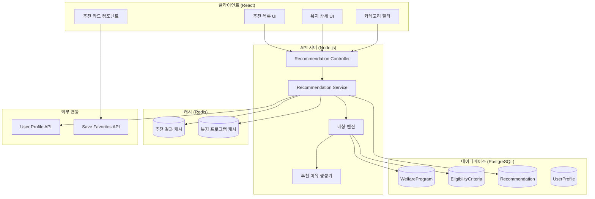
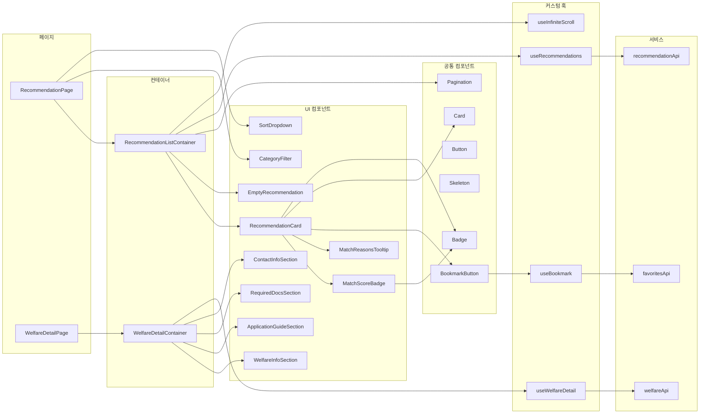
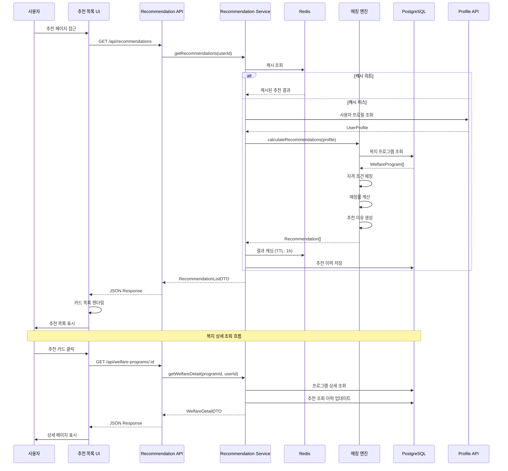
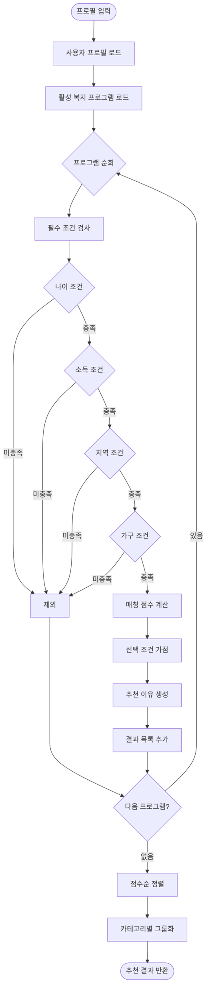
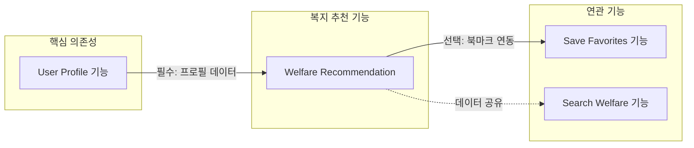
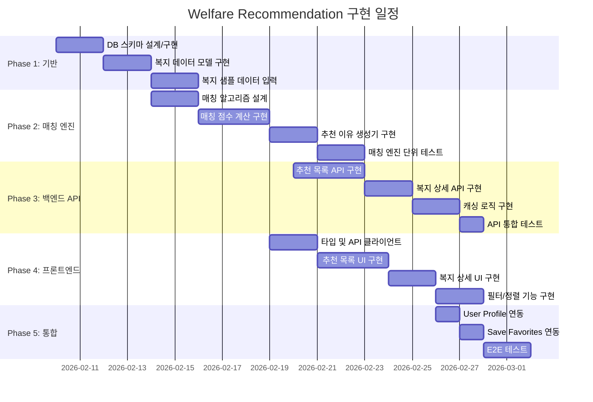

# 복지 추천 (Welfare Recommendation) - 설계 문서

> 작성일: 2026-02-03  
> 기반 문서: welfare-recommendation.plan.md  
> 상태: 설계 중

---

## 1. 아키텍처 개요

### 1.1 시스템 아키텍처



### 1.2 컴포넌트 관계도



### 1.3 데이터 흐름



### 1.4 매칭 엔진 흐름



---

## 2. 데이터 모델

### 2.1 TypeScript 타입 정의

```typescript
// ==================== Enums ====================

/** 복지 카테고리 */
enum WelfareCategory {
  LIVING_SUPPORT = 'living_support',   // 생활지원
  HOUSING = 'housing',                  // 주거
  EDUCATION = 'education',              // 교육
  MEDICAL = 'medical',                  // 의료
  EMPLOYMENT = 'employment',            // 고용
  CHILDCARE = 'childcare',              // 보육/돌봄
  OTHER = 'other'                       // 기타
}

/** 대상 그룹 */
enum TargetGroup {
  YOUTH = 'youth',                      // 청년 (19-34세)
  MIDDLE_AGED = 'middle_aged',          // 중장년 (35-64세)
  SENIOR = 'senior',                    // 노인 (65세 이상)
  CHILD = 'child',                      // 아동
  DISABLED = 'disabled',                // 장애인
  SINGLE_PARENT = 'single_parent',      // 한부모
  MULTICULTURAL = 'multicultural',      // 다문화가정
  VETERAN = 'veteran',                  // 보훈대상자
  LOW_INCOME = 'low_income',            // 저소득층
  PREGNANT = 'pregnant',                // 임산부
  GENERAL = 'general'                   // 일반
}

/** 소득 분위 */
enum IncomeLevel {
  LEVEL_1 = 1,   // 기초생활수급
  LEVEL_2 = 2,   // 차상위
  LEVEL_3 = 3,   // 중위소득 50% 이하
  LEVEL_4 = 4,   // 중위소득 75% 이하
  LEVEL_5 = 5,   // 중위소득 100% 이하
  LEVEL_6 = 6,   // 중위소득 150% 이하
  LEVEL_7 = 7,   // 중위소득 200% 이하
  LEVEL_8 = 8,   // 중위소득 200% 초과
  ALL = 0        // 소득 무관
}

/** 가구 유형 */
enum HouseholdType {
  SINGLE = 'single',                    // 1인가구
  COUPLE = 'couple',                    // 부부
  NUCLEAR = 'nuclear',                  // 핵가족
  EXTENDED = 'extended',                // 대가족
  SINGLE_PARENT = 'single_parent',      // 한부모
  MULTI_CHILD = 'multi_child',          // 다자녀 (3명 이상)
  GRANDPARENT = 'grandparent'           // 조손가정
}

/** 정렬 옵션 */
enum SortOption {
  MATCH_SCORE = 'match_score',          // 매칭률순
  LATEST = 'latest',                    // 최신순
  DEADLINE = 'deadline',                // 마감임박순
  POPULARITY = 'popularity'             // 인기순
}

// ==================== 복지 프로그램 ====================

/** 복지 프로그램 엔티티 */
interface WelfareProgram {
  id: string;
  name: string;
  description: string;
  summary: string;                      // 요약 설명 (카드용)
  category: WelfareCategory;
  targetGroups: TargetGroup[];
  eligibilityCriteria: EligibilityCriteria;
  applicationMethod: ApplicationMethod;
  requiredDocuments: RequiredDocument[];
  contactInfo: ContactInfo;
  benefits: string;                     // 지원 내용
  benefitAmount?: string;               // 지원 금액
  applicationPeriod?: ApplicationPeriod;
  managingOrganization: string;         // 담당 기관
  sourceUrl?: string;                   // 출처 URL
  tags: string[];
  viewCount: number;
  bookmarkCount: number;
  isActive: boolean;
  createdAt: Date;
  updatedAt: Date;
}

/** 자격 조건 */
interface EligibilityCriteria {
  ageMin?: number;                      // 최소 나이 (null: 제한 없음)
  ageMax?: number;                      // 최대 나이 (null: 제한 없음)
  incomeLevels: IncomeLevel[];          // 해당 소득 분위 (빈 배열: 제한 없음)
  regions: RegionCode[];                // 지역 코드 (빈 배열: 전국)
  householdTypes: HouseholdType[];      // 가구 유형 (빈 배열: 제한 없음)
  specialConditions: SpecialCondition[]; // 특수 조건
}

/** 특수 조건 */
interface SpecialCondition {
  key: string;                          // 조건 키 (예: 'is_employed', 'has_disability')
  label: string;                        // 표시 라벨
  value: boolean | string | number;     // 조건 값
  isRequired: boolean;                  // 필수 여부
  bonusScore?: number;                  // 가점 (선택 조건인 경우)
}

/** 지역 코드 */
interface RegionCode {
  sido: string;                         // 시/도 코드
  sigungu?: string;                     // 시/군/구 코드 (null: 시/도 전체)
}

/** 신청 방법 */
interface ApplicationMethod {
  online?: OnlineApplication;
  offline?: OfflineApplication;
  phone?: string;
}

interface OnlineApplication {
  url: string;
  siteName: string;
  instructions?: string;
}

interface OfflineApplication {
  location: string;
  address: string;
  instructions?: string;
}

/** 필요 서류 */
interface RequiredDocument {
  name: string;
  description?: string;
  isRequired: boolean;
  templateUrl?: string;                 // 양식 다운로드 URL
}

/** 연락처 정보 */
interface ContactInfo {
  phone?: string;
  email?: string;
  website?: string;
  address?: string;
  operatingHours?: string;
}

/** 신청 기간 */
interface ApplicationPeriod {
  startDate: Date;
  endDate?: Date;                       // null: 상시
  isAlwaysOpen: boolean;
}

// ==================== 추천 결과 ====================

/** 추천 결과 엔티티 */
interface Recommendation {
  id: string;
  userId: string;
  programId: string;
  program?: WelfareProgram;             // JOIN 시 포함
  matchScore: number;                   // 매칭률 (0-100)
  matchReasons: MatchReason[];          // 추천 이유
  isBookmarked: boolean;
  viewedAt?: Date;
  createdAt: Date;
  updatedAt: Date;
}

/** 매칭 이유 */
interface MatchReason {
  type: MatchReasonType;
  label: string;                        // 사용자에게 표시할 텍스트
  weight: number;                       // 가중치
}

enum MatchReasonType {
  AGE = 'age',
  INCOME = 'income',
  REGION = 'region',
  HOUSEHOLD = 'household',
  SPECIAL = 'special'
}

// ==================== DTO ====================

/** 추천 목록 요청 */
interface GetRecommendationsRequest {
  category?: WelfareCategory;
  sortBy?: SortOption;
  page?: number;
  limit?: number;
}

/** 추천 목록 응답 */
interface GetRecommendationsResponse {
  recommendations: RecommendationItem[];
  totalCount: number;
  categories: CategoryCount[];
  page: number;
  limit: number;
  hasMore: boolean;
}

/** 추천 아이템 (목록용) */
interface RecommendationItem {
  id: string;
  programId: string;
  name: string;
  summary: string;
  category: WelfareCategory;
  matchScore: number;
  matchReasons: MatchReason[];
  benefits: string;
  benefitAmount?: string;
  deadline?: Date;
  isBookmarked: boolean;
  tags: string[];
}

/** 카테고리별 개수 */
interface CategoryCount {
  category: WelfareCategory;
  label: string;
  count: number;
}

/** 복지 상세 응답 */
interface WelfareDetailResponse {
  program: WelfareProgram;
  matchScore: number;
  matchReasons: MatchReason[];
  isBookmarked: boolean;
  relatedPrograms: RelatedProgram[];
}

/** 관련 복지 */
interface RelatedProgram {
  id: string;
  name: string;
  category: WelfareCategory;
  matchScore: number;
}

/** 추천 새로고침 응답 */
interface RefreshRecommendationsResponse {
  success: boolean;
  updatedCount: number;
  message: string;
}
```

### 2.2 데이터베이스 스키마

```sql
-- 복지 프로그램 테이블
CREATE TABLE welfare_program (
    id UUID PRIMARY KEY DEFAULT gen_random_uuid(),
    name VARCHAR(200) NOT NULL,
    description TEXT NOT NULL,
    summary VARCHAR(500) NOT NULL,
    category VARCHAR(50) NOT NULL,
    target_groups VARCHAR(50)[] NOT NULL DEFAULT '{}',
    eligibility_criteria JSONB NOT NULL,
    application_method JSONB NOT NULL,
    required_documents JSONB NOT NULL DEFAULT '[]',
    contact_info JSONB,
    benefits TEXT NOT NULL,
    benefit_amount VARCHAR(200),
    application_start_date DATE,
    application_end_date DATE,
    is_always_open BOOLEAN DEFAULT FALSE,
    managing_organization VARCHAR(200) NOT NULL,
    source_url VARCHAR(500),
    tags VARCHAR(50)[] DEFAULT '{}',
    view_count INTEGER DEFAULT 0,
    bookmark_count INTEGER DEFAULT 0,
    is_active BOOLEAN DEFAULT TRUE,
    created_at TIMESTAMP WITH TIME ZONE DEFAULT CURRENT_TIMESTAMP,
    updated_at TIMESTAMP WITH TIME ZONE DEFAULT CURRENT_TIMESTAMP
);

-- 인덱스
CREATE INDEX idx_welfare_program_category ON welfare_program(category);
CREATE INDEX idx_welfare_program_is_active ON welfare_program(is_active);
CREATE INDEX idx_welfare_program_target_groups ON welfare_program USING GIN(target_groups);
CREATE INDEX idx_welfare_program_tags ON welfare_program USING GIN(tags);
CREATE INDEX idx_welfare_program_eligibility ON welfare_program USING GIN(eligibility_criteria);

-- 추천 결과 테이블
CREATE TABLE recommendation (
    id UUID PRIMARY KEY DEFAULT gen_random_uuid(),
    user_id UUID NOT NULL REFERENCES user_profile(id) ON DELETE CASCADE,
    program_id UUID NOT NULL REFERENCES welfare_program(id) ON DELETE CASCADE,
    match_score INTEGER NOT NULL CHECK (match_score >= 0 AND match_score <= 100),
    match_reasons JSONB NOT NULL DEFAULT '[]',
    is_bookmarked BOOLEAN DEFAULT FALSE,
    viewed_at TIMESTAMP WITH TIME ZONE,
    created_at TIMESTAMP WITH TIME ZONE DEFAULT CURRENT_TIMESTAMP,
    updated_at TIMESTAMP WITH TIME ZONE DEFAULT CURRENT_TIMESTAMP,
    
    UNIQUE(user_id, program_id)
);

-- 인덱스
CREATE INDEX idx_recommendation_user_id ON recommendation(user_id);
CREATE INDEX idx_recommendation_program_id ON recommendation(program_id);
CREATE INDEX idx_recommendation_match_score ON recommendation(user_id, match_score DESC);
CREATE INDEX idx_recommendation_bookmarked ON recommendation(user_id, is_bookmarked) WHERE is_bookmarked = TRUE;

-- 추천 이력 테이블 (분석용)
CREATE TABLE recommendation_history (
    id UUID PRIMARY KEY DEFAULT gen_random_uuid(),
    user_id UUID NOT NULL,
    program_id UUID NOT NULL,
    match_score INTEGER NOT NULL,
    action VARCHAR(50) NOT NULL, -- 'generated', 'viewed', 'bookmarked', 'applied'
    created_at TIMESTAMP WITH TIME ZONE DEFAULT CURRENT_TIMESTAMP
);

CREATE INDEX idx_recommendation_history_user ON recommendation_history(user_id, created_at DESC);
CREATE INDEX idx_recommendation_history_action ON recommendation_history(action, created_at);
```

---

## 3. API/인터페이스 설계

### 3.1 REST API 명세

#### 추천 목록 조회
```
GET /api/recommendations

Query Parameters:
  - category: WelfareCategory (optional) - 카테고리 필터
  - sortBy: SortOption (optional, default: 'match_score') - 정렬 기준
  - page: number (optional, default: 1) - 페이지 번호
  - limit: number (optional, default: 20) - 페이지당 개수

Headers:
  - Authorization: Bearer {token}

Response: 200 OK
{
  "recommendations": [
    {
      "id": "uuid",
      "programId": "uuid",
      "name": "청년 월세 지원",
      "summary": "청년의 주거비 부담 완화를 위한 월세 지원",
      "category": "housing",
      "matchScore": 95,
      "matchReasons": [
        { "type": "age", "label": "만 19~34세 청년 대상", "weight": 30 },
        { "type": "income", "label": "중위소득 100% 이하 해당", "weight": 25 }
      ],
      "benefits": "월 최대 20만원 지원",
      "benefitAmount": "월 20만원",
      "deadline": "2026-03-31",
      "isBookmarked": false,
      "tags": ["청년", "주거", "월세"]
    }
  ],
  "totalCount": 45,
  "categories": [
    { "category": "housing", "label": "주거", "count": 12 },
    { "category": "living_support", "label": "생활지원", "count": 15 }
  ],
  "page": 1,
  "limit": 20,
  "hasMore": true
}

Error Responses:
  - 401 Unauthorized: 인증 실패
  - 404 Not Found: 사용자 프로필 없음 (프로필 등록 필요)
```

#### 복지 프로그램 상세 조회
```
GET /api/welfare-programs/:id

Path Parameters:
  - id: string (required) - 복지 프로그램 ID

Headers:
  - Authorization: Bearer {token}

Response: 200 OK
{
  "program": {
    "id": "uuid",
    "name": "청년 월세 지원",
    "description": "청년의 주거비 부담을 완화하기 위해...",
    "summary": "청년의 주거비 부담 완화를 위한 월세 지원",
    "category": "housing",
    "targetGroups": ["youth", "low_income"],
    "eligibilityCriteria": { ... },
    "applicationMethod": {
      "online": {
        "url": "https://apply.example.com",
        "siteName": "청년 포털",
        "instructions": "회원가입 후 신청서 작성"
      },
      "offline": {
        "location": "주민센터",
        "address": "서울시 강남구...",
        "instructions": "신분증 지참"
      }
    },
    "requiredDocuments": [
      { "name": "주민등록등본", "isRequired": true },
      { "name": "소득증명서", "isRequired": true },
      { "name": "임대차계약서", "isRequired": true }
    ],
    "contactInfo": {
      "phone": "1644-0000",
      "website": "https://www.example.com"
    },
    "benefits": "월 최대 20만원 지원",
    "benefitAmount": "월 20만원",
    "managingOrganization": "국토교통부"
  },
  "matchScore": 95,
  "matchReasons": [ ... ],
  "isBookmarked": false,
  "relatedPrograms": [
    { "id": "uuid", "name": "청년 전세대출", "category": "housing", "matchScore": 88 }
  ]
}

Error Responses:
  - 401 Unauthorized: 인증 실패
  - 404 Not Found: 프로그램 없음
```

#### 추천 새로고침
```
POST /api/recommendations/refresh

Headers:
  - Authorization: Bearer {token}

Response: 200 OK
{
  "success": true,
  "updatedCount": 45,
  "message": "추천 목록이 갱신되었습니다."
}

Error Responses:
  - 401 Unauthorized: 인증 실패
  - 404 Not Found: 사용자 프로필 없음
  - 429 Too Many Requests: 요청 제한 (1분에 1회)
```

#### 추천 조회 기록
```
POST /api/recommendations/:id/view

Headers:
  - Authorization: Bearer {token}

Response: 200 OK
{
  "success": true,
  "viewedAt": "2026-02-03T10:30:00Z"
}
```

### 3.2 서비스 인터페이스

```typescript
// recommendation.service.ts

interface IRecommendationService {
  /**
   * 사용자의 추천 복지 목록 조회
   */
  getRecommendations(
    userId: string,
    options: GetRecommendationsRequest
  ): Promise<GetRecommendationsResponse>;

  /**
   * 복지 프로그램 상세 정보 조회
   */
  getWelfareDetail(
    programId: string,
    userId: string
  ): Promise<WelfareDetailResponse>;

  /**
   * 추천 결과 새로고침 (프로필 변경 시)
   */
  refreshRecommendations(userId: string): Promise<RefreshRecommendationsResponse>;

  /**
   * 추천 조회 기록 저장
   */
  recordView(recommendationId: string, userId: string): Promise<void>;

  /**
   * 캐시 무효화
   */
  invalidateCache(userId: string): Promise<void>;
}

// matching-engine.service.ts

interface IMatchingEngineService {
  /**
   * 프로필 기반 매칭 점수 계산
   */
  calculateMatchScore(
    profile: UserProfile,
    criteria: EligibilityCriteria
  ): MatchResult;

  /**
   * 추천 이유 텍스트 생성
   */
  generateMatchReasons(
    profile: UserProfile,
    criteria: EligibilityCriteria,
    matchResult: MatchResult
  ): MatchReason[];

  /**
   * 전체 복지 프로그램 매칭 실행
   */
  runMatchingForUser(
    profile: UserProfile,
    programs: WelfareProgram[]
  ): Recommendation[];
}

interface MatchResult {
  isEligible: boolean;          // 자격 충족 여부
  score: number;                // 매칭 점수 (0-100)
  matchedConditions: string[];  // 충족 조건 목록
  bonusScore: number;           // 가점
}
```

### 3.3 커스텀 훅 인터페이스

```typescript
// useRecommendations.ts

interface UseRecommendationsOptions {
  category?: WelfareCategory;
  sortBy?: SortOption;
  initialPage?: number;
  limit?: number;
}

interface UseRecommendationsReturn {
  recommendations: RecommendationItem[];
  categories: CategoryCount[];
  totalCount: number;
  isLoading: boolean;
  isError: boolean;
  error: Error | null;
  hasMore: boolean;
  
  // 액션
  loadMore: () => void;
  refresh: () => Promise<void>;
  setCategory: (category: WelfareCategory | undefined) => void;
  setSortBy: (sortBy: SortOption) => void;
}

function useRecommendations(options?: UseRecommendationsOptions): UseRecommendationsReturn;

// useWelfareDetail.ts

interface UseWelfareDetailReturn {
  program: WelfareProgram | null;
  matchScore: number;
  matchReasons: MatchReason[];
  isBookmarked: boolean;
  relatedPrograms: RelatedProgram[];
  isLoading: boolean;
  isError: boolean;
  error: Error | null;
  
  // 액션
  toggleBookmark: () => Promise<void>;
  refetch: () => void;
}

function useWelfareDetail(programId: string): UseWelfareDetailReturn;

// useBookmark.ts

interface UseBookmarkReturn {
  isBookmarked: boolean;
  isLoading: boolean;
  toggle: () => Promise<void>;
}

function useBookmark(programId: string, initialState?: boolean): UseBookmarkReturn;
```

---

## 4. 파일 구조

### 4.1 프론트엔드 구조

```
src/features/recommendation/
├── index.ts                          # Public exports
├── api/
│   ├── index.ts
│   ├── recommendationApi.ts          # API 클라이언트
│   ├── recommendationApi.types.ts    # API 타입 정의
│   └── welfareApi.ts                 # 복지 상세 API
├── components/
│   ├── index.ts
│   ├── RecommendationList/
│   │   ├── RecommendationList.tsx
│   │   ├── RecommendationList.styles.ts
│   │   └── index.ts
│   ├── RecommendationCard/
│   │   ├── RecommendationCard.tsx
│   │   ├── RecommendationCard.styles.ts
│   │   └── index.ts
│   ├── MatchScoreBadge/
│   │   ├── MatchScoreBadge.tsx
│   │   └── index.ts
│   ├── MatchReasons/
│   │   ├── MatchReasonsTooltip.tsx
│   │   ├── MatchReasonsList.tsx
│   │   └── index.ts
│   ├── CategoryFilter/
│   │   ├── CategoryFilter.tsx
│   │   └── index.ts
│   ├── SortDropdown/
│   │   ├── SortDropdown.tsx
│   │   └── index.ts
│   ├── EmptyRecommendation/
│   │   ├── EmptyRecommendation.tsx
│   │   └── index.ts
│   ├── WelfareDetail/
│   │   ├── WelfareInfoSection.tsx
│   │   ├── ApplicationGuideSection.tsx
│   │   ├── RequiredDocsSection.tsx
│   │   ├── ContactInfoSection.tsx
│   │   ├── RelatedPrograms.tsx
│   │   └── index.ts
│   └── Skeleton/
│       ├── RecommendationCardSkeleton.tsx
│       └── index.ts
├── constants/
│   ├── index.ts
│   ├── categories.ts                 # 카테고리 상수
│   ├── sortOptions.ts                # 정렬 옵션
│   └── matchReasonLabels.ts          # 추천 이유 라벨
├── hooks/
│   ├── index.ts
│   ├── useRecommendations.ts
│   ├── useWelfareDetail.ts
│   ├── useBookmark.ts
│   └── useInfiniteScroll.ts
├── pages/
│   ├── index.ts
│   ├── RecommendationPage.tsx        # 추천 목록 페이지
│   └── WelfareDetailPage.tsx         # 복지 상세 페이지
├── types/
│   ├── index.ts
│   ├── recommendation.types.ts
│   ├── welfare.types.ts
│   └── api.types.ts
└── utils/
    ├── index.ts
    ├── matchScoreHelpers.ts          # 점수 포맷팅
    ├── categoryHelpers.ts            # 카테고리 변환
    └── deadlineHelpers.ts            # 마감일 계산
```

### 4.2 백엔드 구조

```
server/src/modules/recommendation/
├── recommendation.module.ts          # 모듈 정의
├── recommendation.controller.ts      # 컨트롤러
├── recommendation.service.ts         # 비즈니스 로직
├── recommendation.repository.ts      # 데이터 액세스
├── controllers/
│   └── welfare-program.controller.ts # 복지 프로그램 컨트롤러
├── services/
│   ├── matching-engine.service.ts    # 매칭 엔진
│   ├── reason-generator.service.ts   # 추천 이유 생성
│   └── cache.service.ts              # 캐시 관리
├── dto/
│   ├── get-recommendations.dto.ts
│   ├── recommendation-response.dto.ts
│   ├── welfare-detail.dto.ts
│   └── refresh-response.dto.ts
├── entities/
│   ├── welfare-program.entity.ts
│   ├── recommendation.entity.ts
│   └── recommendation-history.entity.ts
├── interfaces/
│   ├── eligibility-criteria.interface.ts
│   ├── match-result.interface.ts
│   └── match-reason.interface.ts
└── constants/
    ├── match-weights.constant.ts     # 매칭 가중치
    └── cache-keys.constant.ts        # 캐시 키

server/migrations/
├── 007_create_welfare_program.sql
├── 008_create_recommendation.sql
└── 009_create_recommendation_history.sql
```

---

## 5. 의존성

### 5.1 프론트엔드 의존성

```json
{
  "dependencies": {
    "react": "^18.2.0",
    "react-dom": "^18.2.0",
    "react-router-dom": "^6.x",
    "typescript": "^5.x",
    "@tanstack/react-query": "^5.x",
    "axios": "^1.x",
    "tailwindcss": "^3.x",
    "lucide-react": "^0.x",
    "clsx": "^2.x",
    "date-fns": "^3.x"
  },
  "devDependencies": {
    "@types/react": "^18.x",
    "@testing-library/react": "^14.x",
    "vitest": "^1.x",
    "msw": "^2.x"
  }
}
```

### 5.2 백엔드 의존성

```json
{
  "dependencies": {
    "express": "^4.x",
    "typescript": "^5.x",
    "pg": "^8.x",
    "redis": "^4.x",
    "zod": "^3.x",
    "winston": "^3.x"
  },
  "devDependencies": {
    "@types/express": "^4.x",
    "@types/node": "^20.x",
    "jest": "^29.x",
    "ts-jest": "^29.x"
  }
}
```

### 5.3 기능 의존성



| 의존 기능 | 필수 여부 | 연동 내용 |
|----------|----------|----------|
| User Profile | 필수 | 사용자 프로필 데이터 (나이, 소득, 지역 등) |
| Save Favorites | 선택 | 복지 프로그램 북마크/즐겨찾기 |
| Search Welfare | 공유 | 복지 프로그램 마스터 데이터 |

---

## 6. 구현 순서

### 6.1 단계별 구현 계획



### 6.2 상세 구현 체크리스트

#### Phase 1: 기반 구축 (2일)
- [ ] PostgreSQL 테이블 생성 (welfare_program, recommendation)
- [ ] 엔티티 클래스 구현
- [ ] 리포지토리 기본 CRUD 구현
- [ ] 복지 프로그램 샘플 데이터 20개 입력

#### Phase 2: 매칭 엔진 개발 (5일)
- [ ] `MatchingEngineService` 기본 구조 생성
- [ ] 나이 조건 매칭 로직 구현
- [ ] 소득 조건 매칭 로직 구현
- [ ] 지역 조건 매칭 로직 구현
- [ ] 가구 유형 조건 매칭 로직 구현
- [ ] 특수 조건 매칭 로직 구현
- [ ] 매칭 점수 계산 알고리즘 구현 (가중치 적용)
- [ ] `ReasonGeneratorService` 구현
- [ ] 추천 이유 템플릿 정의
- [ ] 단위 테스트 작성 (최소 20개 케이스)

#### Phase 3: 백엔드 API 개발 (4일)
- [ ] `RecommendationController` 생성
- [ ] `GET /api/recommendations` 엔드포인트 구현
- [ ] `GET /api/welfare-programs/:id` 엔드포인트 구현
- [ ] `POST /api/recommendations/refresh` 엔드포인트 구현
- [ ] `POST /api/recommendations/:id/view` 엔드포인트 구현
- [ ] Redis 캐싱 로직 구현 (TTL: 1시간)
- [ ] 캐시 무효화 로직 구현
- [ ] 페이지네이션 구현
- [ ] 에러 핸들링 및 검증
- [ ] API 통합 테스트 작성

#### Phase 4: 프론트엔드 개발 (5일)
- [ ] TypeScript 타입 정의 파일 생성
- [ ] `recommendationApi` 클라이언트 구현
- [ ] `useRecommendations` 훅 구현
- [ ] `useWelfareDetail` 훅 구현
- [ ] `useBookmark` 훅 구현
- [ ] `RecommendationPage` 컴포넌트 구현
- [ ] `RecommendationList` 컴포넌트 구현
- [ ] `RecommendationCard` 컴포넌트 구현
- [ ] `MatchScoreBadge` 컴포넌트 구현
- [ ] `MatchReasonsTooltip` 컴포넌트 구현
- [ ] `CategoryFilter` 컴포넌트 구현
- [ ] `SortDropdown` 컴포넌트 구현
- [ ] `WelfareDetailPage` 컴포넌트 구현
- [ ] 복지 상세 섹션 컴포넌트들 구현
- [ ] 스켈레톤 로딩 UI 구현
- [ ] 빈 상태 UI 구현
- [ ] 반응형 스타일링

#### Phase 5: 통합 및 테스트 (3일)
- [ ] User Profile API 연동
- [ ] 프로필 없는 사용자 처리 (온보딩 유도)
- [ ] Save Favorites API 연동
- [ ] 북마크 토글 기능 연동
- [ ] 프로필 변경 시 자동 새로고침 연동
- [ ] E2E 테스트 시나리오 작성 및 실행
- [ ] 성능 테스트 (목표: 300ms 이내)
- [ ] 버그 수정 및 최적화

---

## 7. 테스트 전략

### 7.1 매칭 엔진 테스트 케이스

| 테스트 케이스 | 입력 | 기대 결과 |
|--------------|------|----------|
| 청년 월세 지원 - 적격 | 나이: 25, 소득: 4분위, 지역: 서울 | 매칭: true, 점수: 90+ |
| 청년 월세 지원 - 나이 초과 | 나이: 40, 소득: 4분위 | 매칭: false |
| 노인 기초연금 - 적격 | 나이: 70, 소득: 2분위 | 매칭: true, 점수: 95+ |
| 다자녀 지원 - 자녀 2명 | 가구: 다자녀(2명) | 매칭: false |
| 다자녀 지원 - 자녀 3명 | 가구: 다자녀(3명) | 매칭: true |
| 지역 한정 복지 - 타 지역 | 지역: 부산, 조건: 서울 한정 | 매칭: false |

### 7.2 API 테스트

```typescript
describe('RecommendationController', () => {
  describe('GET /api/recommendations', () => {
    it('프로필이 있는 사용자는 추천 목록을 받는다');
    it('프로필이 없는 사용자는 404를 받는다');
    it('카테고리 필터가 적용된다');
    it('정렬 옵션이 적용된다');
    it('페이지네이션이 동작한다');
  });

  describe('POST /api/recommendations/refresh', () => {
    it('캐시가 무효화되고 새 추천이 생성된다');
    it('1분 내 재요청은 429를 받는다');
  });
});
```

---

## 8. 다음 단계

`Cmd+Shift+P` → `BKIT: Analysis 문서 생성`을 실행하여 구현 분석 문서를 작성하세요.

---
*상태: 설계 중*
